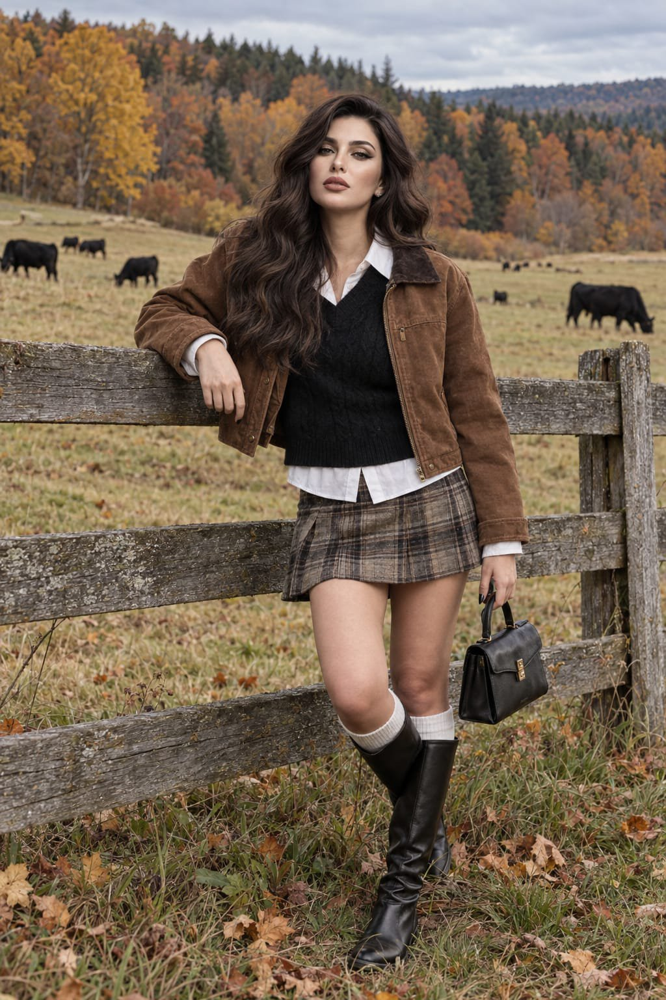

# Autumn Countryside Fence Portrait from Reference

**中文标题：** 参考图→秋日乡村木栅栏人像  
**ID:** `gi25-x-691` · **Mode:** `edit`  
**Categories:** `character-consistency`, `edit-change-preserve`  
**Tags:** `x-twitter`, `community`, `gpt-image-2.5`, `x-direct`, `en`



### Autumn Countryside Fence Portrait from Reference

```text
Create an ultra-photorealistic autumn countryside portrait of the girl from the attached reference image. Preserve her exact facial identity, distinctive features, natural proportions, and overall appearance without altering or beautifying her face.

She is standing beside a weathered wooden fence in a quiet rural pasture, resting one arm naturally on the fence while her other hand carries a small structured black leather handbag. Her posture is relaxed and candid, with one knee subtly bent.

She wears a warm brown cropped jacket over a black knitted sweater layered with a crisp white shirt, a short muted plaid skirt, clean white crew socks, and tall black leather boots. The outfit should look naturally worn, with authentic fabric textures, folds, stitching, and minor imperfections.

Behind her stretches an expansive autumn meadow with several black cows grazing in the distance. Dense mixed woodland surrounds the pasture, with golden-yellow leaves, burnt orange foliage, muted green evergreens, and scattered fallen leaves across the grass. A cool overcast sky creates soft, diffused daylight and gentle shadows.

Make the image look like an authentic high-end outdoor photograph captured with a professional full-frame camera. Natural skin texture, visible pores, fine facial details, individual strands of hair, realistic eyes, subtle imperfections, physically accurate lighting, genuine fabric and leather textures, detailed weathered wood, grass and foliage, realistic depth of field and optical falloff.

Avoid beauty filters, artificial skin, excessive sharpness, HDR effects, CGI, 3D rendering, painterly textures, plastic appearance, facial distortion, excessive blur, or an AI-generated look. The final result should feel like a real candid autumn fashion photograph captured in the countryside.
```

- **Recommended model:** `gpt-image-2.5-sunburst`
- **Settings:** _(defaults)_
- **Source:** [community](https://x.com/mehvishs25/status/2108207834815230156) — @mehvishs25
- **License note:** Original public X post; quoted with attribution — remix with attribution
- **Notes:** Collected directly from X; original post https://x.com/mehvishs25/status/2108207834815230156; post text names GPT Image 2.5; verified=True
- **Preview:** `previews/gi25-x-691.jpg`
