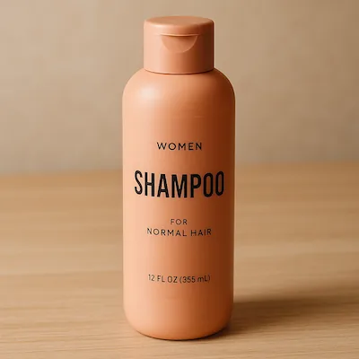
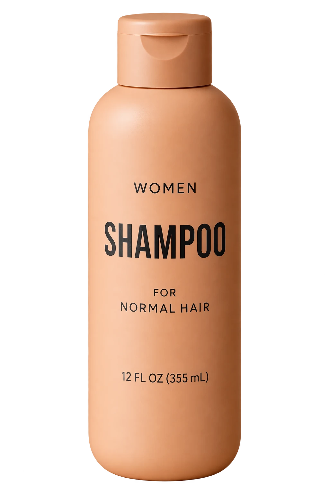

# Transparent product cutout extract

**中文标题：** 商品透明抠图  
**ID:** `gi25-cut-002` · **Mode:** `edit`  
**Categories:** `product-cutout`, `ecommerce`  
**Tags:** `transparent`, `cutout`, `openai-official`  




### Transparent product cutout extract

```text
Extract the product from the input image and isolate it on a fully transparent background.
Output: centered product, crisp silhouette, no halos/fringing.
Preserve product geometry and label legibility exactly.
Add only light polishing. Do not add a solid backdrop, checkerboard, scenery, or shadow.
Do not restyle the product; remove the background and preserve clean alpha transparency.
```

- **Recommended model:** `either`
- **Settings:** `quality=medium`, `size=1024x1536`, `background=transparent`
- **Source:** [OpenAI Image prompting](https://developers.openai.com/api/docs/guides/image-prompting) — OpenAI
- **License note:** OpenAI docs examples
- **Notes:** API: background=transparent, output_format=png|webp.
