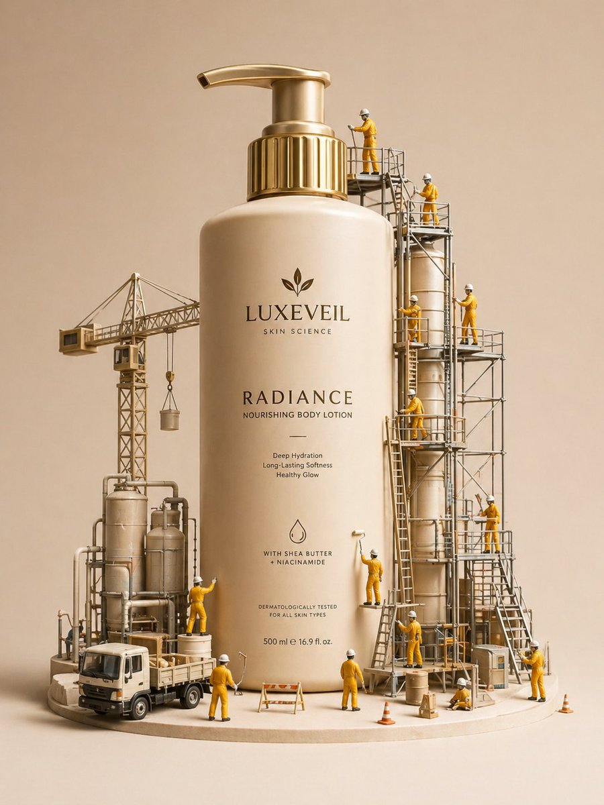

# Miniature diorama skincare LUXEVEIL ad

**中文标题：** 微缩沙盘护肤主图 LUXEVEIL  
**ID:** `gi25-eco-007` · **Mode:** `generate`  
**Categories:** `ecommerce`  
**Tags:** `diorama`, `skincare`, `evolink`, `community`  



### Miniature diorama skincare LUXEVEIL ad

```text
A hyper-realistic miniature diorama product advertisement featuring an oversized luxury skincare pump bottle labeled "LUXEVEIL Skin Science - Radiance Nourishing Body Lotion" in cream/beige with a polished gold pump top, placed on a circular platform. Tiny figurine construction workers dressed in yellow coveralls and white hard hats swarm around the bottle climbing scaffolding, painting the bottle with rollers, operating a tower crane, working near industrial tanks and pipework, and unloading a miniature flatbed truck. The scene includes metal scaffolding structures, industrial silos, orange traffic cones, wooden barricades, and storage barrels. The overall color palette is warm beige, cream, gold, and mustard yellow. Studio photography style with soft diffused lighting, no shadows, clean beige background. The concept metaphorically shows workers "crafting" or "building" the perfect lotion. Tilt-shift miniature aesthetic, ultra-detailed, commercial product photography, 8K resolution, photorealistic CGI render.
```

- **Recommended model:** `gpt-image-2.5-sunburst`
- **Settings:** _(defaults)_
- **Source:** [GitHub](https://github.com/EvoLinkAI/awesome-gpt-image-2-API-and-Prompts) — @Strength04_X (via EvoLinkAI)
- **License note:** CC0-1.0 (repo badge)
- **Notes:** EvoLink README Case 1; original X attributed in repo.
