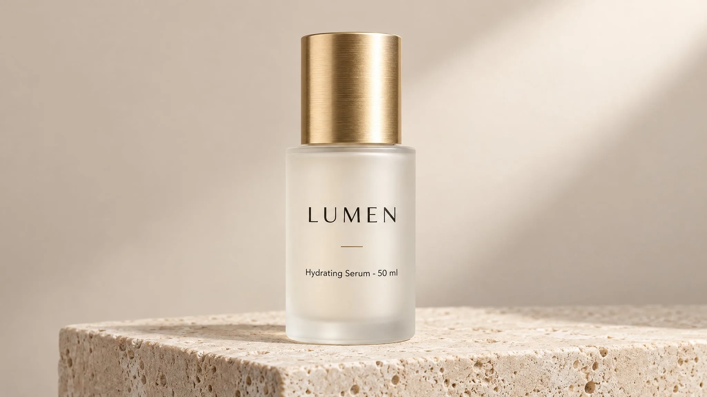

# LUMEN hydrating serum studio packshot

**中文标题：** LUMEN 保湿精华棚拍包装图  
**ID:** `gi25-eco-017` · **Mode:** `generate`  
**Categories:** `ecommerce`, `product-cutout`  
**Tags:** `felo`, `vendor-blog`, `gpt-image-2.5`, `packshot`, `exact-text`



### LUMEN hydrating serum studio packshot

```text
Studio product photograph of a frosted glass 50 ml serum bottle with a brushed gold cap,
standing on a pale travertine plinth against a soft beige backdrop.
Label text (exact): "LUMEN" as the brand, "Hydrating Serum · 50 ml" beneath it,
rendered once, straight on, sharp and fully legible.
Composition: centred, full bottle in frame, generous empty space on the right.
Light: large softbox from the upper right, gentle gradient falloff, clean contact shadow.
Style: premium beauty e-commerce photography, crisp detail, no props.
Constraints: no additional text, no logos, no watermark, no studio reflections.
```

- **Recommended model:** `gpt-image-2.5-sunburst`
- **Settings:** _(defaults)_
- **Source:** [vendor-blog](https://felo.ai/blog/gpt-image-2-5-use-cases/) — Felo Search Blog
- **License note:** Felo blog copy-paste examples; remix with attribution
- **Notes:** Copy-paste GPT Image 2.5 use-case prompt from Felo Search Blog (2026-09-10); not previously in this repo.
