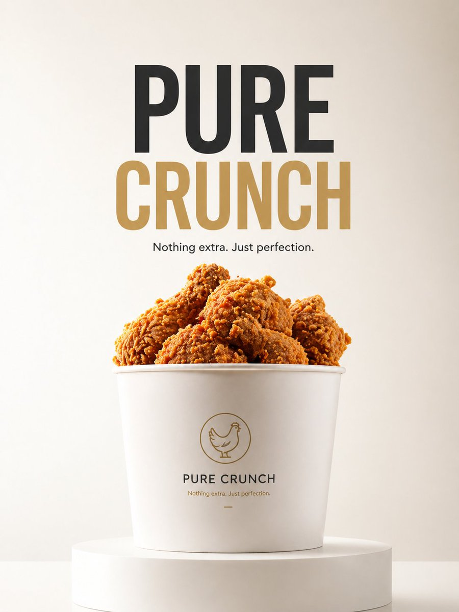

# Minimalist Product Ad: PURE CRUNCH

**中文标题：** 电商主图：极简炸鸡 PURE CRUNCH  
**ID:** `gi25-x-014` · **Mode:** `generate`  
**Categories:** `ecommerce`  
**Tags:** `x-twitter`, `evolink`, `community`, `gpt-image-2`



### Minimalist Product Ad: PURE CRUNCH

```text
A minimalist product advertisement with a {argument name="product" default="fried chicken bucket"} placed on a clean white podium.

Background: soft gradient ({argument name="background gradient" default="light cream to white"}), clean studio.

Lighting: soft diffused, premium Apple-style.

Typography (center): “{argument name="headline" default="PURE CRUNCH"}”

Small text below: “Nothing extra. Just perfection.”

Style: ultra clean, editorial minimal, high-end branding, 8K.
```

- **Recommended model:** `either`
- **Settings:** _(defaults)_
- **Source:** [X/Twitter](https://x.com/Strength04_X/status/2047917220165231011) — @Strength04_X (via EvoLinkAI)
- **License note:** CC0-1.0 (EvoLink catalog); original X post — remix with attribution
- **Notes:** Mirrored in EvoLink case 158 (ecommerce.md); original post on X.
