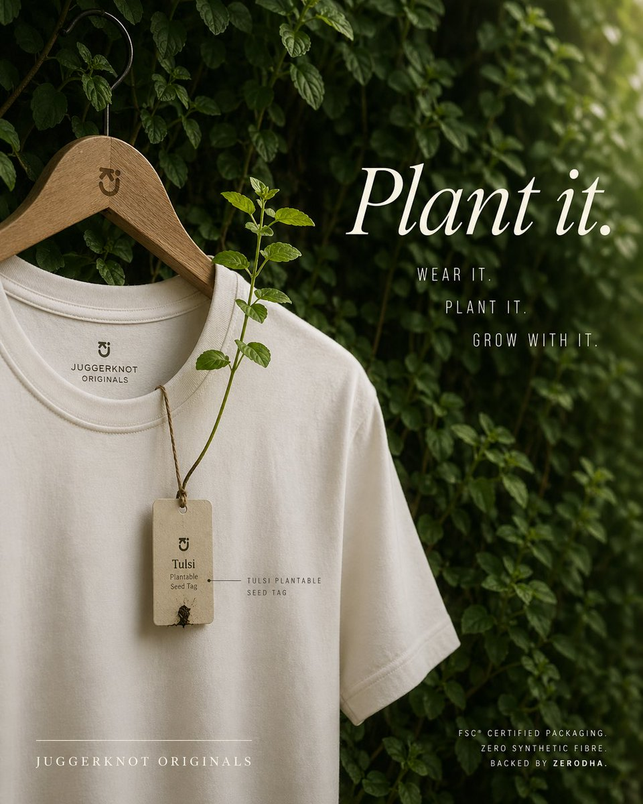

# Sustainable T-Shirt Plantable Tag Ad

**中文标题：** 电商主图：可种植吊牌环保 T 恤  
**ID:** `gi25-x-015` · **Mode:** `edit`  
**Categories:** `ecommerce`  
**Tags:** `x-twitter`, `evolink`, `community`, `gpt-image-2`



### Sustainable T-Shirt Plantable Tag Ad

```text
A premium eco-conscious fashion advertisement, shot as a refined editorial product photo. A single off-white or natural cream crew-neck T-shirt hangs on a smooth wooden hanger with a black metal hook, placed against a lush wall of dense green leaves and climbing vines. The hanger has a small minimalist brand monogram engraved near the neck. The shirt is shown from the upper torso down to part of the hem, slightly angled, with soft natural folds and high-quality cotton texture. Printed inside the collar is a minimalist brand mark and the text "JUGGERKNOT ORIGINALS". Hanging from the neckline is 1 rectangular recycled-paper seed tag tied with rustic brown twine; the tag reads "Tulsi" and "Plantable Seed Tag" with a tiny sprouting seed detail near the bottom. From the tag, 1 real tulsi plant stem grows upward across the front of the shirt, with several fresh green leaves, visually demonstrating that the tag is plantable. Add a small fine-label annotation near the tag reading "TULSI PLANTABLE SEED TAG". On the right side, large elegant white serif typography says {argument name="headline text" default="Plant it."}. Beneath it, place 3 stacked lines of narrow uppercase sans-serif copy: "WEAR IT.", "PLANT IT.", and "GROW WITH IT.". At the lower left, add the brand name in spaced uppercase serif text: {argument name="brand name" default="JUGGERKNOT ORIGINALS"}, with a thin horizontal line above it. At the lower right, add 3 lines of small uppercase sans-serif text: "FSC® CERTIFIED PACKAGING.", "ZERO SYNTHETIC FIBRE", and "BACKED BY ZERODHA.". Use soft diffused daylight, shallow depth of field, moody green-and-cream color grading, luxury sustainable-brand aesthetics, clean composition, vertical poster layout, subtle shadows, and a calm organic atmosphere. Keep the design minimal, premium, and photorealistic, with the shirt occupying the left half and the typography balanced on the right.
```

- **Recommended model:** `either`
- **Settings:** _(defaults)_
- **Source:** [X/Twitter](https://x.com/Diplomeme/status/2047957339974828092) — @Diplomeme (via EvoLinkAI)
- **License note:** CC0-1.0 (EvoLink catalog); original X post — remix with attribution
- **Notes:** Mirrored in EvoLink case 156 (ecommerce.md); original post on X.
