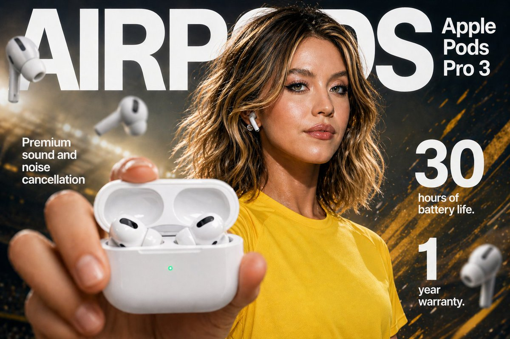

# Earbuds E-commerce Infographic

**中文标题：** 电商主图：耳机信息图  
**ID:** `gi25-x-016` · **Mode:** `generate`  
**Categories:** `ecommerce`, `poster-typography`  
**Tags:** `x-twitter`, `evolink`, `community`, `gpt-image-2`



### Earbuds E-commerce Infographic

```text
High-impact e-commerce infographic for "{argument name="product" default="Apple Pods Pro 3"}" wireless earbuds.
Foreground: An extreme close-up of a hand holding an open glossy white wireless earbud charging case toward the camera. Inside the case are two sleek white earbuds with black speaker accents. A small glowing green LED indicator is visible on the front of the case. The hand and case have slight macro-lens depth blur for realism.

Mid-ground: A {argument name="model" default="confident young woman"} with tan skin, brown eyes, and dark hair tied in a messy bun. She has natural makeup with a dewy glow. She is wearing a plain {argument name="clothing" default="yellow athletic t-shirt"} (no logos). One white earbud is in her ear. She is looking directly at the camera with a subtle, confident expression.

Background: Clean soft gray gradient studio backdrop with shallow depth of field. Diagonal rainbow prism lens flares and soft light leaks across the scene. Several blurred floating white earbuds in the background for depth and motion.

Lighting: Soft professional studio lighting with glossy highlights on the product, subtle rim light on the model, high dynamic range.

Typography (modern sans-serif, white):

Top center (behind model): Large bold text “AIRPODS”

Top right: “Apple Pods Pro 3”

Mid-left: “Premium sound and noise cancellation”

Mid-right: Large bold “30” with “hours of battery life”

Bottom-right: Large bold “1” with “year warranty”

Style: Ultra-realistic, commercial product photography, 8k resolution, sharp focus on product case, shallow depth of field, vibrant yet clean color palette, premium advertising aesthetic.
```

- **Recommended model:** `gpt-image-2.5-sunburst`
- **Settings:** _(defaults)_
- **Source:** [X/Twitter](https://x.com/SPEEDAI07/status/2047981795552153860) — @SPEEDAI07 (via EvoLinkAI)
- **License note:** CC0-1.0 (EvoLink catalog); original X post — remix with attribution
- **Notes:** Mirrored in EvoLink case 155 (ecommerce.md); original post on X.
