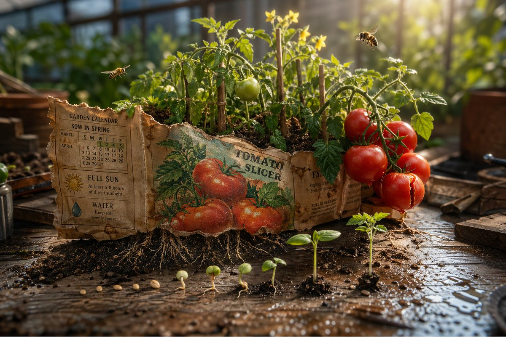

# Magical Seed Packet Diorama

**中文标题：** 魔法种子袋立体场景  
**ID:** `gi25-x-017` · **Mode:** `generate`  
**Categories:** `ecommerce`, `poster-typography`  
**Tags:** `x-twitter`, `evolink`, `community`, `gpt-image-2`



### Magical Seed Packet Diorama

```text
Epic 3D scene: a weathered seed packet lying open on a potting bench, its promise erupting into the garden it describes. The illustration on the front becomes real. {argument name="plant type" default="[PLANT / FLOWER]"} growing at full scale from the paper, roots visible through the packet's base pushing into soil below.
{argument name="detail left" default="[DETAIL 1]"} in full bloom at one corner. {argument name="detail right" default="[DETAIL 2]"} mid-growth at the other, not yet what it will be.
Tiny insects that belong to this plant, {argument name="insect type" default="[BEE / BUTTERFLY / BEETLE]"}, hovering at correct scale.
The written instructions on the back become garden calendar, "sow in spring" manifests as actual spring light. "full sun" manifests as a single shaft of it, hitting the tallest bloom perfectly.
Scattered seeds between packet and soil each showing their germination stage, split coat, first root, first shoot, first leaf.
The packet's torn top edge becomes a treeline.
Potting bench surface with soil scatter and water droplets.
Tilt-shift depth of field, greenhouse morning light, the packet as the garden it always intended.
```

- **Recommended model:** `either`
- **Settings:** _(defaults)_
- **Source:** [X/Twitter](https://x.com/AllaAisling/status/2048156345518768190) — @AllaAisling (via EvoLinkAI)
- **License note:** CC0-1.0 (EvoLink catalog); original X post — remix with attribution
- **Notes:** Mirrored in EvoLink case 143 (ad-creative.md); original post on X.
