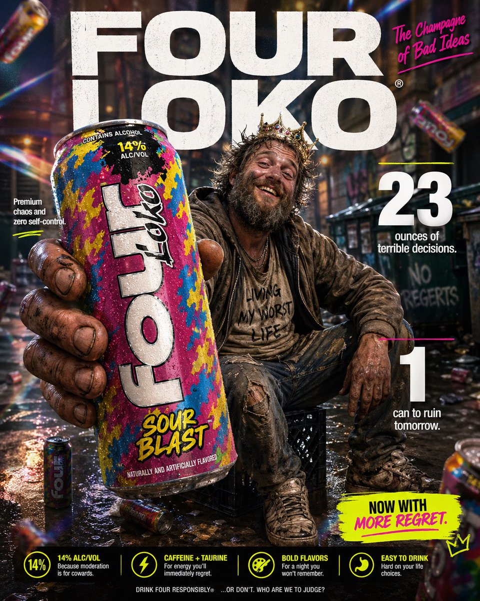

# Parody Luxury Product Advertisement

**中文标题：** 戏仿奢侈品饮料广告  
**ID:** `gi25-x-018` · **Mode:** `generate`  
**Categories:** `ecommerce`, `poster-typography`  
**Tags:** `x-twitter`, `evolink`, `community`, `gpt-image-2`



### Parody Luxury Product Advertisement

```text
High-impact parody e-commerce infographic for “{argument name="product" default="Four Loko"}” malt beverage. Foreground: An extreme close-up of a rough, weathered hand holding a tall, brightly colored can of {argument name="product" default="Four Loko"} toward the camera. The can is slightly cold with visible condensation droplets and a loud, chaotic flavor design. The hand and can have a slight macro-lens blur for depth, with the can still reading clearly as the hero product. Central Subject: In the mid-ground, a funny, disheveled {argument name="subject" default="homeless-looking man"} sitting casually on a milk crate in an urban alley. He has a scruffy beard, messy hair, layered worn clothing, and a huge unbothered grin. He should look chaotic but oddly charismatic, like the accidental king of bad decisions. He is posed like a confident lifestyle-ad model, proudly showing off the can. Background & Lighting: A ridiculously polished ad-style backdrop mixed with a grimy city alley setting. Soft-focus urban textures, dumpster shapes, graffiti hints, and scattered clutter in the distance. Add dramatic studio lighting, soft glow, rainbow prism flares, and subtle light leaks to make the whole thing look way too premium for the subject matter. A few blurred {argument name="product" default="Four Loko"} cans can float artistically in the background for extra absurdity. Typography & Layout (Bold sans-serif, white and neon accent styling): Top Center (Background): Massive, bold text reading “{argument name="brand name" default="FOUR LOKO"}” positioned behind the subject. Top Right: Bold text reading “The Champagne of Bad Ideas”. Mid-Left: “Premium chaos and zero self-control” Mid-Right: Large, bold “23” with the text “ounces of terrible decisions.” Bottom-Right: Large, bold “1" with the text “can to ruin tomorrow.” Optional small callout text near the bottom: “Now with more regret.” Style: Ultra-detailed, 8k parody commercial photography, sharp focus on the can, shallow depth of field, vibrant trashy color palette, clean advertising composition, exaggerated premium product-ad aesthetic, funny visual contrast between polished branding and the wrecked subject.
```

- **Recommended model:** `gpt-image-2.5-sunburst`
- **Settings:** _(defaults)_
- **Source:** [X/Twitter](https://x.com/tonysimons_/status/2048057490940596595) — @tonysimons_ (via EvoLinkAI)
- **License note:** CC0-1.0 (EvoLink catalog); original X post — remix with attribution
- **Notes:** Mirrored in EvoLink case 131 (ad-creative.md); original post on X.
