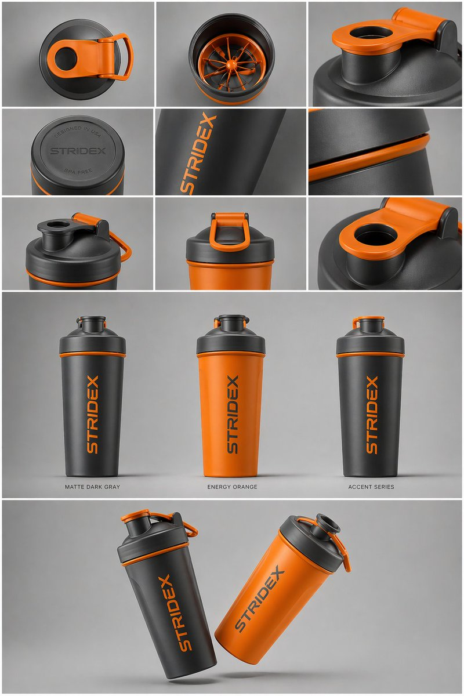

# Industrial Design Presentation Sheet

**中文标题：** 电商主图：工业设计展示页  
**ID:** `gi25-x-019` · **Mode:** `generate`  
**Categories:** `ecommerce`, `poster-typography`  
**Tags:** `x-twitter`, `evolink`, `community`, `gpt-image-2`



### Industrial Design Presentation Sheet

```text
Core Subject: [{argument name="reference" default="use the uploaded image"}, keep the details, typography and structure locked 100%]

Layout & Composition: A {argument name="presentation type" default="professional industrial design presentation sheet"}. The image should be organized into a clean grid system.

Top Row: A 3x3 layout showing top-down flat lay views and close-up macro details of materials.

Middle Section: Three hero shots of the product standing upright in different color ways (Matte Black, Arctic White, and accented variants). The products should be slightly tilted to show depth and form.

Bottom Section: A dynamic "floating" composition featuring two products overlapping at opposing angles to showcase the front and side profiles simultaneously.

Environment & Lighting: Set against a minimalist, neutral studio gray background. Soft top-down lighting with realistic contact shadows. High-end product photography aesthetic.

Style & Finish: Matte textures, clean silhouettes, and sharp edges. Leave designated blank areas on the product surfaces for "Placeholder Branding" and "Graphic Mockups." 4k resolution, Unreal Engine 5 render style, hyper-realistic, clean aesthetic.
```

- **Recommended model:** `gpt-image-2.5-sunburst`
- **Settings:** _(defaults)_
- **Source:** [X/Twitter](https://x.com/ShamsAmin56/status/2047627860752621647) — @ShamsAmin56 (via EvoLinkAI)
- **License note:** CC0-1.0 (EvoLink catalog); original X post — remix with attribution
- **Notes:** Mirrored in EvoLink case 116 (ecommerce.md); original post on X.
