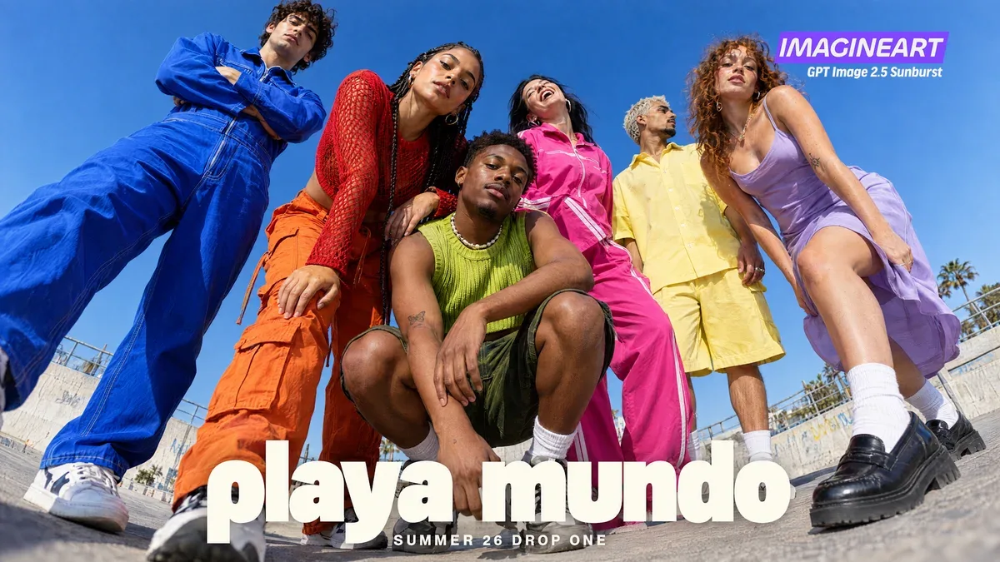

# Dense frame: six-model fashion campaign

**中文标题：** 六人高密度时装广告  
**ID:** `gi25-x-023` · **Mode:** `generate`  
**Categories:** `ecommerce`, `poster-typography`  
**Tags:** `x-twitter`, `community`, `gpt-image-2.5`, `liuyaanng`



### Dense frame: six-model fashion campaign

```text
a fashion campaign for an invented label, shot from a camera on the ground with a 24mm lens tilted fifteen degrees. Six people in electric blue, tomato red, lime green, hot pink, butter yellow and lilac, all posed differently, against plain cobalt sky.
```

- **Recommended model:** `gpt-image-2.5-sunburst`
- **Settings:** _(defaults)_
- **Source:** [X/Twitter](https://x.com/ImagineArt_X/status/2097520459969601977) — @ImagineArt_X (via liuyaanng/awesome-gpt-image-2.5)
- **License note:** Community X post mirrored in awesome-gpt-image-2.5; remix with attribution
- **Notes:** Community X prompt #032 (poster branding) curated in liuyaanng/awesome-gpt-image-2.5 docs/prompts/community-x.md; original on X.
