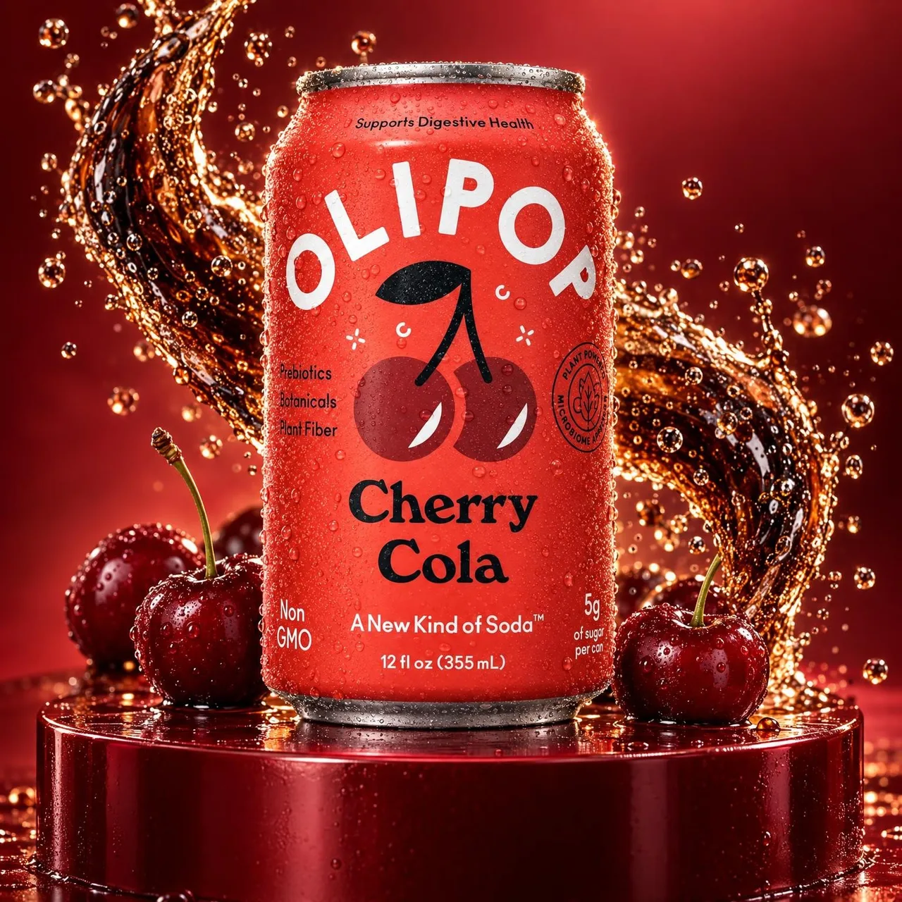

# Packaging-Locked Multi-Campaign Product Shots

**中文标题：** 同包装参考→多套活动产品照：不丢罐面  
**ID:** `gi25-x-163` · **Mode:** `edit`  
**Categories:** `ecommerce`, `edit-change-preserve`  
**Tags:** `x-twitter`, `community`, `gpt-image-2.5`, `xianyu`, `en`



### Packaging-Locked Multi-Campaign Product Shots

```text
Product photography workflow (GPT Image 2.5):
1) Upload a few basic reference photos of the same product packaging (example: OLIPOP Cherry Cola can).
2) Generate several completely different campaign / e-commerce art directions from those refs.
3) Hard constraint: never lose the original packaging — logo, can shape, label text, brand colors stay locked.
4) Deliver multiple polished concepts without a physical reshoot.

Principle: same product, many art directions; packaging identity is must-stay.
```

- **Recommended model:** `gpt-image-2.5-sunburst`
- **Settings:** _(defaults)_
- **Source:** [community](https://x.com/zahra4sure/status/2100572388031156287) — @zahra4sure (via xianyu110/awesome-gpt-image2.5)
- **License note:** Community X post mirrored in xianyu110/awesome-gpt-image2.5; remix with attribution
- **Notes:** xianyu110/awesome-gpt-image2.5 case 2100572388031156287; category=电商改图.
