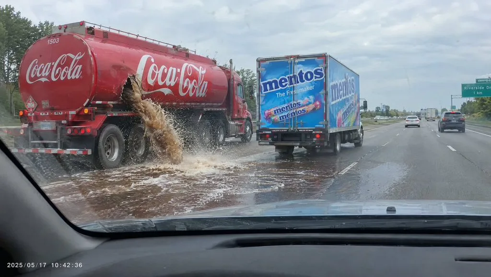

# Cola and Mentos Highway Dashcam

**中文标题：** 可乐与曼妥思高速公路行车记录仪画面  
**ID:** `gi25-x-172` · **Mode:** `generate`  
**Categories:** `ecommerce`  
**Tags:** `x-twitter`, `community`, `gpt-image-2.5`, `seeapi`, `en`



### Cola and Mentos Highway Dashcam

```text
DIRECTIVE:
Produce one still that reads as a real in-car dashcam frame grabbed from a moving car on a highway. Optical dashcam capture, wide windshield view, windshield glass, A-pillar, a slice of dashboard/hood — lived-in dashcam JPEG, not cinema, not HDR.

BEAT / COMPOSITION:
Looking forward through the windshield. On the LEFT side of the road (left lane or left shoulder, clearly in frame): TWO branded trucks close together.

COCA-COLA TRUCK (LEFT, CRITICAL):
A full-size Coca-Cola tanker / delivery truck, official Coca-Cola red livery and logos readable. It has a breakdown: a torn ragged hole in the tank wall. A thick, heavy jet of dark-brown Coca-Cola is blasting out of that hole onto the asphalt — lots of liquid, puddle spreading, foam, spray in the air, wet road shine. The truck is stopped or crawling, hazard situation.

MENTOS TRUCK (BESIDE IT, CRITICAL):
Right next to the Coca-Cola truck (same left cluster, slightly ahead or alongside): a closed box truck / delivery truck with large, unmistakable MENTOS branding on the side (Mentos logo, candy rolls artwork). Rear and side doors CLOSED. No candy spilling. You can clearly read that it is a Mentos truck.

CAMERA PACK:
Fixed dashcam behind the windshield, slight barrel wide, dashboard or hood bottom of frame, windshield dirt/reflections, timestamp overlay optional, daytime road, other traffic farther ahead. Real consumer dashcam still.

LIGHT:
Daylight, overcast or sun, real road color, cola looking like dark soda not black oil.

PHOTOGRAPHIC CHARACTER:
Unstaged dashcam grab — physically grounded trucks, readable brands, the leak is the event.
```

- **Recommended model:** `gpt-image-2.5-sunburst`
- **Settings:** _(defaults)_
- **Source:** [community](https://x.com/ECLIPSEINTEL001/status/2100730298543550674) — @ECLIPSEINTEL001 (via SeeAPI/awesome-gpt-image-2.5-prompts)
- **License note:** Community X post mirrored in SeeAPI/awesome-gpt-image-2.5-prompts; remix with attribution
- **Notes:** SeeAPI P67 (p67-cola-and-mentos-highway-dashcam)
