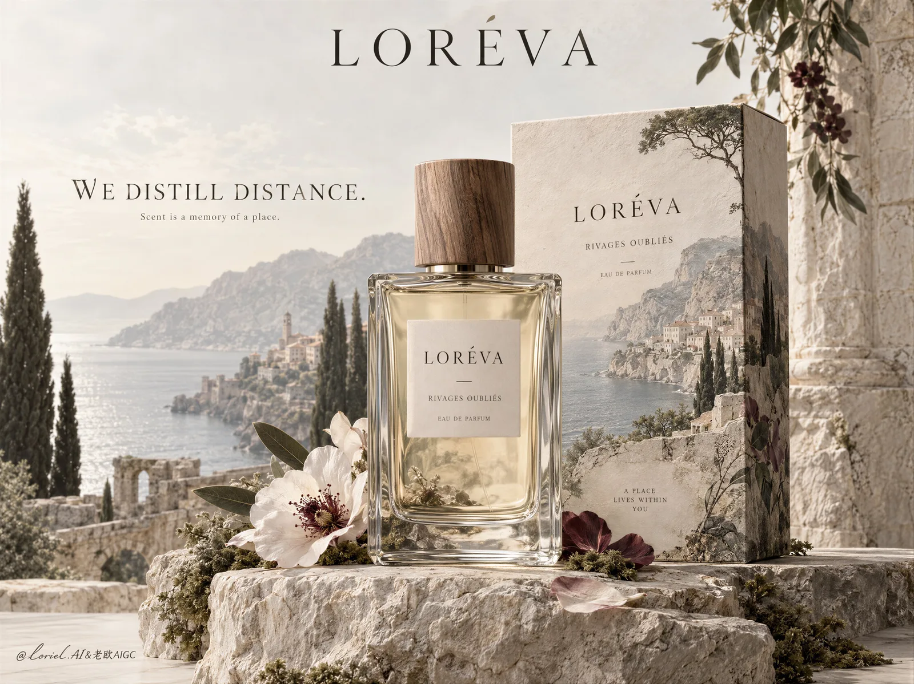

# Loreva Coastal Fragrance Ad

**中文标题：** LORÉVA 海岸香水广告  
**ID:** `gi25-x-180` · **Mode:** `generate`  
**Categories:** `ecommerce`  
**Tags:** `x-twitter`, `community`, `gpt-image-2.5`, `seeapi`, `en`



### Loreva Coastal Fragrance Ad

```text
Create a museum-grade fragrance advertising hero image for a fictional couture perfume house named LORÉVA, designed as a single elevated editorial composition where a real perfume bottle and its packaging become the center of a poetic landscape installation. Preserve the structural intelligence of the reference as pure design logic: one centered rectangular glass perfume bottle in the foreground, one slightly taller packaging box behind it, a sculptural mineral pedestal beneath, and a softly dissolved destination-world unfolding behind and partly through the product. The final image must be more artistic, more restrained, and more luxurious than a conventional fragrance ad, reading like a collectible gallery poster and a high-fashion website hero at the same time.

The product is the absolute hero. The bottle must be photoreal and exquisitely rendered: thick transparent glass walls, elegant proportions, pale luminous fragrance liquid, subtle refraction and reflection, crisp shoulder edges, a warm natural wood cap with visible grain, and a clean label with refined typography. The packaging box behind it must feel like a premium paper object with tactile matte texture and softly weathered printed artwork, extending the same atmospheric landscape language as if the scent’s world lives inside the packaging. The bottle must dominate through clarity, stillness, and material precision, while the box functions as a quiet architectural support.

The concept is that scent contains a place, but the place is rendered as memory rather than illustration. Build a pale, cultured, painterly-photoreal Mediterranean landscape rising behind and around the product: faded coastal mountains, distant shoreline, cypress silhouettes, softened stone villages, mineral air, and restrained botanical traces. This world should feel washed in time, almost like a restored fresco or hand-tinted landscape memory, not a literal travel postcard. The environmental imagery should dissolve gently into the pale background and partially into the box surface, creating an impression that perfume is a vessel for atmosphere, distance, and silence.

At the base, build a sculpted still-life pedestal using pale rock, moss, weathered stone, muted dried stems, one or two softly toned flowers, and delicate translucent petals. These elements must feel curated and minimal, never crowded. The still-life should support the bottle like a fragrance altar rather than decorative styling. Reduce any unnecessary prop abundance and let emptiness play an active role in the composition.

Color hierarchy: 60% parchment ivory, limestone beige, chalk white, and pale mineral paper tones; 20% moss green, cypress green, dry olive, and soft botanical grey-green; 15% muted wine, dusty plum, faded sienna, and floral burgundy accents; 5% clear glass highlights and crisp dark typography. Lighting is soft and intelligent: diffused daylight from the front-left, refined shadow pooling under the glass, subtle highlight lines along bottle edges, a quiet glow through the liquid, and atmospheric depth in the landscape field. Keep contrast low but sophisticated, with volume and separation achieved through material response rather than harsh dramatic lighting.

Typography must be colder, fewer, and more elevated. Place the brand name "LORÉVA" at the top center in a refined high-contrast serif with generous breathing room. On the left open space, place only one statement line in elegant serif capitals: "WE DISTILL DISTANCE." Add one very small supporting line beneath it, brief and intelligent, about scent, memory, and place. Keep all other interface text minimal or nearly absent. Typography should feel like part of a luxury exhibition layout, not a commercial web banner, and must never compete with the bottle.

Material semantics must be explicit and exquisite: thick glass refraction, matte paper carton fibers, natural wood grain, soft stone powder, translucent petal veins, restrained floral depth, and atmospheric landscape pigment softness. The fusion between object and world must feel seamless, as if the fragrance has condensed an entire geography into one vessel. Every element should feel intentional, rarefied, and calm.

Rendering target: photoreal luxury perfume campaign, fine-art still-life precision, editorial sophistication, high-end print finish, product-dominant hierarchy, restrained visual poetry, elegant negative space, and international gallery-level aesthetic.

Structured exclusion constraints: no real fragrance brand names, no copied text, no cluttered florals, no excessive decorative crystals, no distorted bottle geometry, no warped label, no unreadable typography, no random letters, no muddy color, no dirty haze, no busy prop styling, no style drift, no cheap beauty-commerce look, no AI artifacts.
```

- **Recommended model:** `gpt-image-2.5-sunburst`
- **Settings:** _(defaults)_
- **Source:** [community](https://x.com/ou_zhen599/status/2101557541318910089) — @ou_zhen599 (via SeeAPI/awesome-gpt-image-2.5-prompts)
- **License note:** Community X post mirrored in SeeAPI/awesome-gpt-image-2.5-prompts; remix with attribution
- **Notes:** SeeAPI P75 (p75-loreva-coastal-fragrance-ad)
