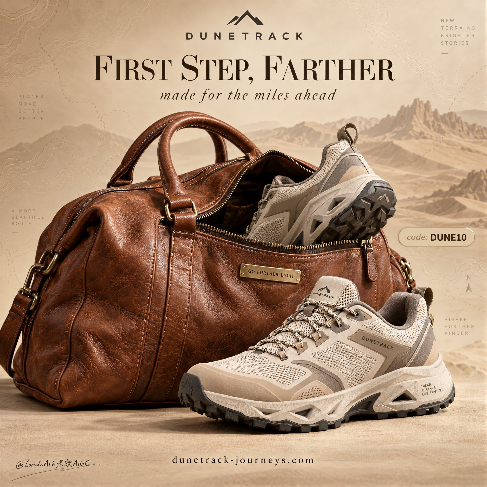

# Sneaker × Travel-Bag Pairing Poster

**中文标题：** 球鞋×旅行袋对位海报：产品别干同一种活  
**ID:** `gi25-x-495` · **Mode:** `generate`  
**Categories:** `ecommerce`, `poster-typography`, `edit-change-preserve`  
**Tags:** `x-twitter`, `community`, `gpt-image-2.5`, `xianyu`, `en`



### Sneaker × Travel-Bag Pairing Poster

```text
A premium commercial poster for a fictional travel-footwear brand called DUNETRACK, designed as a luxury style-advertising image where a real product object and conceptual travel design are deeply fused into one clean, high-impact composition. The hero scene is built around a large caramel-brown full-grain leather duffel bag resting on a seamless warm sand-beige studio surface, slightly angled toward camera, with the zipper opened wide across the front. A pair of premium travel-trail sneakers emerges naturally from the bag as if mid-packing for a refined journey: one shoe fully grounded in the foreground and clearly dominant, the second shoe partially lifted from the bag opening with its heel and outsole visible, creating a confident diagonal rise. The products must remain the absolute visual focus.

Framing and composition: vertical poster layout, centered and stable, eye-level three-quarter product angle, broad negative space in the upper half for brand and editorial typography, clean studio isolation, no clutter. The bag forms the main visual mass on the left and center, the hero shoe anchors the lower right, and the second shoe breaks the bag silhouette to create elegant motion. Integrate a subtle curator-grade environmental abstraction into the backdrop and floor: faint embossed topographic route lines, soft dune-shadow gradients, and barely visible map-like travel contours pressed into the beige background, so the scene feels like luxury travel branding rather than a plain product cutout. These graphic-terrain elements must stay minimal and never compete with the bag or shoes.

Product design: create high-end trail-lifestyle sneakers in a desert-neutral luxury palette, combining warm ivory engineered mesh, sandstone matte rubber guards, soft taupe structural supports, restrained cool-grey branding marks, precision lacing, breathable woven texture, sculpted geometry, and a high-traction outsole with refined angular cutouts. The shoe should feel like a fusion of performance hiking, elevated airport travel, and modern lifestyle design. The leather duffel bag should be rich, supple, naturally creased full-grain leather with hand-finished seams, elegant handle construction, premium stitching, brushed brass hardware, and a small rectangular metal plaque engraved exactly: "GO FURTHER LIGHT".

Lighting and color: soft directional studio key light from upper left, diffused and premium, with controlled highlights across the leather grain, crisp silhouette separation on the hero shoe, soft grounding shadows beneath the bag and outsole, and subtle reflected warmth from the studio floor. Build stronger tonal contrast than a normal e-commerce shot so the bag volume, rubber sole architecture, and mesh material transitions feel sculptural and editorial. Palette balance: 60% sand, camel, and warm beige neutrals; 30% caramel leather, toasted tan, and mineral taupe; 10% cool grey branding and deep charcoal outsole accents. The image must feel warm, refined, expensive, and tactile, with no muddy beige haze or dead black patches.

Materials and finish: hyper-real product photography quality, leather pores, natural wrinkles, premium seam tension, realistic zipper teeth, softly brushed rubber texture, technical mesh weave, precise lace threading, matte-polished metal hardware, embossed map lines in the background, and elegant fine-grain studio retouching. The finish should feel like a Cannes-level campaign for a premium travel-performance label: luxurious, restrained, and highly physical.

Typography: all copy in English only, integrated as premium editorial design. At the top center place the brand mark reading exactly: "DUNETRACK". Below it set a large refined headline reading exactly: "FIRST STEP, FARTHER". Beneath it place a smaller italic subline reading exactly: "made for the miles ahead". Near the right side of the product area place a small rounded badge reading exactly: "code: DUNE10". At the bottom center add the website line reading exactly: "dunetrack-journeys.com". Typography should combine elegant serif and clean modern sans-serif, with soft tonal contrast against the warm background, spacious kerning, and precise luxury alignment. Keep all text away from the main shoe silhouette and key material details.

Output and constraints: polished luxury footwear advertisement, product-first hierarchy, no people, no extra props beyond the duffel bag and shoes, no random travel clutter, no copied existing slogans, no real brand names, no chaotic background graphics. Keep the shoes anatomically correct as products: accurate outsole structure, believable lace paths, consistent left-right pair logic, correct sole thickness, no duplicate soles, no broken mesh panels, no impossible angles, no floating products, no distorted bag geometry, no unreadable text, no muddy beige color cast, no cheap sportswear styling, no overexposed highlights, and no visual drift away from clean premium travel branding.
```

- **Recommended model:** `gpt-image-2.5-sunburst`
- **Settings:** _(defaults)_
- **Source:** [community](https://x.com/ou_zhen599/status/2100485040425832579) — @ou_zhen599 (via xianyu110/awesome-gpt-image2.5)
- **License note:** Community X post mirrored in xianyu110/awesome-gpt-image2.5; remix with attribution
- **Notes:** xianyu110 case 2100485040425832579; category=电商改图
- **Preview:** `previews/gi25-x-495.jpg`
