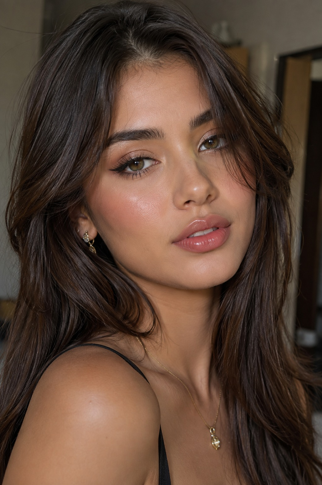

# Selfie to Glossy Designer-Toy Avatar

**中文标题：** 自拍→glossy 设计师玩具头像  
**ID:** `gi25-x-525` · **Mode:** `edit`  
**Categories:** `ecommerce`, `edit-change-preserve`  
**Tags:** `x-twitter`, `community`, `gpt-image-2.5`, `xianyu`, `en`



### Selfie to Glossy Designer-Toy Avatar

```text
@Create image Create a premium glossy 3D "designer toy" render of the subject(s) using the uploaded image as the only reference. Render one floating head per person (no duplication), cropped cleanly below the jaw with a visible neck and full head comfortably framed. Style: high-quality vinyl figure with ultra-smooth, simplified forms, rounded volumes, and strong glossy reflections across key facial areas. Hair should be sculpted, glossy, and stylized, with embedded playful accessories. Include oversized retro wraparound sunglasses with vibrant, matching frame/lens colors. Use strong studio lighting with pronounced highlights. Background: blue sky with soft clouds.
```

- **Recommended model:** `gpt-image-2.5-sunburst`
- **Settings:** _(defaults)_
- **Source:** [community](https://x.com/meAsifAi/status/2100057090332995927) — @meAsifAi (via xianyu110/awesome-gpt-image2.5)
- **License note:** Community X post mirrored in xianyu110/awesome-gpt-image2.5; remix with attribution
- **Notes:** xianyu110 case 2100057090332995927; category=电商改图; verified=True
- **Preview:** `previews/gi25-x-525.jpg`
