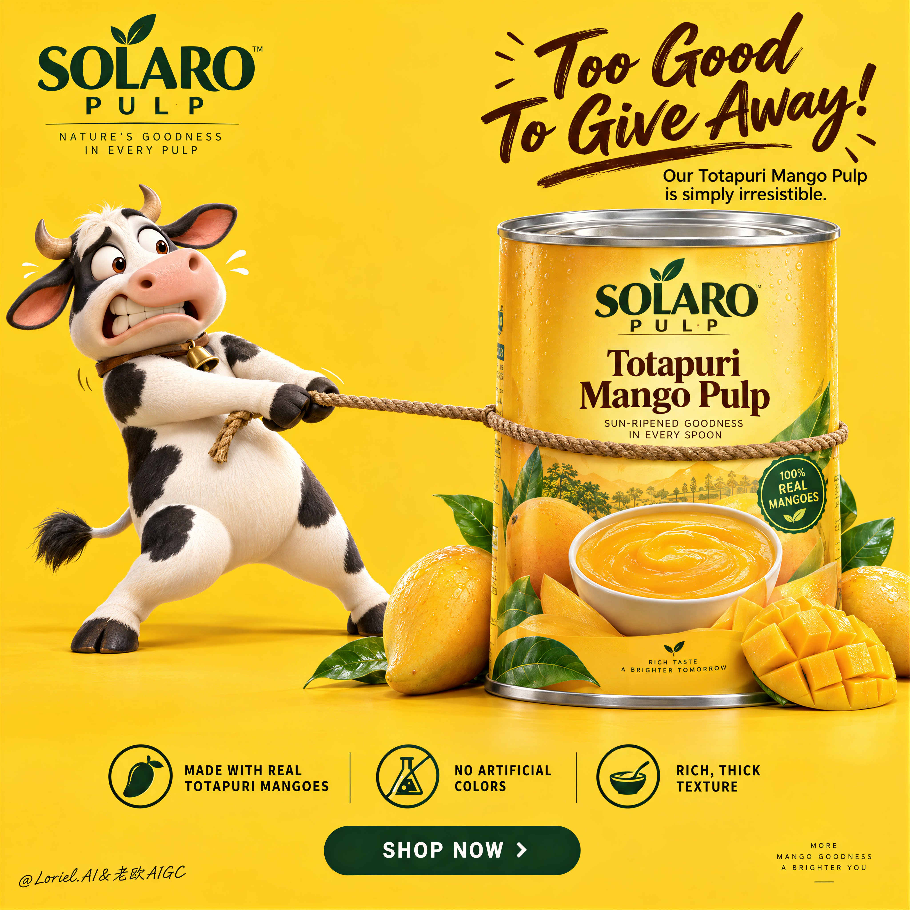

# Mango Can Physics-Gag Poster: The Product Hero a Bull Can't Drag

**中文标题：** 芒果罐物理笑话海报：牛拽不动的产品英雄  
**ID:** `gi25-x-543` · **Mode:** `generate`  
**Categories:** `ecommerce`, `edit-change-preserve`  
**Tags:** `x-twitter`, `community`, `gpt-image-2.5`, `xianyu`, `en`



### Mango Can Physics-Gag Poster: The Product Hero a Bull Can't Drag

```text
Create a Cannes-level ultra-premium mango FMCG advertising poster for a fictional tropical food house called SOLARO PULP, preserving the exact structural logic of a bright high-conversion product campaign while merging narrative humor, forensic packaging realism, and curatorial restraint. The composition is vertical and highly controlled: a saturated full-frame mango-yellow studio background, one expressive 3D dairy-cow mascot on the left pulling a rope with comic desperation, one large premium mango-pulp can dominating the right side, a bold witty headline block in the upper-right quadrant, one clean three-part benefit strip near the bottom, and one centered call-to-action plaque beneath it. The final image must feel playful, memorable, and globally polished, while keeping the can as the unquestioned commercial hero.

Core composition: use a vivid monochrome mango-yellow background with a seamless floor-to-wall studio transition and generous negative space. On the left, place one premium 3D cow mascot standing upright, leaning backward with visible effort while gripping a rope that is tied tightly around the can. The rope creates the main directional tension across the frame, but the can must visually win the struggle through scale, weight, and authority. On the right, position one large front-facing can of mango pulp, cleanly isolated and slightly forward in the composition, surrounded at the base by a small curated cluster of real mangoes, one scored mango cheek, several glossy leaves, and nothing more. Keep the frame open, breathable, and conversion-driven.

Orbit atmosphere: the emotional hook should feel like the product is so rich and irresistible that even the farm mascot refuses to let it go. The humor must feel brand-smart, not childish. The mascot’s expression should communicate eager panic, possessiveness, and comic frustration, while the product remains calm, solid, and desirable. The poster should create instant recall through one simple story: desire meets abundance, and the can becomes the source of the joke. The mood is bright, cheerful, and high-confidence, but still clean enough to feel premium.

Transit realism: render every material with world-class FMCG precision. The can must show accurate cylindrical geometry, crisp top-lid metal reflections, subtle rolled-edge seams, flawless label registration, believable print contrast, and premium finish. The label should contain only elegant built-in branding such as “SOLARO PULP” and the product name “Totapuri Mango Pulp,” supported by a realistic mango visual and a bowl of dense puree. The mangoes at the base must show taut skin gloss, ripe yellow-orange gradients, natural dimples, juicy fiber in the cut fruit, and fresh green leaves with visible veins. The rope should show twisted fiber detail, tension compression where it presses into the can, and believable contact with the mascot’s hooves. The mascot must carry smooth premium 3D surfacing, soft matte-to-satin shading, correct hoof anatomy, natural limb articulation, subtle skin/fur transition, and expressive but clean facial sculpting with no animation slop.

Port restraint: simplify the campaign into a more gallery-like FMCG statement. Remove extra decorative fruit clutter, excessive footer information, and unnecessary small promotional noise. Keep only the logo block, the upper-right witty headline, the left mascot, the right hero can, one restrained fruit cluster, the bottom benefit strip, and the CTA plaque. Let the yellow field, the rope tension, and the can scale create the luxury. The frame should feel edited, intelligent, and immediately readable.

Mascot design: create a lovable premium-cartoon dairy cow with rounded proportions, black-and-white patches, small horns, expressive wide eyes, a slightly open mouth, lifted brows, and a tense pulling posture. The character should feel physically grounded, with believable weight shift through the legs, stretched arms or forelimbs gripping the rope, and clear contact shadows. The cow is a narrative device, not the hero product. It supports the brand story but never steals dominance from the can.

Typography and message layout: in the upper-left corner, place one compact brand block for SOLARO PULP. In the upper-right quadrant, place a large playful English headline such as “Too Good To Give Away” or “So Rich, Nobody Wants To Share,” with one short supporting line beneath it describing the richness of Totapuri mango pulp. The main phrase can be rendered in expressive brush-script or lively premium handwriting, while the secondary line uses a clean modern sans-serif. Typography must feel art-directed, witty, and compositionally integrated, not generic or overly retail.

Bottom information architecture: near the bottom, include one clean three-part benefits band with elegant icons and concise copy such as “Made with real Totapuri mangoes,” “No artificial colors,” and “Rich, thick texture.” Beneath it, place one centered rounded CTA plaque such as “SHOP NOW” or “TASTE THE GOLD.” Keep the band crisp, symmetrical, and highly legible, but avoid a noisy marketplace-flyer feel. If a tiny footer exists, it should be minimal and peripheral.

Lighting: use bright premium studio lighting with soft frontal clarity and subtle upper-left shaping. The yellow background must remain luminous and even, without dirty gradients. The can should receive the cleanest highlight structure, with crisp label readability and controlled metallic sheen on the lid. The mascot should have smooth dimensional modeling and soft contact shadows. The mangoes should catch small glossy highlights and juicy speculars. Keep the image cheerful and dimensional, but never harsh or cluttered.

Color hierarchy: 60% saturated mango yellow and warm golden-orange tones; 30% black, white, deep brown, and warm neutral accents from the mascot, rope, and label typography; 10% green leaf accents and silver metallic can-top highlights. The palette must feel fruity, bright, trustworthy, and internationally premium.

Design intent: the final poster must preserve the exact impact logic of the reference structure—full yellow background, left-side mascot action, right-side hero can, upper-right witty text block, bottom benefits strip, and centered CTA—while merging Orbit narrative charm, Transit material realism, and Port curatorial restraint into one resolved luxury FMCG campaign. The humor creates memorability, but the product remains the true visual and commercial center.

Rendering style: ultra-polished FMCG advertising, premium 3D mascot branding, bright studio product poster, clean global retail campaign, high-end packaging realism, appetizing fruit detail, elegant graphic hierarchy, world-class commercial retouching, immaculate print-ready finish.

Negative prompt: copied source text, real brand names, low-detail mascot, creepy cow face, malformed limbs, bad hoof anatomy, unreadable label, cheap flyer styling, muddy yellow background, warped can geometry, fake mango texture, cluttered footer, poor typography spacing, flat lighting, black blotches, watermark
```

- **Recommended model:** `gpt-image-2.5-sunburst`
- **Settings:** _(defaults)_
- **Source:** [community](https://x.com/ou_zhen599/status/2099500411455721969) — @ou_zhen599 (via xianyu110/awesome-gpt-image2.5)
- **License note:** Community X post mirrored in xianyu110/awesome-gpt-image2.5; remix with attribution
- **Notes:** xianyu110 case 2099500411455721969; category=电商改图; verified=True
- **Preview:** `previews/gi25-x-543.jpg`
