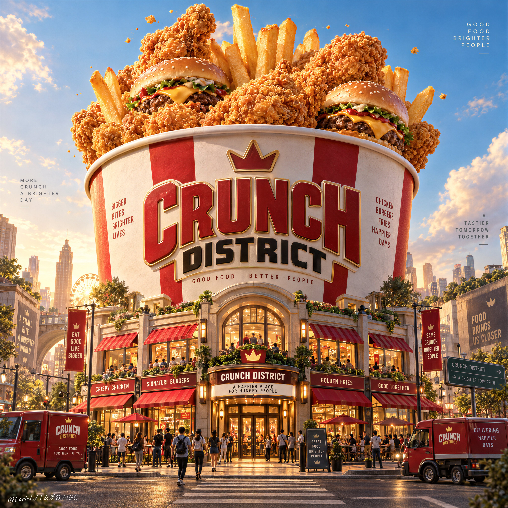

# Giant Bucket City Poster: Scale Illusion Pinned by Miniature Streets

**中文标题：** 巨桶城市海报：尺度幻觉靠微型街区钉死  
**ID:** `gi25-x-544` · **Mode:** `generate`  
**Categories:** `ecommerce`, `edit-change-preserve`  
**Tags:** `x-twitter`, `community`, `gpt-image-2.5`, `xianyu`, `en`



### Giant Bucket City Poster: Scale Illusion Pinned by Miniature Streets

```text
Create a Cannes-level ultra-premium fast-food advertising poster for a fictional brand called CRUNCH DISTRICT, preserving the exact structural logic of a monumental bucket-city campaign while merging narrative spectacle, forensic food realism, and curatorial restraint into one resolved image. The composition is vertical and cinematic: one colossal fried-chicken bucket rises in the center like an urban landmark, overflowing with hero fast-food items, while its lower structure transforms into a compact branded street district with storefronts, awnings, food kiosks, tiny pedestrians, and a few parked delivery vehicles. The image must feel like an entire city built around appetite, yet remain clean, disciplined, and unmistakably product-led.

Core composition: use a low street-level perspective looking slightly upward so the bucket dominates the skyline from lower frame to upper-middle frame. The giant bucket must be perfectly centered and visually stable, with premium dimensional branding integrated on the front as the main architectural identity mark, such as “CRUNCH DISTRICT”. From the bucket opening, let oversized fried chicken pieces, upright fries, and a small number of burgers emerge like a celebratory edible skyline. Keep the upper sky open and breathable, with only a few sculptural cloud forms and a sparse scattering of tiny crumbs or coating particles. The bucket remains the unquestioned hero; the surrounding city only reinforces its myth.

Orbit atmosphere: the poster should feel like a legendary fast-food district at the height of its golden-hour energy, as if the city has gathered around a sacred monument of crunch. The streets below suggest excitement, gathering, and ritual, but not chaos. Tiny figures, storefront lights, and food trucks create the emotional impression of a living destination, while the oversized foods above feel like a dream of abundance made real. The tone should be joyful, larger-than-life, and cinematic, yet mature enough to feel like an international award-winning campaign rather than a theme-park illustration.

Transit realism: render every food and architectural surface with commercial-grade precision. The fried chicken must show layered craggy crust, realistic breading granules, warm oil-sheen glints, crackled edges, and dense golden-orange browning with deeper amber shadows in the creases. The fries should stand upright with believable rigidity, lightly salted surfaces, faint blistering, and clear potato structure. The burgers should show soft glossy buns, seared patties, clean cheese melt, and minimal but readable fillings. The bucket itself must feel like premium printed packaging at enormous scale, with crisp label edges, subtle paperboard texture, smooth curvature, and believable structural volume. The street-level district must carry refined storefront materials, striped awnings, glass reflections, painted trims, asphalt texture, signage relief, and small vehicle detail that all feel physically grounded.

Port restraint: simplify the visual system so the grandeur feels curated rather than overloaded. Keep only the giant bucket, a select number of floating hero foods, a handful of cloud shapes, a compact but rich architectural base, and a few sparse atmospheric crumbs. Reduce excessive signage, over-busy urban clutter, and random decorative elements. Let the contrast between monumental object and miniature city create the intelligence of the composition. The poster should feel more like a luxury exhibition image for fast food culture than a noisy retail ad.

Street-district design: build the base of the bucket into an elegant branded neighborhood with 4–6 visible storefront fronts, a central entrance, a few lit windows, one or two delivery vans, and a controlled number of tiny pedestrians interacting naturally in the street. Include a crosswalk or narrow roadway in the foreground to ground the viewer in the city scale. The small architecture should feel lively and precise, but still secondary to the giant bucket and hero foods above.

Lighting: use high-end warm daylight with slight golden-hour character. The upper food elements catch the brightest sunlight, creating premium highlights on chicken crust, fry edges, and burger buns. The bucket surface should carry soft sculptural shading and subtle frontal readability. At street level, introduce slightly warmer reflected light and refined storefront glows to deepen the sense of place. Keep shadows rich but never muddy, and avoid dead black areas.

Material and texture: emphasize crunchy crust topography, fry salt crystals, burger bun gloss, soft paperboard bucket finish, sign lettering depth, glass storefront reflections, painted architectural trims, tiny street objects, and subtle atmospheric dust. Every material must feel photographically plausible and luxuriously retouched.

Color hierarchy: 60% fried-gold, creamy bucket white, and luminous sky blue; 30% ketchup red, warm caramel browns, and urban neutral shadows; 10% green, teal, and sign-light accents in tiny controlled touches. The palette must feel appetizing, festive, and internationally premium.

Design intent: the final poster must preserve the exact impact logic of a giant central bucket monument, overflowing hero food, a miniature branded city at its base, and a clean sky-framed vertical composition, while merging Orbit atmosphere, Transit realism, and Port curatorial restraint into one complete fast-food myth image. The bucket is the city, the city is the brand, and the brand is the appetite.

Rendering style: ultra-photoreal luxury fast-food advertising, cinematic branded food-world architecture, premium packaging monument, highly detailed miniature urban district, world-class commercial retouching, clean graphic hierarchy, appetizing hero-food realism, print-ready finish.

Negative prompt: copied source text, real brand names, cartoon food, plastic-looking chicken, low-detail fries, cheap burger styling, cluttered signage, unreadable main logo, warped bucket geometry, muddy colors, distorted street perspective, excessive crumbs, chaotic crowds, dirty shadows, black blotches, watermark
```

- **Recommended model:** `gpt-image-2.5-sunburst`
- **Settings:** _(defaults)_
- **Source:** [community](https://x.com/ou_zhen599/status/2099489998882177205) — @ou_zhen599 (via xianyu110/awesome-gpt-image2.5)
- **License note:** Community X post mirrored in xianyu110/awesome-gpt-image2.5; remix with attribution
- **Notes:** xianyu110 case 2099489998882177205; category=电商改图; verified=True
- **Preview:** `previews/gi25-x-544.jpg`
