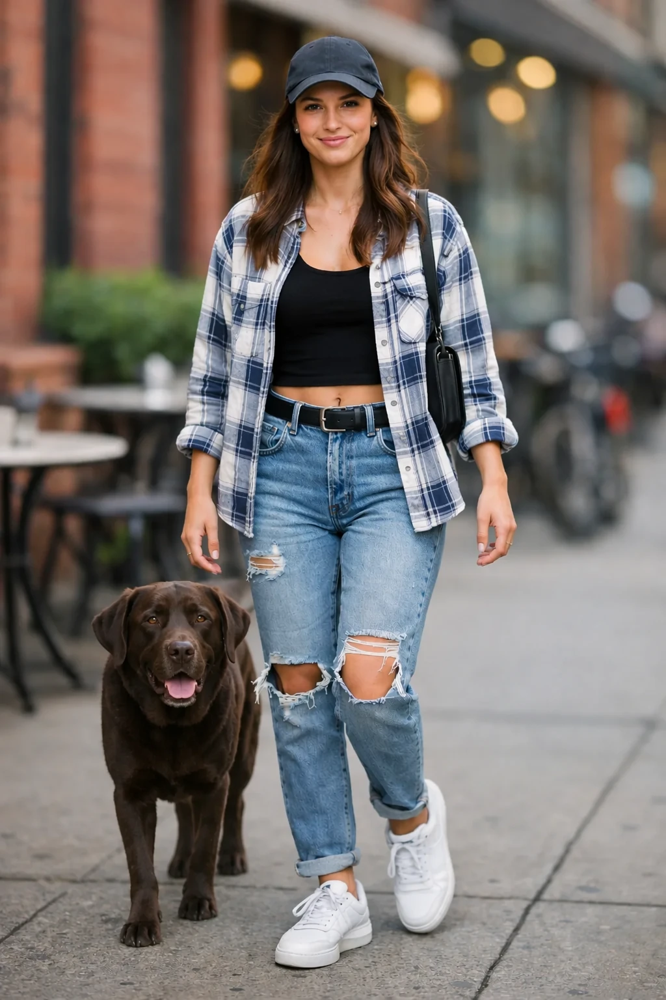

# Composite dog into scene next to woman

**中文标题：** 多图合成：狗放入场景  
**ID:** `gi25-edit-004` · **Mode:** `multi_ref`  
**Categories:** `edit-change-preserve`  
**Tags:** `compositing`, `openai-official`  




### Composite dog into scene next to woman

```text
Place the dog from the second image into the setting of image 1, right next to the woman, use the same style of lighting, composition and background. Do not change anything else.
```

- **Recommended model:** `either`
- **Settings:** `quality=medium`, `size=1024x1536`
- **Source:** [OpenAI Image prompting](https://developers.openai.com/api/docs/guides/image-prompting) — OpenAI
- **License note:** OpenAI docs examples
