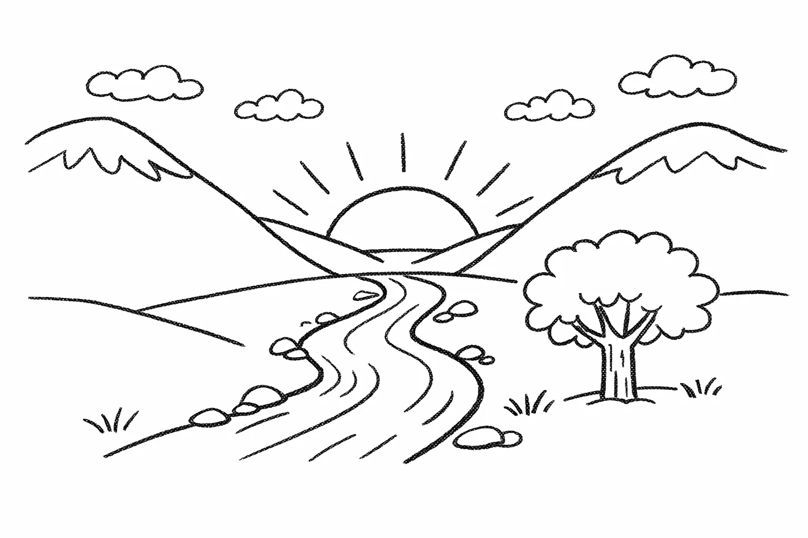
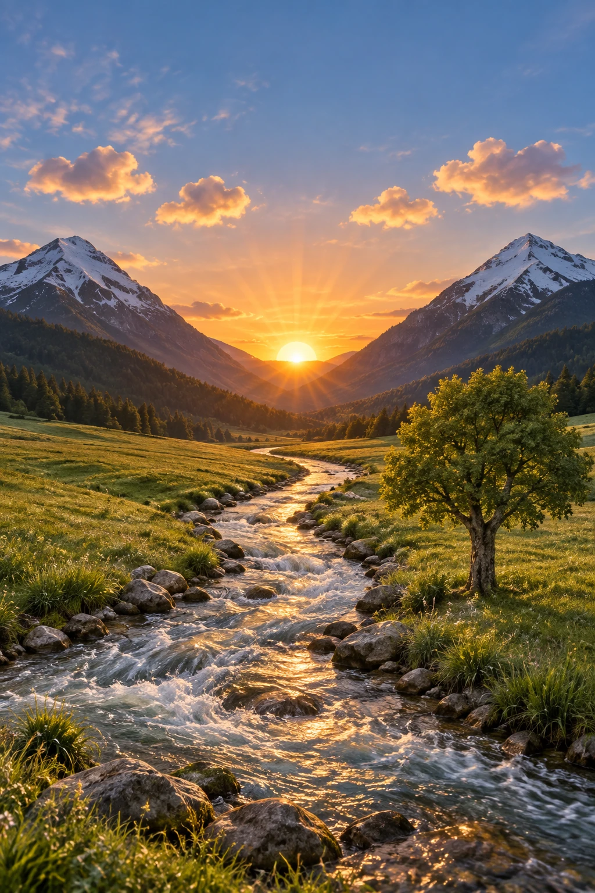

# Drawing to photoreal preserve layout

**中文标题：** 手绘转写实：锁定构图  
**ID:** `gi25-edit-005` · **Mode:** `edit`  
**Categories:** `edit-change-preserve`  
**Tags:** `sketch-to-photo`, `openai-official`  




### Drawing to photoreal preserve layout

```text
Turn this drawing into a photorealistic image.
Preserve the exact layout, proportions, and perspective.
Choose realistic materials and lighting consistent with the sketch intent.
Do not add new elements or text.
```

- **Recommended model:** `either`
- **Settings:** `quality=medium`, `size=1024x1536`
- **Source:** [OpenAI Image prompting](https://developers.openai.com/api/docs/guides/image-prompting) — OpenAI
- **License note:** OpenAI docs examples
