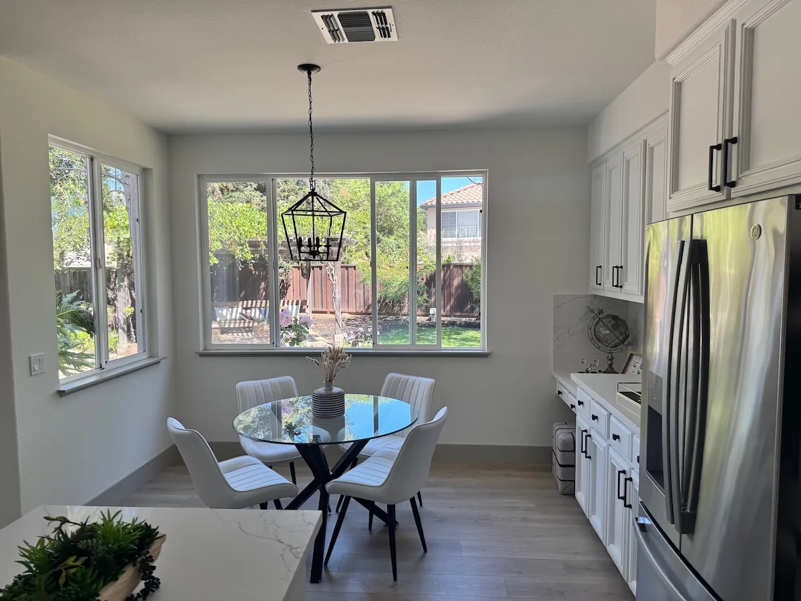

# Replace white chairs with wood chairs

**中文标题：** 室内家具替换：白椅改木椅  
**ID:** `gi25-edit-009` · **Mode:** `edit`  
**Categories:** `edit-change-preserve`  
**Tags:** `interior`, `object-swap`, `openai-official`  




### Replace white chairs with wood chairs

```text
In this room photo, replace ONLY the white chairs with chairs made of wood.
Preserve camera angle, room lighting, floor shadows, and surrounding objects.
Keep all other aspects of the image unchanged.
Photorealistic contact shadows and fabric texture.
```

- **Recommended model:** `either`
- **Settings:** `quality=medium`, `size=1536x1024`
- **Source:** [OpenAI Image prompting](https://developers.openai.com/api/docs/guides/image-prompting) — OpenAI
- **License note:** OpenAI docs examples
