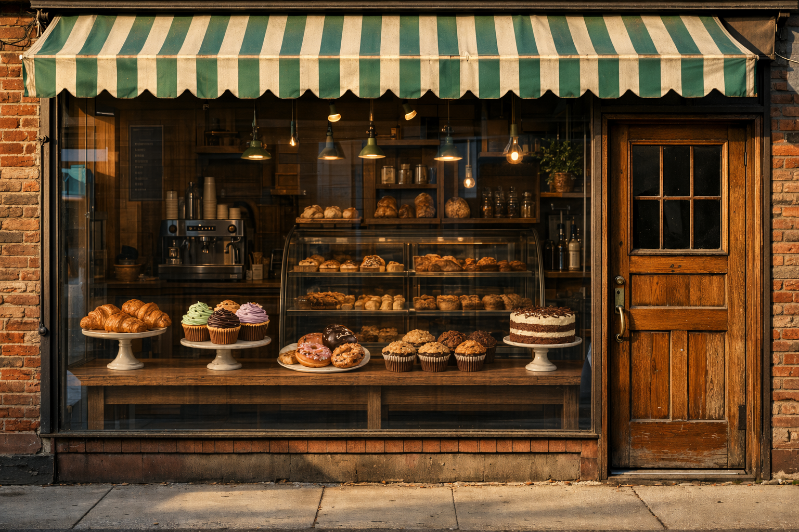

# Remove storefront posters preserve architecture

**中文标题：** 清除橱窗海报保留建筑  
**ID:** `gi25-edit-010` · **Mode:** `edit`  
**Categories:** `edit-change-preserve`  
**Tags:** `cleanup`, `preserve-list`, `fal`  



### Remove storefront posters preserve architecture

```text
Remove every advertising sign and poster from the shop windows in this storefront
photograph. Preserve the awning, the brick facade, the mullions, the window
reflections, the sidewalk, and every person on the sidewalk exactly. Reconstruct
the glass naturally: clean reflections of the street, no ghosting of the removed
posters, no leftover adhesive marks, no logo drift. Match the original lighting,
white balance, and film grain. No watermark.
```

- **Recommended model:** `gpt-image-2.5-sunburst`
- **Settings:** `quality=high`
- **Source:** [Vendor blog](https://fal.ai/learn/tools/prompting-gpt-image-2) — Ilker Izgi / fal
- **License note:** fal blog examples; adapt for 2.5
