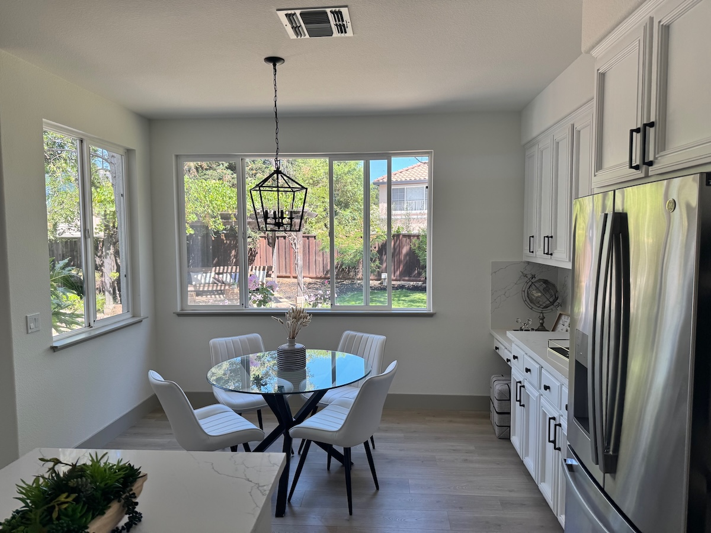
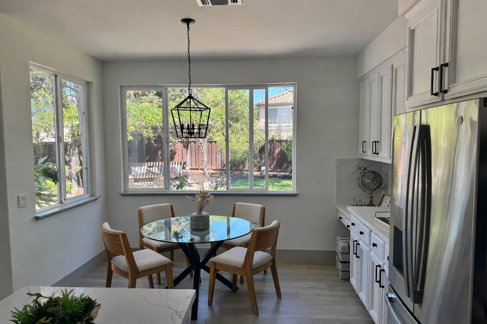

# Interior oak chair swap

**中文标题：** 室内橡木椅替换  
**ID:** `gi25-edit-012` · **Mode:** `edit`  
**Categories:** `edit-change-preserve`  
**Tags:** `interior`, `object-swap`, `fal`  




### Interior oak chair swap

```text
Replace only the white dining chairs in this room with natural oak wooden chairs.
Preserve the camera angle, table shape, window light, floor shadows,
reflections on the table, cabinet geometry, refrigerator reflections,
and all surrounding objects.
Keep the room otherwise unchanged.
Photorealistic contact shadows and believable wood grain.
```

- **Recommended model:** `either`
- **Settings:** _(defaults)_
- **Source:** [Vendor blog](https://fal.ai/learn/tools/prompting-gpt-image-2) — Ilker Izgi / fal
- **License note:** fal blog examples; adapt for 2.5
