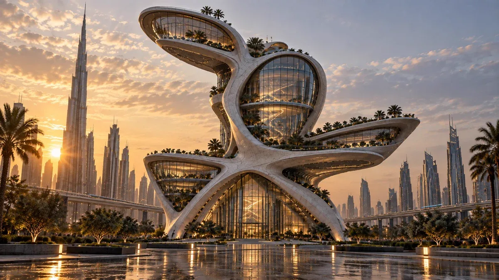

# Turn a sketch into futuristic architecture

**中文标题：** 草图变成未来建筑  
**ID:** `gi25-x-063` · **Mode:** `edit`  
**Categories:** `edit-change-preserve`  
**Tags:** `x-twitter`, `community`, `gpt-image-2.5`, `liuyaanng`, `edit-pattern`, `minimal`



### Turn a sketch into futuristic architecture

```text
turn it into a future building
```

- **Recommended model:** `either`
- **Settings:** _(defaults)_
- **Source:** [X/Twitter](https://x.com/peter6759/status/2097503664789430530) — @peter6759 (via liuyaanng/awesome-gpt-image-2.5)
- **License note:** Community X post mirrored in awesome-gpt-image-2.5; remix with attribution
- **Notes:** Community X prompt #039 (image editing) curated in liuyaanng/awesome-gpt-image-2.5; same thread may hold multiple prompts; original on X.
