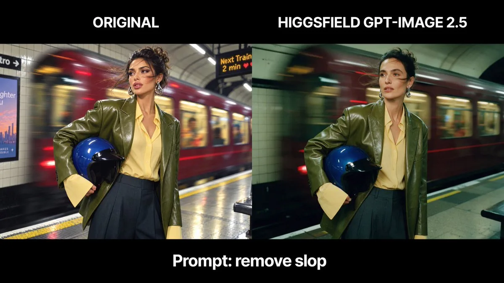

# Remove obvious AI artifacts

**中文标题：** 去除明显 AI 痕迹  
**ID:** `gi25-x-076` · **Mode:** `edit`  
**Categories:** `edit-change-preserve`  
**Tags:** `x-twitter`, `community`, `gpt-image-2.5`, `liuyaanng`, `edit-pattern`, `minimal`



### Remove obvious AI artifacts

```text
remove slop
```

- **Recommended model:** `gpt-image-2.5-flare`
- **Settings:** _(defaults)_
- **Source:** [X/Twitter](https://x.com/higgsfield_ai/status/2097556101155955113) — @higgsfield_ai (via liuyaanng/awesome-gpt-image-2.5)
- **License note:** Community X post mirrored in awesome-gpt-image-2.5; remix with attribution
- **Notes:** Community X prompt #017 (image editing) curated in liuyaanng/awesome-gpt-image-2.5; verified short edit instruction from the original X post; original on X.
