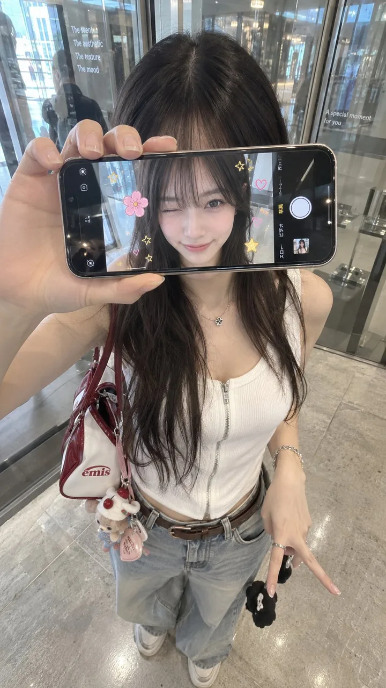

# Phone-Screen Frame Portrait

**中文标题：** 手机屏幕框中框人像  
**ID:** `gi25-x-159` · **Mode:** `edit`  
**Categories:** `edit-change-preserve`, `character-consistency`  
**Tags:** `x-twitter`, `community`, `gpt-image-2.5`, `phimaker`, `en`



### Phone-Screen Frame Portrait

```text
Ultra-realistic iPhone creative portrait, identity preserved exactly from reference image.  Young woman standing indoors in front of a glass storefront or reflective wall, photographed from a slightly high front angle. She holds a smartphone horizontally directly in front of her face, covering her eyes and upper face in real life. The phone screen faces the camera and clearly shows a live camera/photo view of her face.  Composition: The real woman is visible behind the phone, but her face is mostly hidden by the horizontal phone. On the phone screen, her face appears clearly centered, smiling softly and winking. The phone acts like a frame within the frame. Her hand grips the top edge of the phone, fingers visible across the top.  Pose: One hand holds the phone horizontally across her face. Her other hand is lower near her waist making a peace sign or casual gesture. She stands relaxed, facing camera.  Outfit: White fitted zip-front sleeveless top, loose light-wash baggy jeans, brown belt, playful accessories, rings, bracelet, red-and-white shoulder bag, small plush/keychain accessories hanging from bag or belt.  Phone screen details: The phone screen shows a clean live-camera image of her face with a wink and soft smile. Add cute sticker-style doodles around the screen/photo area: small colorful sparkles, stars, flower sticker near the face. The stickers should look like playful phone-camera decoration, not random floating objects.  Environment: Indoor mall/storefront area with glass doors, reflections, polished floor, soft daylight mixed with indoor light, casual streetwear snapshot vibe.  Camera + lighting: 0.5x iPhone wide-angle photo, close candid framing, realistic reflections on glass and phone screen, slight distortion on hands, raw social-media feel.  Important: Match the phone-covering-face composition, horizontal phone screen showing her face, wink expression on screen, hand gripping phone, playful stickers, white zip top, baggy jeans, accessories, and indoor glass background closely.  Natural skin texture, realistic screen reflections, no beauty filter, no smoothing. 4K vertical 9:16.
```

- **Recommended model:** `gpt-image-2.5-sunburst`
- **Settings:** _(defaults)_
- **Source:** [community](https://x.com/AI__TSUBAKI/status/2097448516322988041) — @AI__TSUBAKI (via PhiMaker5/awesome-gpt-image-2.5-prompts)
- **License note:** Community X post mirrored in PhiMaker5/awesome-gpt-image-2.5-prompts; remix with attribution
- **Notes:** PhiMaker id=122; published 2026-09-08; source_verified=True.
