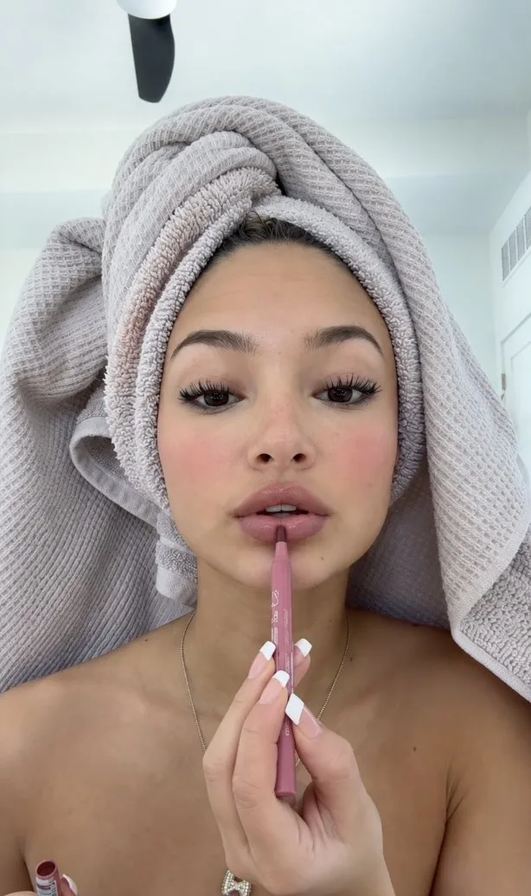

# Towel-Wrapped Makeup Frame Reconstruction

**中文标题：** 包毛巾上妆视频画面重建  
**ID:** `gi25-x-173` · **Mode:** `edit`  
**Categories:** `edit-change-preserve`, `character-consistency`  
**Tags:** `x-twitter`, `community`, `gpt-image-2.5`, `seeapi`, `en`



### Towel-Wrapped Makeup Frame Reconstruction

```text
{
  "prompt_type": "photorealistic_image_reconstruction",
  "objective": "Recreate the supplied reference image as closely as possible while completely removing and ignoring all on-screen text, playback controls, progress bars, icons, timestamps, and other video UI elements. Preserve the underlying photographic scene, subject, pose, facial expression, styling, lighting, environment, framing, proportions, and material textures.",
  "reference_priority": {
    "overall_composition": "extremely high",
    "subject_placement": "extremely high",
    "facial_structure": "extremely high",
    "towel_shape_and_texture": "extremely high",
    "hand_position": "extremely high",
    "lip_pencil_position": "extremely high",
    "lighting": "extremely high",
    "background_geometry": "high",
    "color_palette": "high",
    "micro_texture": "high",
    "ui_elements": "ignore_completely"
  },
  "canvas": {
    "orientation": "portrait",
    "aspect_ratio": "approximately 704:1130",
    "framing": "vertical smartphone-camera composition",
    "crop": "tight close-up extending from the top of the towel/head-wrap to the upper chest and shoulders",
    "edge_behavior": {
      "left_edge": "narrow black vertical border visible outside the main portrait area",
      "right_edge": "very narrow dark/black edge outside the main portrait area",
      "top_edge": "small amount of pale background above the towel",
      "bottom_edge": "cropped at the upper torso/chest area"
    },
    "important": "Do not reproduce any screenshot controls, text, icons, timestamps, progress indicators, or playback buttons."
  },
  "scene_description": {
    "setting": "bright, minimalist, modern bathroom or clean dressing-room interior",
    "visual_mood": "soft, intimate, casual beauty-routine selfie",
    "time_of_day": "daytime or bright daylight-balanced interior",
    "overall_style": "authentic modern smartphone beauty video frame, highly photorealistic, softly beauty-filtered but still natural",
    "environmental_complexity": "minimal and uncluttered",
    "background_focus": "soft and slightly out of focus compared with the woman's face"
  },
  "subject": {
    "person": {
      "description": "adult woman",
      "pose": "facing directly toward the camera in a relaxed seated or reclined position",
      "orientation": "frontal portrait",
      "head_alignment": "centered with minimal natural tilt",
      "body_visibility": "head, neck, shoulders, upper chest, and one or both hands visible",
      "expression": "calm, relaxed, subtly pouty, neutral-to-soft beauty-tutorial expression",
      "gaze": "looking toward the camera"
    },
    "skin": {
      "base_tone": "light-to-medium warm beige with a soft golden undertone",
      "texture": "very smooth and evenly toned, consistent with a subtle social-media beauty filter",
      "finish": "soft luminous skin with gentle natural highlights",
      "blemishes": "minimal",
      "pores": "subtle and softened rather than highly detailed",
      "blush": "visible diffuse rosy-pink blush on the apples of both cheeks",
      "undertone": "warm and healthy",
      "contrast": "low-to-moderate"
    },
    "face": {
      "shape": "soft oval face",
      "forehead": "smooth and moderately broad",
      "cheeks": "full, softly rounded cheeks",
      "jaw": "softly tapered jawline",
      "chin": "small, rounded chin",
      "symmetry": "natural high facial symmetry",
      "proportions": "delicate youthful-looking facial proportions"
    },
    "eyes": {
      "shape": "large almond-shaped eyes",
      "color": "deep dark brown",
      "orientation": "frontal and directed toward the camera",
      "upper_lashes": {
        "length": "very long",
        "density": "high",
        "curl": "strong upward curl",
        "appearance": "clearly enhanced beauty-makeup eyelashes"
      },
      "lower_lashes": "subtle and less pronounced",
      "eyelids": "softly defined",
      "eye_makeup": "minimal dark definition around the lash line",
      "under_eye": "smooth, softly brightened, no strong dark circles",
      "catchlights": "subtle soft light reflections"
    },
    "eyebrows": {
      "shape": "full, gently arched brows",
      "color": "dark brown",
      "density": "medium-full",
      "styling": "cleanly groomed but natural",
      "texture": "soft individual hair detail"
    },
    "nose": {
      "shape": "small delicate nose",
      "bridge": "smooth and softly defined",
      "tip": "rounded and subtle",
      "lighting": "gentle highlight along bridge and tip",
      "contour": "very subtle natural contour"
    },
    "lips": {
      "shape": "full, plush lips",
      "upper_lip": "defined cupid's bow",
      "lower_lip": "fuller and rounded",
      "position": "slightly parted and gently pursed",
      "color": "muted rosy mauve nude",
      "finish": "soft satin with slight natural gloss",
      "makeup": "subtle lip liner and muted pink-nude color",
      "action": "lip liner is being applied directly to the center/lower portion of the lips"
    }
  },
  "hair": {
    "visibility": "hair is almost entirely concealed",
    "style": "hair wrapped completely inside a large towel turban",
    "visible_hair": "only a very small amount, if any, near the forehead/hairline",
    "instruction": "Do not expose long loose hair around the shoulders."
  },
  "head_towel": {
    "type": "large bath towel wrapped into a voluminous turban",
    "material": "thick woven cotton with pronounced waffle-knit texture",
    "primary_color": "warm pale gray-beige / greige",
    "texture": {
      "pattern": "fine repeating square/waffle weave",
      "definition": "clearly visible but softened by smartphone-camera processing",
      "surface": "matte and absorbent cotton"
    },
    "structure": {
      "top": "large rounded layered folds piled above the head",
      "front": "thick rolled edge framing the forehead",
      "left_side": "large outward-folding towel mass extending behind the left side of the head",
      "right_side": "longer towel section falling downward along the right side of the face and shoulder",
      "rear": "substantial layered towel volume behind the head",
      "folds": "multiple overlapping organic folds and twisted layers",
      "silhouette": "wide, rounded, oversized towel silhouette surrounding the upper head"
    },
    "color_variation": "subtle tonal differences between overlapping folds, with slightly pink-beige and cool-gray variations",
    "lighting_response": "soft highlights on raised waffle ridges and gentle shadows inside folds"
  },
  "secondary_towel_or_fabric": {
    "description": "additional soft gray towel-like fabric visible around the sides/back of the head and behind the shoulders",
    "material": "plush absorbent terry or textured cotton",
    "color": "light neutral gray",
    "purpose": "adds layered towel volume around the head"
  },
  "hands": {
    "visibility": "hands prominently visible in the lower-center foreground",
    "skin_tone": "matching the warm beige/golden complexion of the subject",
    "position": "one hand or both hands hold the cosmetic pencil vertically in front of the mouth",
    "gesture": "delicate precision beauty-makeup application",
    "fingers": {
      "shape": "slender feminine fingers",
      "pose": "relaxed but controlled around the pencil",
      "anatomy": "natural human finger proportions",
      "instruction": "No extra fingers, merged fingers, distorted joints, or malformed hands."
    },
    "nails": {
      "length": "medium-long",
      "shape": "soft square / squared-off",
      "color": "opaque clean white",
      "finish": "smooth glossy manicure",
      "detail": "subtle specular reflections on nail surfaces"
    }
  },
  "cosmetic_pencil": {
    "type": "slim lip-liner pencil",
    "position": "almost perfectly vertical, extending upward from the lower center of the image toward the lips",
    "tip_location": "touching or nearly touching the center/lower lip",
    "body_color": "dusty rose, muted pink, mauve-pink",
    "finish": "matte to satin",
    "shape": "slender cylindrical cosmetic pencil",
    "visible_length": "substantial section extends downward into the hand",
    "branding": "small indistinct light-colored cosmetic markings may appear on the body, but no readable text",
    "interaction": "actively outlining or applying color to the lower lip"
  },
  "jewelry": {
    "necklace": {
      "type": "very thin delicate chain",
      "color": "silver or pale metallic",
      "placement": "around the neck and partially visible over the upper chest",
      "pendant": {
        "description": "small delicate metallic charm",
        "shape": "compact rounded or letter-like charm",
        "position": "centered low on the visible neck/chest area",
        "appearance": "bright metallic highlights with slight sparkle"
      }
    }
  },
  "upper_body": {
    "clothing": "bare shoulders and upper chest",
    "pose": "relaxed shoulders",
    "skin_rendering": "smooth but naturally dimensional",
    "lighting": "soft frontal light with mild shadowing beneath chin and around collarbones",
    "composition": "shoulders extend toward both lower corners of the frame"
  },
  "background": {
    "walls": {
      "color": "very pale cool white with a subtle blue-gray cast",
      "finish": "smooth painted wall",
      "detail": "clean minimalist architecture"
    },
    "ceiling_fan": {
      "visibility": "partial fan visible near the upper center-left region",
      "description": "white or very pale ceiling fan housing with one dark gray/black blade descending into the frame",
      "focus": "slightly soft because it is outside the main focal plane"
    },
    "air_vent": {
      "position": "upper-right background",
      "description": "rectangular white HVAC or air-return vent with narrow horizontal slats",
      "appearance": "subtle, clean, geometric",
      "focus": "slightly softened"
    },
    "door_or_architecture": {
      "position": "far right background",
      "description": "minimal white architectural edge or door frame",
      "visibility": "partial",
      "detail_level": "soft and unobtrusive"
    },
    "background_depth": "shallow depth with background softly blurred while remaining recognizable"
  },
  "camera": {
    "device_style": "modern smartphone front-facing camera",
    "lens": "wide selfie lens approximately 24-28mm full-frame equivalent",
    "perspective": "close facial selfie perspective with mild wide-angle characteristics",
    "camera_height": "roughly eye level",
    "camera_distance": "approximately arm's length",
    "orientation": "vertical portrait",
    "focus_point": "eyes and central face",
    "sharpness": "face sharp, background moderately softened",
    "depth_of_field": "moderately shallow",
    "stabilization": "stable frame",
    "image_quality": "high-resolution modern smartphone image",
    "processing": "subtle computational photography and beauty-filter smoothing"
  },
  "lighting": {
    "primary_source": "large diffused frontal window or soft artificial daylight source",
    "direction": "front and slightly above",
    "quality": "very soft",
    "contrast": "low",
    "shadows": "gentle, diffuse, no hard-edged shadows",
    "skin_highlights": "soft highlights on forehead, nose, cheeks, and lips",
    "towel_lighting": "slightly brighter highlights along raised woven ridges",
    "background_lighting": "cool pale ambient illumination",
    "color_temperature": "cool-neutral daylight with warm skin rendering",
    "overall_effect": "flattering, clean, soft beauty-video lighting"
  },
  "color_palette": {
    "dominant_colors": [
      "pale cool white",
      "warm light gray",
      "beige",
      "greige",
      "soft rosy pink",
      "dusty mauve",
      "warm golden skin"
    ],
    "saturation": "moderately low",
    "contrast": "low-to-moderate",
    "highlights": "creamy and soft",
    "shadows": "gentle and slightly lifted",
    "skin_color_priority": "natural warm skin must remain distinct from the cool background",
    "towel_color_priority": "neutral warm gray-beige"
  },
  "beauty_processing": {
    "style": "subtle social-media beauty filter",
    "skin_smoothing": "moderate-to-high",
    "blemish_reduction": "high",
    "facial_shape_adjustment": "minimal",
    "eye_enhancement": "subtle",
    "lash_enhancement": "visible",
    "blush_enhancement": "moderate",
    "lip_enhancement": "subtle",
    "overall_result": "polished but believable smartphone beauty footage",
    "avoid": "extreme face reshaping, plastic skin, unrealistic symmetry, or artificial CGI skin"
  },
  "composition_geometry": {
    "subject_center": "approximately centered horizontally",
    "face_position": "face occupies the central middle portion of the frame",
    "eyes": "located around the upper-middle third",
    "towel_top": "extends into the upper quarter of the frame",
    "mouth": "located near the vertical center",
    "hands": "occupy the lower-center foreground",
    "pencil": "creates a nearly vertical central visual line",
    "shoulders": "fill the lower left and lower right regions",
    "negative_space": "limited, intimate close-up framing",
    "symmetry": "mostly symmetrical frontal composition with natural asymmetry in towel folds and hands"
  },
  "fine_details": {
    "skin": "soft realistic texture with subtle tonal variation",
    "lashes": "individual lash clusters visible",
    "brows": "fine hair texture visible",
    "lips": "subtle natural lip texture beneath the makeup",
    "nails": "clean glossy white surfaces",
    "towel": "individual woven ridges and loops visible",
    "necklace": "tiny metallic reflections",
    "pencil": "small printed cosmetic markings without readable lettering",
    "background": "faint architectural details without distracting clutter"
  },
  "photographic_style": {
    "genre": "casual luxury beauty/self-care smartphone portrait",
    "realism": "extreme photorealism",
    "image_character": "authentic paused frame from a beauty video",
    "retouching": "soft computational beauty processing",
    "texture": "clean but not sterile",
    "dynamic_range": "high",
    "sharpness": "moderately sharp on face and hands",
    "compression": "subtle smartphone/social-media compression character"
  },
  "negative_prompt": [
    "text",
    "captions",
    "subtitles",
    "watermarks",
    "logos",
    "play button",
    "pause button",
    "progress bar",
    "timeline",
    "timestamp",
    "video controls",
    "UI overlays",
    "social media icons",
    "interface elements",
    "different person",
    "different facial proportions",
    "different pose",
    "different towel style",
    "loose long hair",
    "dark towel",
    "bright colored towel",
    "red lipstick",
    "dark lipstick",
    "heavy contouring",
    "dramatic eyeliner",
    "eyeglasses",
    "sunglasses",
    "earrings",
    "extra jewelry",
    "extra people",
    "extra hands",
    "extra fingers",
    "missing fingers",
    "deformed hands",
    "elongated fingers",
    "incorrect nail color",
    "pointed nails",
    "red nails",
    "lipstick tube instead of lip pencil",
    "horizontal composition",
    "landscape photography",
    "full body",
    "profile view",
    "three-quarter profile",
    "dramatic pose",
    "hard flash",
    "strong shadows",
    "warm orange lighting",
    "dark environment",
    "busy bathroom",
    "mirror-dominant composition",
    "studio fashion editorial",
    "cinematic photography",
    "CGI",
    "3D render",
    "illustration",
    "anime",
    "plastic skin",
    "over-smoothed skin",
    "uncanny face",
    "excessive HDR",
    "extreme bokeh",
    "overly sharpened pores"
  ],
  "final_instruction": "Generate a single highly photorealistic vertical image matching the reference composition as closely as possible. Preserve the same centered frontal facial framing, oversized textured beige-gray towel turban with layered folds, warm smooth skin, rosy cheeks, long dark eyelashes, full muted pink nude lips, white glossy manicure, vertical dusty-pink lip pencil touching the lower lip, delicate silver necklace, bare shoulders, pale cool bathroom background, partial ceiling fan at the top, and rectangular air vent in the upper-right background. Remove and ignore every text element, timestamp, playback button, progress line, and all other interface graphics. The result should look like the clean underlying video frame with no UI overlay."
}
```

- **Recommended model:** `gpt-image-2.5-sunburst`
- **Settings:** _(defaults)_
- **Source:** [community](https://x.com/neverfilmed/status/2100670687489020274) — @neverfilmed (via SeeAPI/awesome-gpt-image-2.5-prompts)
- **License note:** Community X post mirrored in SeeAPI/awesome-gpt-image-2.5-prompts; remix with attribution
- **Notes:** SeeAPI P68 (p68-towel-wrapped-makeup-frame-reconstruction)
