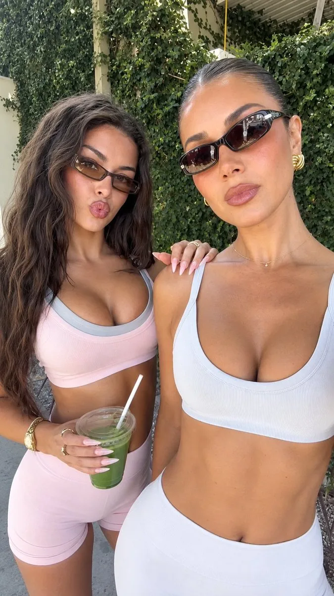

# Two Woman Fitness Selfie Reconstruction

**中文标题：** 双人健身自拍重建  
**ID:** `gi25-x-184` · **Mode:** `edit`  
**Categories:** `edit-change-preserve`, `character-consistency`  
**Tags:** `x-twitter`, `community`, `gpt-image-2.5`, `seeapi`, `en`



### Two Woman Fitness Selfie Reconstruction

```text
{
  "prompt_type": "photorealistic_reference_image_reconstruction",
  "goal": "Recreate the supplied reference photograph as closely as possible, matching the composition, two-person arrangement, facial expressions, body positioning, clothing, accessories, background foliage, camera perspective, natural lighting, colors, proportions, and smartphone-photo aesthetic. Completely ignore and remove all text, interface elements, buttons, icons, timestamps, watermarks, captions, borders, and any other screen graphics.",
  "reference_fidelity": {
    "target": "extremely high visual similarity",
    "priority_order": [
      "overall composition and crop",
      "positions and scale of both subjects",
      "facial expressions and head angles",
      "hair shapes and colors",
      "eyewear",
      "clothing silhouettes and colors",
      "hand placement and manicures",
      "green drink and straw",
      "background greenery and architecture",
      "lighting and color grading",
      "fine material and skin detail"
    ]
  },
  "canvas": {
    "orientation": "portrait",
    "aspect_ratio": "approximately 736:1307",
    "framing": "tight vertical smartphone selfie photograph",
    "crop_style": "upper-body to mid-thigh/full partial-body framing",
    "camera_distance": "very close, approximately arm's length",
    "camera_height": "slightly above chest level and angled downward just a little",
    "composition": "two adult women standing very close together, occupying nearly the entire frame",
    "edge_behavior": {
      "top": "small amount of background visible above both heads",
      "left": "left woman's hair and body extend close to frame edge",
      "right": "right woman's shoulder and torso extend close to frame edge",
      "bottom": "right woman's pants and left woman's legs extend toward the bottom border"
    }
  },
  "scene": {
    "setting": "sunny outdoor patio, garden, or residential courtyard",
    "atmosphere": "warm upscale casual summer lifestyle setting",
    "visual_style": "authentic high-end smartphone social-media photograph rather than studio photography",
    "background": {
      "dominant_element": "dense dark green leafy hedge or climbing vegetation",
      "architecture": {
        "visible": true,
        "description": "cream/light beige stucco or concrete vertical structure partially concealed by foliage",
        "details": [
          "vertical pale structural post",
          "light wall surface",
          "subtle roof or pergola structure near upper right",
          "dark horizontal/wood-like architectural element"
        ]
      },
      "vegetation": {
        "type": "dense broadleaf greenery",
        "color": "deep natural green with lighter sunlit leaves",
        "density": "very high",
        "focus": "slightly softer than subjects"
      },
      "ground": {
        "appearance": "light gray or pale stone/concrete patio",
        "visibility": "mostly obscured by subjects, visible in lower background"
      }
    }
  },
  "subjects": {
    "count": 2,
    "both_are": "adult women",
    "interaction": "standing closely together for a casual selfie/fashion-lifestyle photo",
    "mood": "playful, confident, relaxed, summery"
  },
  "right_subject": {
    "position": "foreground right, larger and closer to camera",
    "scale": "dominant subject occupying approximately 55-60 percent of visible image width",
    "body_visibility": "head, shoulders, torso, abdomen, hips, and upper portion of high-waisted pants visible",
    "pose": {
      "orientation": "facing camera almost directly",
      "head": "slightly tilted toward viewer's left",
      "shoulders": "relaxed and open",
      "torso": "front-facing with a slight natural rotation",
      "right_arm": "mostly outside or along edge of frame",
      "left_arm": "near center-left region, hand resting over the other woman's shoulder",
      "posture": "upright and relaxed"
    },
    "face": {
      "shape": "soft oval with defined cheekbones and tapered lower face",
      "skin": {
        "tone": "warm medium tan / golden beige",
        "finish": "smooth, luminous, lightly sun-kissed",
        "texture": "natural fine texture softened by smartphone processing",
        "highlights": "warm highlights across forehead, cheeks, nose, and upper chest"
      },
      "expression": "subtle pout with lips gently pursed, calm confident expression",
      "gaze": "directly toward camera",
      "eyes": {
        "visibility": "mostly obscured by sunglasses",
        "makeup": "subtle polished eye makeup around exposed areas"
      },
      "brows": "dark, groomed, defined",
      "nose": "straight, softly defined",
      "lips": {
        "shape": "full and defined",
        "color": "muted pink-nude / soft mauve",
        "finish": "satin to slightly glossy",
        "expression": "slight kissy pout"
      },
      "cheeks": "softly bronzed with faint warm blush"
    },
    "hair": {
      "color": "dark brown to nearly black",
      "style": "sleek, tightly pulled-back hairstyle",
      "length": "long but mostly gathered away from face",
      "part": "clean center or slightly off-center part",
      "finish": "smooth and glossy",
      "texture": "fine smooth strands with subtle individual detail",
      "silhouette": "close to scalp near crown and pulled toward back"
    },
    "eyewear": {
      "type": "narrow futuristic wraparound sunglasses",
      "frame": "dark metallic or glossy black",
      "lens": "dark smoked brown-black reflective lenses",
      "shape": "elongated angular cat-eye / shield hybrid",
      "size": "medium width, relatively narrow vertical height",
      "position": "low enough to clearly frame upper face but completely cover eyes",
      "reflection": "subtle bright outdoor reflections visible on lenses",
      "style": "fashion-forward early-2000s-inspired rectangular sunglasses"
    },
    "clothing": {
      "top": {
        "type": "fitted cropped athletic tank / sports-bra-style top",
        "color": "very pale icy blue-white / cool lavender-white",
        "neckline": "wide rounded scoop neckline",
        "straps": "medium-width athletic straps",
        "fit": "snug and body-contouring",
        "length": "cropped just below bust",
        "material": "stretch athletic fabric with fine ribbed texture",
        "finish": "matte with subtle fabric highlights"
      },
      "bottom": {
        "type": "high-waisted fitted leggings or yoga pants",
        "color": "matching very pale blue-white / cool lavender-white",
        "rise": "very high waist",
        "fit": "close-fitting through waist and hips",
        "surface": "smooth stretch fabric with subtle ribbed construction",
        "waistband": "wide and supportive",
        "silhouette": "clean fitted athletic line"
      }
    },
    "jewelry": {
      "earrings": {
        "type": "large gold hoop earrings",
        "shape": "rounded thick hoops",
        "finish": "warm polished gold",
        "visibility": "clearly visible on side closest to camera"
      },
      "necklace": {
        "type": "very delicate short gold chain",
        "pendant": "tiny minimalist pendant",
        "placement": "low on upper chest"
      }
    },
    "manicure": {
      "hand": "the hand resting on the other woman's shoulder",
      "nails": {
        "length": "long",
        "shape": "long almond / tapered stiletto-almond",
        "color": "pale neutral pink or soft nude",
        "finish": "high gloss",
        "appearance": "well-manicured, elegant"
      },
      "rings": {
        "quantity": "one or a few delicate rings",
        "material": "silver or gold",
        "style": "minimal"
      }
    }
  },
  "left_subject": {
    "position": "behind and to the left of foreground woman",
    "scale": "slightly smaller due to being farther from camera",
    "body_visibility": "head, shoulders, torso, waist, shorts, and upper-to-mid thighs visible",
    "pose": {
      "orientation": "facing camera",
      "head": "slightly tilted",
      "shoulders": "relaxed",
      "left_arm": "lower and partially cropped",
      "right_arm": "near center/right with hand interacting visually with foreground woman",
      "posture": "casual and slightly angled"
    },
    "face": {
      "shape": "soft youthful oval",
      "skin": {
        "tone": "warm medium tan / golden beige",
        "finish": "smooth and softly luminous",
        "texture": "natural but subtly beauty-filtered"
      },
      "expression": "playful exaggerated kissy lips / duck-face pout",
      "gaze": "toward camera",
      "eyes": {
        "visibility": "visible through tinted sunglasses",
        "appearance": "dark eyes with subtle eye makeup"
      },
      "brows": "dark and defined",
      "nose": "small and softly contoured",
      "lips": {
        "shape": "full and prominent",
        "color": "muted rosy pink",
        "finish": "soft satin",
        "expression": "strong puckered kiss expression"
      }
    },
    "hair": {
      "color": "dark brown",
      "style": "long, voluminous, loose hair",
      "length": "past shoulders, extending down toward waist/hips",
      "texture": "soft waves with natural body",
      "part": "slightly off-center",
      "appearance": "full, slightly tousled, glossy",
      "face_framing": "multiple loose strands and thick sections frame cheeks and jaw",
      "volume": "high around sides of head"
    },
    "eyewear": {
      "type": "small narrow rectangular sunglasses",
      "frame": "dark brown/black",
      "lens": "warm brown smoked translucent lenses",
      "shape": "slightly cat-eye / rectangular",
      "position": "centered across eyes",
      "style": "retro-futuristic narrow fashion sunglasses"
    },
    "clothing": {
      "top": {
        "type": "fitted cropped tank / sports-bra top",
        "color": "soft pale blush pink",
        "trim": "contrasting light cool-gray piping or trim around neckline and straps",
        "neckline": "rounded scoop",
        "fit": "tight and supportive",
        "length": "cropped above waist",
        "material": "stretch athletic fabric",
        "finish": "matte with subtle rib texture"
      },
      "bottom": {
        "type": "high-waisted fitted biker shorts",
        "color": "matching pale blush pink",
        "length": "mid-thigh",
        "fit": "tight body-contouring silhouette",
        "material": "smooth stretchy athletic fabric",
        "waistband": "high and wide",
        "wrinkles": "subtle natural fabric tension around hips and thighs"
      }
    },
    "accessories": {
      "watch_or_bracelet": {
        "position": "left wrist",
        "type": "chunky gold watch or stacked bracelet",
        "finish": "polished gold",
        "appearance": "bright metallic highlights"
      },
      "rings": {
        "style": "minimal delicate rings",
        "finish": "gold"
      }
    },
    "drink": {
      "type": "clear plastic cup of green beverage",
      "position": "held in front of lower torso",
      "beverage": "bright natural green smoothie, matcha, or pressed green drink",
      "cup": {
        "material": "transparent plastic",
        "shape": "medium-to-large cylindrical takeaway cup",
        "lid": "clear domed or flat plastic lid",
        "condensation": "subtle moisture on exterior",
        "color_detail": "green drink dominates interior"
      },
      "straw": {
        "color": "white",
        "type": "straight plastic straw",
        "position": "rises diagonally upward from cup toward the upper-right",
        "visibility": "clearly visible"
      },
      "grip": {
        "hand": "left subject's hand wrapped naturally around the cup",
        "fingers": "slender",
        "nails": "long pale pink/nude glossy nails"
      }
    }
  },
  "interaction_between_subjects": {
    "distance": "very close, shoulders and upper arms nearly touching",
    "foreground_hand": "right subject's hand rests casually across or near left subject's shoulder",
    "body_overlap": "right subject overlaps part of left subject's torso",
    "social_context": "close friends posing together for a casual fashion/lifestyle selfie",
    "pose_relationship": "coordinated but spontaneous"
  },
  "background": {
    "vegetation": {
      "description": "dense leafy hedge covering most of the upper and central background",
      "colors": [
        "deep forest green",
        "medium natural green",
        "olive green",
        "muted sage green"
      ],
      "lighting": "mixed shade with small patches of warm sunlight",
      "texture": "many overlapping small and medium leaves",
      "depth": "moderate"
    },
    "architecture": {
      "wall": "warm off-white or beige",
      "vertical_pillar": "pale beige structural column at upper-left/center",
      "roof_structure": "partial slatted pergola/awning visible upper-right",
      "background_detail": "subtle and not distracting"
    },
    "ground": {
      "material": "light gray stone/concrete",
      "texture": "slightly rough",
      "lighting": "softly illuminated"
    }
  },
  "lighting": {
    "source": "natural outdoor daylight",
    "style": "bright but softened sunlight filtered through nearby foliage",
    "direction": "front-right and slightly above camera",
    "quality": "soft directional daylight with some dappled highlights",
    "skin_rendering": "warm, luminous, flattering",
    "hair_highlights": "subtle warm highlights on loose strands",
    "clothing_highlights": "soft bright highlights on white/pale fabric",
    "background": "slightly darker foliage creates separation around faces",
    "shadows": "soft and realistic, no harsh flash shadows",
    "color_temperature": "warm-neutral daylight"
  },
  "camera": {
    "device": "modern smartphone front-facing camera",
    "lens": "mildly wide selfie lens",
    "focal_length_equivalent": "approximately 24-28mm",
    "perspective": "close wide-angle portrait with slight natural edge stretching",
    "orientation": "vertical",
    "camera_position": "held above or around eye/chest height",
    "distance": "arm's length or slightly longer selfie distance",
    "focus": "both women's faces reasonably sharp, foreground subject slightly sharper",
    "depth_of_field": "moderate, background softly softened but still recognizable",
    "image_quality": "high-resolution smartphone photograph",
    "processing": "subtle HDR, smooth skin processing, moderate clarity, natural colors",
    "stabilization": "very stable handheld image",
    "motion_blur": "minimal"
  },
  "composition": {
    "foreground_subject": "large on right half of frame",
    "background_subject": "slightly smaller on left half of frame",
    "faces": {
      "right_subject": "upper-right quadrant",
      "left_subject": "upper-left quadrant",
      "vertical_level": "faces approximately aligned but foreground woman's head slightly higher"
    },
    "bodies": {
      "right_subject": "torso dominates lower-right",
      "left_subject": "torso and shorts occupy lower-left"
    },
    "drink": "green cup anchors lower-middle-left region",
    "hands": "one hand near center/top of left subject's shoulder, one hand around green drink",
    "negative_space": "very little negative space due to tight selfie framing",
    "visual_balance": "two faces and two contrasting pastel outfits form the main visual focus"
  },
  "clothing_materials": {
    "right_outfit": {
      "texture": "fine ribbed athletic knit",
      "stretch": "smooth body-contouring stretch",
      "surface": "matte satin"
    },
    "left_outfit": {
      "texture": "fine athletic knit",
      "stretch": "soft and fitted",
      "surface": "matte with subtle sheen"
    }
  },
  "color_grading": {
    "overall": "warm, lightly pastel, natural social-media aesthetic",
    "skin": "warm golden beige",
    "whites": "slightly cool",
    "pink": "soft blush pink",
    "green": "rich natural leafy green",
    "contrast": "moderate",
    "saturation": "moderate",
    "highlights": "slightly warm",
    "shadows": "cooler muted greens and grays",
    "black_levels": "natural, not crushed"
  },
  "beauty_processing": {
    "strength": "moderate",
    "skin_smoothing": "moderate-to-high",
    "blemish_reduction": "moderate",
    "eye_enhancement": "subtle",
    "facial_shape_changes": "none or minimal",
    "lip_definition": "subtle",
    "overall": "polished smartphone/social-media beauty look while remaining photorealistic"
  },
  "micro_details": {
    "skin": "subtle natural pores and tonal variation remain visible",
    "hair": "fine individual strands visible around face and shoulders",
    "sunglasses": "realistic reflections of sky/architecture",
    "gold_jewelry": "tiny sharp specular highlights",
    "nails": "glossy reflections and realistic curvature",
    "athletic_fabric": "fine rib texture and realistic tension folds",
    "drink": "transparent reflections, green liquid depth, slight condensation",
    "leaves": "individual leaf shapes and overlapping shadows",
    "background_structure": "subtle architectural edges and texture"
  },
  "photographic_character": {
    "genre": "luxury casual lifestyle / fashion influencer selfie",
    "realism": "extreme photorealism",
    "camera_feel": "authentic smartphone capture",
    "retouching": "light-to-moderate",
    "avoid": "studio editorial appearance",
    "desired_result": "looks like an actual spontaneous photograph taken outdoors by one of the subjects"
  },
  "negative_prompt": [
    "text",
    "captions",
    "subtitles",
    "watermarks",
    "logos",
    "social media UI",
    "buttons",
    "play icons",
    "pause icons",
    "progress bar",
    "timestamps",
    "interface elements",
    "screen overlays",
    "extra people",
    "third person",
    "different number of subjects",
    "child",
    "teenager",
    "different pose",
    "different camera angle",
    "wide landscape composition",
    "cropped heads",
    "cropped faces",
    "missing hands",
    "extra hands",
    "extra fingers",
    "deformed fingers",
    "anatomical distortion",
    "duplicate limbs",
    "unnatural body proportions",
    "different hairstyles",
    "short hair on left subject",
    "loose hair on right subject",
    "missing sunglasses",
    "oversized sunglasses",
    "round sunglasses",
    "clear sunglasses",
    "different clothing colors",
    "dark clothing",
    "long sleeves",
    "jackets",
    "coats",
    "jeans",
    "skirts",
    "different drink",
    "no drink",
    "cup without straw",
    "metal cup",
    "glass wine goblet",
    "busy city background",
    "indoor environment",
    "night scene",
    "studio backdrop",
    "flash photography",
    "dramatic cinematic lighting",
    "extreme bokeh",
    "fisheye distortion",
    "cartoon",
    "anime",
    "illustration",
    "3D render",
    "CGI",
    "plastic skin",
    "uncanny faces",
    "over-smoothed skin",
    "excessive HDR",
    "oversaturated colors",
    "unrealistic reflections"
  ],
  "final_generation_instruction": "Generate one highly photorealistic vertical smartphone selfie that matches the reference composition as closely as possible. Two adult women stand very close together outdoors against a dense leafy green hedge and pale architectural background. The foreground woman on the right is closer to the camera, wearing a pale icy blue-white fitted cropped athletic top and matching high-waisted leggings, narrow dark wraparound sunglasses, large gold hoop earrings, and delicate gold jewelry. Her hair is sleek and pulled back, her lips are gently pursed, and her right-side presence dominates the frame. Her manicured hand rests casually on the other woman's shoulder. The woman on the left stands slightly behind, wearing a pale blush-pink cropped athletic tank with cool-gray trim and matching high-waisted biker shorts, narrow brown-tinted rectangular sunglasses, and long loose dark wavy hair. She holds a clear cup containing a vivid green drink with a white straw. Both have long glossy almond-shaped manicures and warm naturally bronzed skin. Preserve the intimate selfie perspective, natural daylight, realistic skin, subtle beauty processing, leafy background, pale athletic fabrics, jewelry reflections, and casual social-media lifestyle aesthetic. Remove and ignore all text, buttons, UI elements, timestamps, watermarks, and interface graphics."
}
```

- **Recommended model:** `gpt-image-2.5-sunburst`
- **Settings:** _(defaults)_
- **Source:** [community](https://x.com/jasonugc/status/2101372937353965940) — @jasonugc (via SeeAPI/awesome-gpt-image-2.5-prompts)
- **License note:** Community X post mirrored in SeeAPI/awesome-gpt-image-2.5-prompts; remix with attribution
- **Notes:** SeeAPI P79 (p79-two-woman-fitness-selfie-reconstruction)
