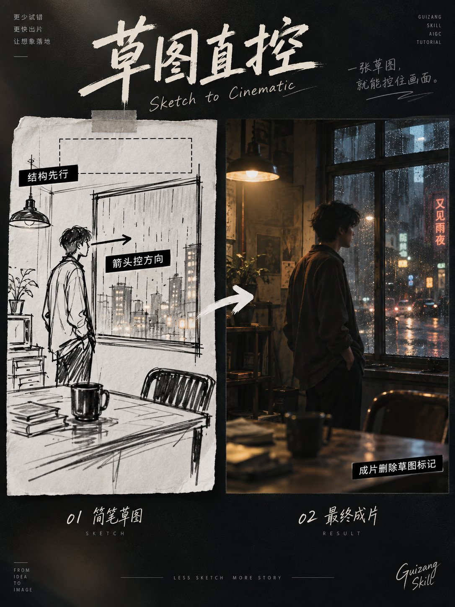

# Chinese Sketch Layout: Boxes and Arrows Lock the Structure

**中文标题：** 中文 Sketch 构图：方框箭头锁结构  
**ID:** `gi25-x-581` · **Mode:** `generate`  
**Categories:** `edit-change-preserve`, `general`  
**Tags:** `x-twitter`, `community`, `gpt-image-2.5`, `xianyu`, `zh`



### Chinese Sketch Layout: Boxes and Arrows Lock the Structure

```text
打开 ChatGPT Images，输入 @Sketch，绘制一张3比4竖版构图草图。

使用简单图形标记画面结构。

A区域代表【人物或产品】
B区域代表【前景物体】
C区域代表【背景建筑或环境】
箭头代表【人物视线、动作或镜头方向】
虚线区域作为【标题或留白安全区】

完成草图后输入以下提示词。

将这张草图转化为一张【海报、产品广告、电影关键帧、室内效果图或出版插图】。

严格继承草图中的主体数量、位置、画面占比、朝向、前后遮挡、地平线、视觉中心和留白区域。

将A区域替换为【主体设定】，正在【具体动作】。
将B区域替换为【前景内容】，形成自然遮挡。
将C区域替换为【场景设定】，符合统一透视与空间尺度。

采用【写实摄影、手绘插画、编辑设计或电影质感】。光线来自【方向】，主色为【颜色】，材质表现【具体要求】。

草图中的方框、箭头、字母和辅助线只用于控制构图，成片中全部删除。

禁止自动居中、改变主体数量、交换前后关系、填满留白、增加分栏、生成过程图和保留草图标记。

输出一张独立的3比4成品图。
```

- **Recommended model:** `gpt-image-2.5-sunburst`
- **Settings:** _(defaults)_
- **Source:** [community](https://x.com/derek_wall90176/status/2098233953949983197) — @derek_wall90176 (via xianyu110/awesome-gpt-image2.5)
- **License note:** Community X post mirrored in xianyu110/awesome-gpt-image2.5; remix with attribution
- **Notes:** xianyu110 case 2098233953949983197; category=Sketch; verified=True
- **Preview:** `previews/gi25-x-581.jpg`
