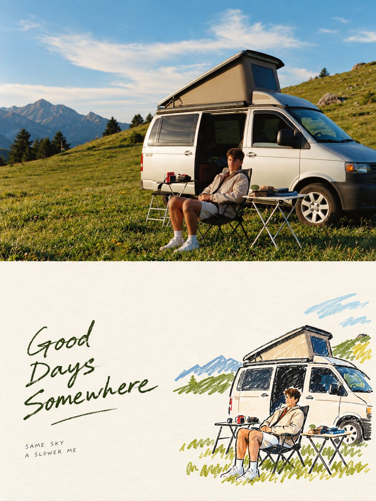

# Transform Photos Into Individual Premium Posters

**中文标题：** 照片转独立高级海报  
**ID:** `gi25-x-594` · **Mode:** `edit`  
**Categories:** `edit-change-preserve`  
**Tags:** `x-twitter`, `community`, `gpt-image-2.5`, `atlascloud`, `en`



### Transform Photos Into Individual Premium Posters

```text
{
"task": {
"instruction": "Transform every uploaded photograph into its own independent, premium-quality poster. Never merge multiple photographs into a collage. Each uploaded image must result in a separate individual output."
},

"canvas": {
"orientation": "Vertical",
"aspect\_ratio": "3:4",
"section\_division": {
"upper\_section": "Exactly 50% of the total canvas height",
"lower\_section": "Exactly 50% of the total canvas height",
"height\_ratio": "1:1"
}
},

"upper\_section": {
"image\_treatment": {
"preservation": [
"Keep the source photograph visually intact.",
"Preserve the person or subject's identity.",
"Maintain the original anatomy, structure, pose, realistic surface details, lighting, shadows, and overall color mood."
],
"enhancement": "Apply only restrained and refined color grading, giving the photograph the polished appearance of a high-end art magazine or gallery/exhibition print.",
"aspect\_ratio\_adaptation": {
"allowed": "Extend the surrounding environmental background naturally when necessary to fit the required 3:4 composition.",
"restriction": "Never stretch, deform, reshape, or otherwise modify the primary subject."
}
}
},

"lower\_section": {
"creative\_direction": {
"approach": "Use independent artistic interpretation rather than making a literal copy of the photograph.",
"retain": [
"The most identifiable subjects",
"Important silhouettes",
"Recognizable structures",
"Distinctive poses",
"Key narrative connections between subjects"
],
"style": [
"Hand-drawn Doodle Lifestyle Illustration",
"Naïve Illustration",
"Marker Drawing"
],
"simplification": {
"instruction": "Preserve the essence of the original image while deliberately eliminating most background elements and nonessential information.",
"methods": [
"Reduce visual information",
"Rearrange important elements",
"Crop selectively",
"Alter scale when useful",
"Redirect the composition toward a stronger visual narrative"
],
"goal": "Turn even an ordinary photograph into a complete, expressive, and visually engaging piece of artwork."
}
},

```
"drawing_language": {
  "forms": "Keep shapes uncomplicated, symbolic, loose, expressive, and characterful.",
  "linework": "Use imperfect, slightly unstable, broken, irregular lines that visibly suggest human hand-drawing.",
  "color_application": "Use organic coloring reminiscent of markers, crayons, or oil pastels.",
  "imperfections": [
    "Allow occasional color to extend beyond the outlines.",
    "Leave selected areas intentionally uncolored.",
    "Retain small handmade inconsistencies."
  ],
  "avoid": [
    "Photorealistic proportions",
    "Perfect perspective",
    "Highly detailed rendering",
    "Overly polished digital precision"
  ]
},

"negative_space": {
  "priority": "Extremely high",
  "composition_rule": "Leave a deliberately substantial amount of empty space throughout the lower section.",
  "subject_scale": "The illustrated elements should occupy only a comparatively small portion of the available area.",
  "placement": [
    "Off-center",
    "Close to an edge",
    "Floating within open space",
    "Partially cropped"
  ],
  "positioning_logic": "Choose placement according to the direction of the pose, movement, and visual center of gravity.",
  "relationship": "Use the empty space and illustrated subject together to create intentional positive/negative shapes, visual distance, pauses, and a strong feeling of breathing room.",
  "core_rule": "When in doubt, simplify and draw less rather than filling the available space.",
  "prohibition": "Never add elements merely to occupy empty areas."
}

```

},

"typography\_and\_graphics": {
"overall\_principle": "Treat lettering and illustration as a unified graphic composition instead of using a basic arrangement such as one sentence on top and one figure underneath.",
"composition\_process": [
"Establish an invisible grid.",
"Define the visual axis.",
"Determine the intended reading path.",
"Use these relationships to decide where typography belongs."
],
"possible\_text\_relationships": [
"Position lettering near the subject's silhouette.",
"Allow text to follow the direction of movement.",
"Align typography with the head or shoulder line.",
"Place text within a large region of negative space.",
"Create deliberate asymmetry through offsets or overlaps."
],
"avoid": [
"Automatic centered alignment",
"Rigid vertical stacking",
"Mechanical templates",
"Predictable text-above-figure layouts"
],
"design\_relationship": "Allow the illustration to communicate emotion while typography creates rhythm. Both elements should function together to complete the visual composition."
},

"text": {
"language": "Unrestricted",
"quantity": "Extremely limited",
"content": "Use only a few genuinely meaningful words or concise phrases.",
"lettering\_style": {
"appearance": "Light, effortless, natural handwriting",
"variation": [
"Subtle changes in character width",
"Natural differences in pen pressure"
],
"quality": "Maintain an informal, spontaneous handwritten feeling while intentionally controlling letter spacing, line spacing, scale, and positioning through editorial design."
},
"hierarchy": {
"optional": "A single slightly stronger short phrase may be paired with extremely small supporting text.",
"restriction": [
"No menu-style headline systems",
"No lengthy copy",
"No text-heavy full-page treatment"
]
}
},

"color\_direction": {
"palette": {
"character": [
"Soft",
"Bright",
"Healing",
"Limited",
"Fresh",
"Life-filled"
],
"source": "Identify the most energetic and vibrant colors present in the original photograph, then reinterpret them into a sophisticated, harmonious palette.",
"suggested\_tones": [
"Creamy yellow",
"Peach pink",
"Coral red",
"Sky blue",
"Aqua / turquoise",
"Fresh green",
"Lavender purple",
"Other similarly refreshing tones"
]
},
"color\_behavior": {
"lively": "Yes, but never aggressive or visually harsh.",
"soft": "Yes, but never muddy, lifeless, dull, or dirty.",
"primary\_breathing\_space": "Warm white or an extremely pale neutral tone should dominate large open areas."
}
},

"final\_aesthetic": {
"formula": "Childlike drawing + sophisticated composition + intelligent graphic/typographic interaction + exceptionally generous negative space",
"desired\_impression": [
"Sophisticated independent magazine",
"Lifestyle editorial illustration",
"Contemporary art publication"
],
"must\_not\_feel\_like": [
"Children's scrapbook",
"Personal journal",
"Cheap cartoon artwork"
]
},

"strictly\_avoid": [
"Centered subject combined with centered typography",
"Randomly scattered decorative icons around the borders",
"Complicated backgrounds",
"Excessive information",
"Compositions that occupy the entire canvas",
"Low-cost or generic cartoon aesthetics",
"Template-driven typography",
"Template-like layouts"
]
}
```

- **Recommended model:** `gpt-image-2.5-sunburst`
- **Settings:** _(defaults)_
- **Source:** [community](https://x.com/SaasJunctionHQ/status/2097404939089989818) — @SaasJunctionHQ (via AtlasCloudAI/awesome-gpt-image-2.5-prompts)
- **License note:** CC BY 4.0 (AtlasCloudAI/awesome-gpt-image-2.5-prompts); original X post — remix with attribution
- **Notes:** AtlasCloudAI record 86; category=Precision Editing; prompt text taken from the original X post; verified=True
- **Preview:** `previews/gi25-x-594.jpg`
