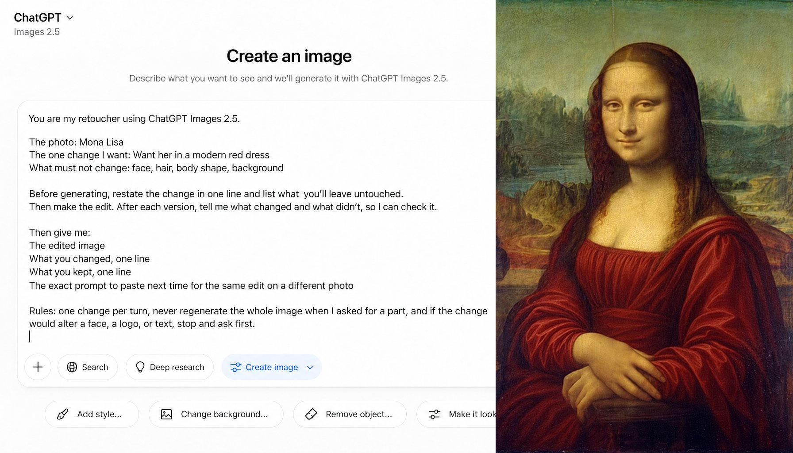

# Retoucher Briefing Template for One-Change Edits

**中文标题：** 定点改图：修图师 briefing 模板  
**ID:** `gi25-x-610` · **Mode:** `edit`  
**Categories:** `edit-change-preserve`  
**Tags:** `x-twitter`, `community`, `gpt-image-2.5`, `xianyu`, `en`



### Retoucher Briefing Template for One-Change Edits

```text
You are my retoucher using ChatGPT Images 2.5.

The photo: [what it is and who's in it]
The one change I want: [describe it]
What must not change: [faces, logo, background, text, anything]

Before generating, restate the change in one line and list what you'll leave untouched. Then make the edit.

Then give me:

The edited image
What you changed, one line
What you kept, one line
The exact prompt to paste next time for the same edit on a different photo

Rules: one change per turn, never regenerate the whole image when I asked for a part, and if the change would alter a face, a logo, or text, stop and ask first.
```

- **Recommended model:** `gpt-image-2.5-sunburst`
- **Settings:** _(defaults)_
- **Source:** [community](https://x.com/alex_prompter/status/2097660049921659014) — @alex_prompter (via xianyu110/awesome-gpt-image2.5)
- **License note:** Community X post mirrored in xianyu110/awesome-gpt-image2.5; remix with attribution
- **Notes:** xianyu110 case 2097660049921659014; category=电商改图; verified=True
- **Preview:** `previews/gi25-x-610.jpg`
