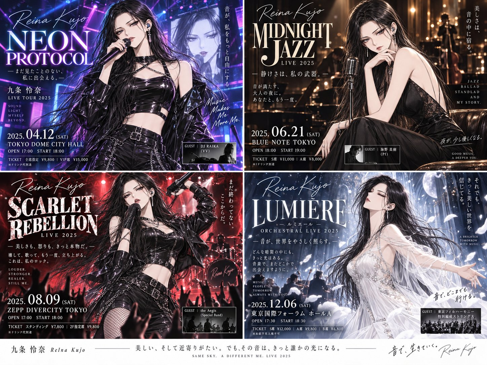

# Four Live-Show Flyer Variations

**中文标题：** 四款演出告知传单  
**ID:** `gi25-x-618` · **Mode:** `edit`  
**Categories:** `edit-change-preserve`, `poster-typography`, `general`  
**Tags:** `x-twitter`, `community`, `gpt-image-2.5`, `bravoneo`, `ja`



### Four Live-Show Flyer Variations

```text
このキャラクターと画風を維持して、プロのデザイナーが制作したような、いろいろなライブ衣装やポーズのライブ告知チラシを2×2の4分割で出して。

衣装、ポーズ、音楽ジャンル、背景、照明、チラシのデザインは自由に発想し、4つそれぞれに違った魅力と意外性を持たせて。ライブの熱気や世界観が伝わるビジュアルと印象的なタイポグラフィを取り入れ、公演タイトルや日時・会場などの架空の告知情報も含めて、プロ級の仕上がりにして。

4つすべて同じキャラクター、同じ画風を維持する。全体の比率は4:3で。
```

- **Recommended model:** `gpt-image-2.5-sunburst`
- **Settings:** _(defaults)_
- **Source:** [community](https://x.com/hAru_mAki_ch/status/2098634675057238254) — @hAru_mAki_ch (via BravoNeo/awesome-gpt-image-2-5-prompts)
- **License note:** Original X post credited via BravoNeo/awesome-gpt-image-2-5-prompts (third-party source, no new license granted); remix with attribution
- **Notes:** BravoNeo entry x-2098634675057238254; use=image-editing,posters,photo-grids; style=graphic-design; prompt matches original X post text; verified=True
- **Preview:** `previews/gi25-x-618.jpg`
