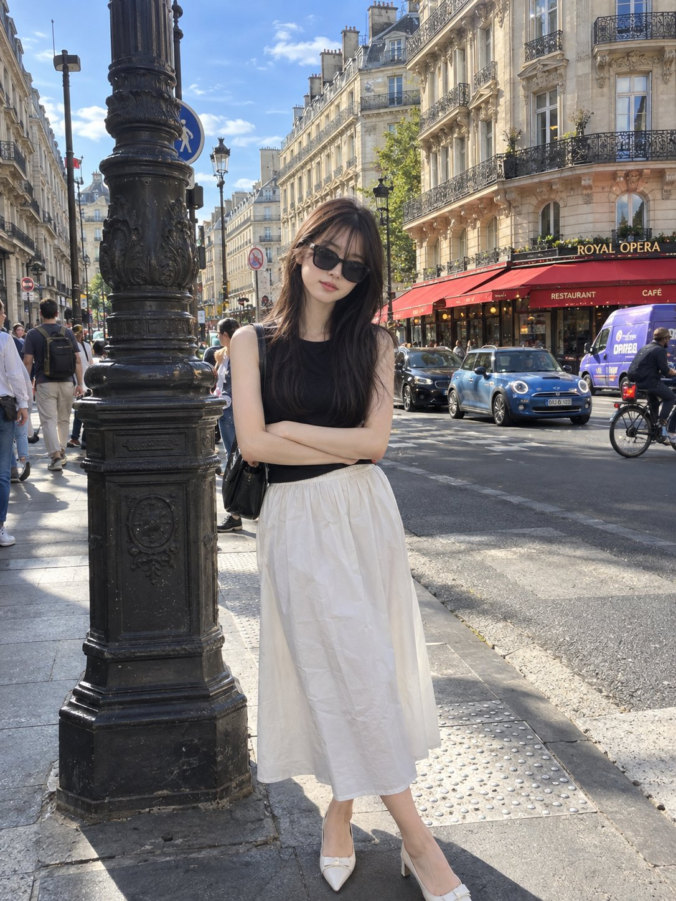

# Photo and Miniature Handmade-Paper Art

**中文标题：** 照片与微型手工纸艺术  
**ID:** `gi25-x-631` · **Mode:** `edit`  
**Categories:** `edit-change-preserve`, `general`  
**Tags:** `x-twitter`, `community`, `gpt-image-2.5`, `bravoneo`, `en`



### Photo and Miniature Handmade-Paper Art

```text
Create a sophisticated 3:4 vertical editorial art poster with GPT Image 2.5, using the uploaded photograph as the primary visual reference.

Divide the composition into two perfectly balanced horizontal halves.

Upper 50% — Original Photograph
Keep the uploaded image almost completely untouched. Preserve the exact identity, facial features, pose, styling, clothing, objects, composition, lighting, colors, proportions, and natural photographic texture. The image should still look like the original photograph, enhanced only with subtle high-end editorial color grading.

Lower 50% — Artistic Interpretation
Transform the key visual elements of the photograph into a tiny, centered handmade-paper artwork. Reduce the scene into a few recognizable shapes and imperfect hand-drawn lines, as if created for an independent contemporary art publication.

Use:

- warm off-white handmade paper
- delicate imperfect ink-like outlines
- simple flat acrylic-inspired shapes
- organic uneven edges
- subtle natural paper fibers and grain
- maximum 4 colors sampled from the original photograph

The miniature artwork should occupy only 10–20% of the lower half, leaving most of the space intentionally empty. Keep it understated and poetic rather than detailed.

Add optional tiny editorial typography only if it naturally complements the composition. Typography should be minimal, elegant, and secondary to the artwork.

Visual direction: contemporary art book, quiet luxury, gallery editorial, handmade print, refined minimalism, poetic negative space, sophisticated composition.

Do not make it: cartoonish, childish, watercolor, colored-pencil, 3D, glossy, overly digital, highly detailed, colorful, busy, or commercial-looking.

The final result should feel like a limited-edition independent art-book cover where a real photograph and its handmade artistic memory coexist in one composition.
```

- **Recommended model:** `gpt-image-2.5-sunburst`
- **Settings:** _(defaults)_
- **Source:** [community](https://x.com/saniaspeaks_/status/2103453485496668450) — @saniaspeaks_ (via BravoNeo/awesome-gpt-image-2-5-prompts)
- **License note:** Original X post credited via BravoNeo/awesome-gpt-image-2-5-prompts (third-party source, no new license granted); remix with attribution
- **Notes:** BravoNeo entry x-2103453485496668450; use=image-editing,art-editorial; style=minimalist,hand-drawn; prompt matches original X post text; verified=True
- **Preview:** `previews/gi25-x-631.jpg`
