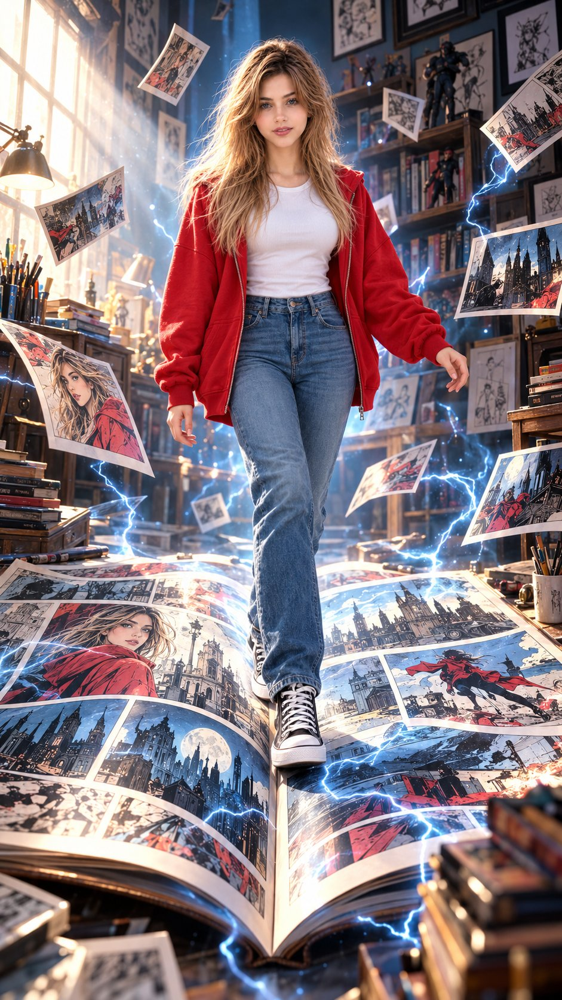

# Giant Comic-Book Fantasy Portrait

**中文标题：** 巨型漫画书幻想人像  
**ID:** `gi25-x-633` · **Mode:** `edit`  
**Categories:** `edit-change-preserve`, `general`  
**Tags:** `x-twitter`, `community`, `gpt-image-2.5`, `bravoneo`, `en`



### Giant Comic-Book Fantasy Portrait

```text
Hyper-realistic IMAX-level Netflix-style surreal cinematic comic-book fantasy portrait, 9:16 vertical. Use the uploaded image as the primary visual reference and preserve the exact facial identity, proportions, and defining features. Create a woman wearing a bright red oversized zip-up hoodie over a fitted plain white T-shirt, high-waisted blue jeans, and black-and-white high-top sneakers. She stands and walks confidently across the center fold of a giant open comic book, her left leg placed forward while the right leg remains slightly behind, knees naturally bent, torso upright, shoulders relaxed, left arm extending slightly outward for balance and right arm hanging loosely beside her body, with her weight shifting naturally onto the forward leg. Her face is turned directly toward the camera with a calm, confident expression, eyes focused straight ahead, relaxed eyelids, softly defined eyebrows, gently closed lips, relaxed jaw and a subtle fearless presence. Her hairstyle is long, straight-to-softly-wavy platinum-blonde hair with a center part, smooth volume at the crown, long face-framing sections falling evenly over both shoulders, slightly curved ends and a few fine strands catching the light, giving the hair a polished but natural movement as she walks. Fair luminous porcelain skin with a bright ivory to light beige tone and neutral-cool undertone, natural realistic texture with soft highlights. She is surrounded by a fantastical bedroom-artist studio filled with framed comic drawings, illustrated panels, scattered books, art supplies, sketches and comic pages, while the giant open comic beneath her creates the illusion that she has stepped directly into its world; multiple floating comic panels surround her at different depths and appear suspended in midair. Thin branching white-blue electrical cracks and glowing energy streaks run through the room, around the comic panels and across the giant pages, suggesting a portal-like transition between reality and the illustrated world. Strong cinematic light enters from the upper-left, creating a bright atmospheric beam through the room and illuminating her hair, face, red hoodie and floating panels, while the surrounding corners remain darker and atmospheric. Rich comic-inspired colour grading with vivid red, cyan-blue, white and muted charcoal tones, warm skin highlights balanced against cool electric-blue energy, deep textured shadows, crisp colour separation, controlled contrast, luminous highlights, restrained skin saturation, subtle atmospheric haze, fine film grain and a polished live-action-meets-graphic-novel cinematic finish.  
Negative prompt: changed identity, distorted face, deformed hands or feet, bad anatomy, unnatural walking pose, extra limbs, flat hair, dull colours, plastic skin, text, watermark.
```

- **Recommended model:** `gpt-image-2.5-sunburst`
- **Settings:** _(defaults)_
- **Source:** [community](https://x.com/imGopalTiwari/status/2104045915195724081) — @imGopalTiwari (via BravoNeo/awesome-gpt-image-2-5-prompts)
- **License note:** Original X post credited via BravoNeo/awesome-gpt-image-2-5-prompts (third-party source, no new license granted); remix with attribution
- **Notes:** BravoNeo entry x-2104045915195724081; use=image-editing,portraits; style=comic,surreal; prompt matches original X post text; verified=True
- **Preview:** `previews/gi25-x-633.jpg`
