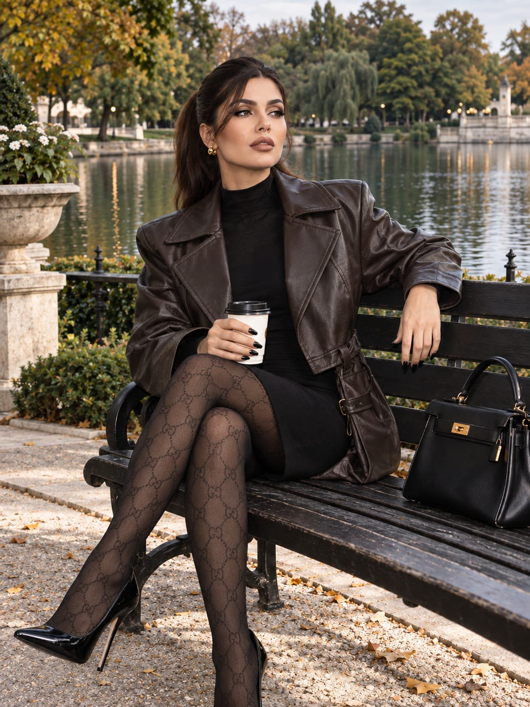

# Lakeside Bench Lifestyle Portrait

**中文标题：** 湖畔长椅生活方式人像  
**ID:** `gi25-x-636` · **Mode:** `edit`  
**Categories:** `edit-change-preserve`, `general`  
**Tags:** `x-twitter`, `community`, `gpt-image-2.5`, `bravoneo`, `en`



### Lakeside Bench Lifestyle Portrait

```text
Use the uploaded reference image as the exact identity and appearance reference for the woman. Preserve her facial identity completely — exact facial structure, eyes, eyebrows, nose, lips, jawline, cheekbones, skin tone, hairstyle, and natural proportions. Do not beautify, reshape, age, or alter her face. She must clearly look like the same person from the reference.

Create an ultra-realistic luxury lifestyle photograph of the same young woman relaxing beside a tranquil lake in an elegant, beautifully landscaped park.

COMPOSITION & POSE

She is seated diagonally on a refined dark wooden park bench, with her body turned slightly toward the lake rather than directly toward the camera. One leg is crossed naturally over the other, creating a long, elegant silhouette without exaggeration. Her shoulders are relaxed and her posture is confident but effortless.

One arm rests casually along the back of the bench while her other hand holds a takeaway coffee cup near her lap. She is looking toward the lake, slightly away from the camera, as if caught naturally during a quiet afternoon moment.

Place a sophisticated black luxury handbag beside her on the bench.

The camera is positioned at approximately eye level in a subtle three-quarter view, capturing her from approximately mid-thigh upward while still showing enough of her crossed legs, footwear, bench, and surrounding environment.

APPEARANCE

Hair pulled into a sleek, polished ponytail with a clean center parting.

Makeup is refined and understated:

- thin elegant winged eyeliner
- softly defined lashes
- naturally shaped brows
- subtle warm complexion
- shaded brown lip pencil defining the natural lip contour
- hydrated, tanned skin with realistic pores and subtle imperfections
- no plastic-looking skin or excessive beauty retouching

Her skin should have a healthy natural glow while retaining authentic photographic texture.

OUTFIT

She wears a matte oversized dark-chocolate leather jacket with pronounced shoulders and a structured waist belt, creating a sophisticated feminine silhouette.

Underneath is a fitted black mini dress featuring a subtle high translucent collar.

She wears sheer transparent black luxury monogram-pattern tights, with an elegant repeating designer-inspired pattern, realistic textile construction, delicate transparency, and visible fine fabric texture. The tights must look physically real rather than digitally printed onto the legs.

Classic black leather pointed-toe stilettos complete the outfit.

Accessories:

- elegant gold earrings
- minimal refined gold jewelry
- no excessive accessories

ENVIRONMENT

A sophisticated luxury park surrounding a calm lake.

In the background:

- still reflective water
- mature green trees
- manicured landscaping
- subtle architectural elements
- distant soft-focus pathways
- elegant natural scenery

Keep the background realistic and understated, with natural depth rather than an artificial fantasy environment.

PHOTOGRAPHY & LIGHTING

Ultra-realistic candid luxury lifestyle photography captured on a Canon PowerShot G7 X, with the distinctive look of a compact-camera photograph combined with a bright direct on-camera flash.

Cloudy daylight provides soft ambient illumination while the camera flash creates a clean, bright editorial pop on her face and clothing.

The lighting should produce:

- extremely realistic skin rendering
- subtle natural shadows
- bright but controlled flash highlights
- realistic pores
- slight moisture/glow on the skin
- authentic fine facial texture
- natural tonal variation

Use slightly reduced overall exposure while maintaining the characteristic bright direct-flash aesthetic.

Color grading should resemble an expensive Instagram luxury-fashion photograph: clean, sophisticated, slightly warm, crisp but not oversharpened, natural colors, subtle contrast, realistic highlights, and authentic compact-camera character.
```

- **Recommended model:** `gpt-image-2.5-sunburst`
- **Settings:** _(defaults)_
- **Source:** [community](https://x.com/mehvishs25/status/2104222515447177333) — @mehvishs25 (via BravoNeo/awesome-gpt-image-2-5-prompts)
- **License note:** Original X post credited via BravoNeo/awesome-gpt-image-2-5-prompts (third-party source, no new license granted); remix with attribution
- **Notes:** BravoNeo entry x-2104222515447177333; use=image-editing,portraits; style=photorealistic; prompt matches original X post text; verified=True
- **Preview:** `previews/gi25-x-636.jpg`
