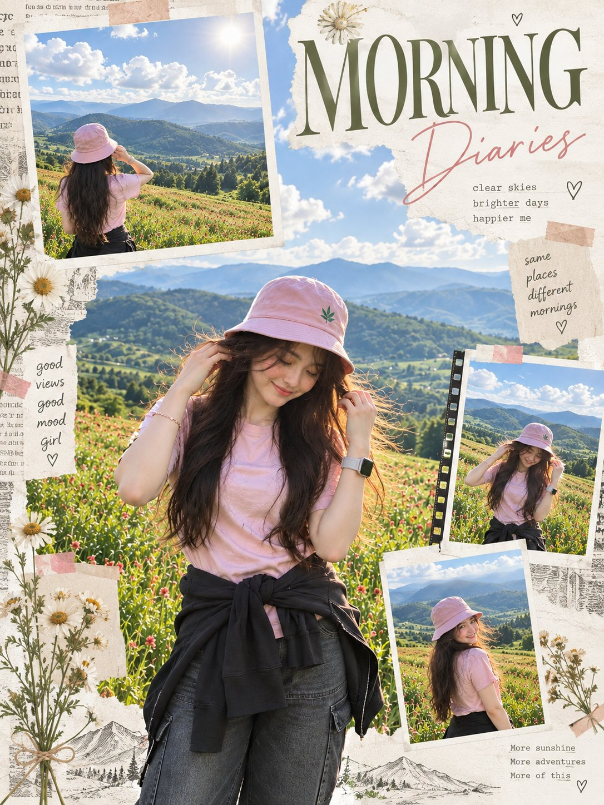

# Morning Editorial Travel Scrapbook

**中文标题：** 清晨旅行手账拼贴  
**ID:** `gi25-x-638` · **Mode:** `edit`  
**Categories:** `edit-change-preserve`, `poster-typography`  
**Tags:** `x-twitter`, `community`, `gpt-image-2.5`, `bravoneo`, `en`



### Morning Editorial Travel Scrapbook

```text
Create a high-end morning editorial scrapbook poster from the uploaded photo. Transform the sunset scene into a fresh early-morning atmosphere with soft golden morning sunlight, clear blue sky, fluffy white clouds, crisp green mountains, and bright wildflowers. Keep the woman’s appearance, outfit, pose, facial features, hair, pink bucket hat, pink T-shirt, dark jacket tied around her waist, and overall identity consistent. Design it as a sophisticated travel-journal collage with torn cream paper, Polaroid frames, subtle washi tape, film-strip details, pressed daisies, delicate botanical sketches, handwritten notes, and vintage paper textures. Use the main photo prominently in the center with several smaller snapshots showing different natural angles from the same scene. Add elegant editorial typography reading “MORNING Diaries”, with small phrases such as “clear skies · brighter days”, “same places, different mornings”, and “good views, good mood”. Keep the palette soft and refined: sky blue, fresh green, warm cream, pale pink, and subtle beige. Make it feel like a premium independent travel magazine mixed with a personal morning diary—artistic, airy, nostalgic, natural, and beautifully composed, not like an advertisement. Strict 3:4 vertical composition, realistic photography blended seamlessly with refined scrapbook elements.
```

- **Recommended model:** `gpt-image-2.5-sunburst`
- **Settings:** _(defaults)_
- **Source:** [community](https://x.com/Aqsahere_/status/2104395935438581848) — @Aqsahere_ (via BravoNeo/awesome-gpt-image-2-5-prompts)
- **License note:** Original X post credited via BravoNeo/awesome-gpt-image-2-5-prompts (third-party source, no new license granted); remix with attribution
- **Notes:** BravoNeo entry x-2104395935438581848; use=image-editing,posters; style=collage,photorealistic; prompt matches original X post text; verified=True
- **Preview:** `previews/gi25-x-638.jpg`
