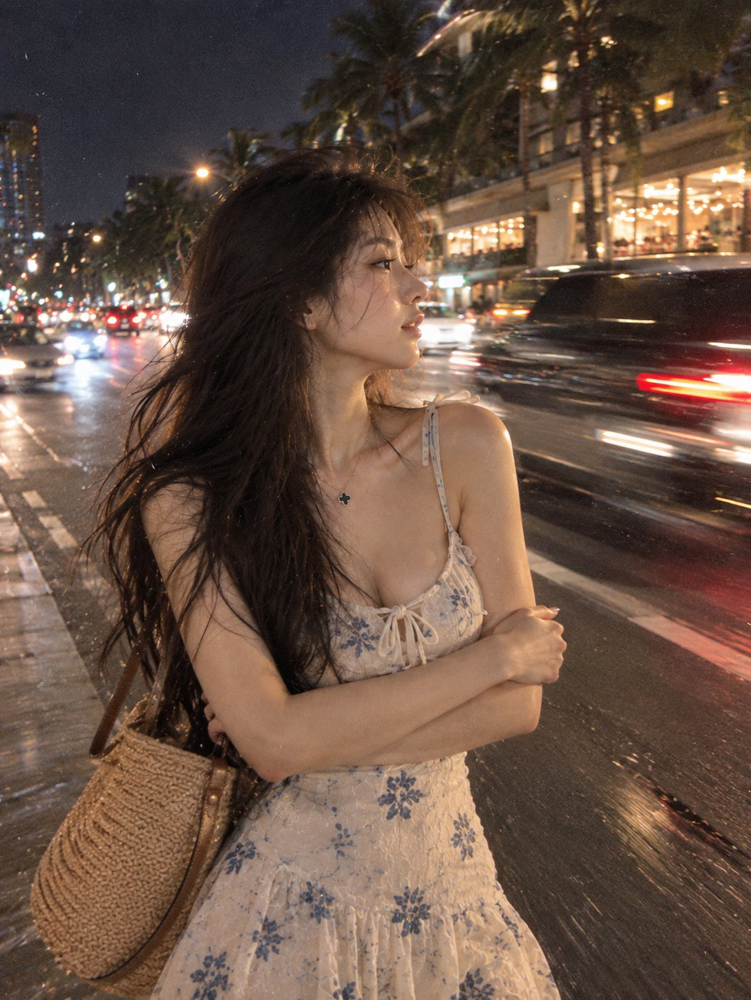

# Casual Night Snapshot with Film Grain and Motion Blur

**中文标题：** 夜间随手拍胶片快照  
**ID:** `gi25-x-646` · **Mode:** `edit`  
**Categories:** `edit-change-preserve`, `general`  
**Tags:** `x-twitter`, `community`, `gpt-image-2.5`, `bravoneo`, `zh`



### Casual Night Snapshot with Film Grain and Motion Blur

```text
参考上传人物的面部衣着特征不发生变化。具有ins风的画面，胶片质感明显，有着轻微的噪点，同时带有运动模糊效果，给人一种平凡无奇、随手拍摄的快照既视感。画面中的主角双手抱胸，歪着头，头发随着风轻轻飘动，显得格外随性。背景是夜晚的场景，背后的车流穿梭不停，整体没有刻意的主体和构图。
```

- **Recommended model:** `gpt-image-2.5-sunburst`
- **Settings:** _(defaults)_
- **Source:** [community](https://x.com/Adam38363368936/status/2105537948431290407) — @Adam38363368936 (via BravoNeo/awesome-gpt-image-2-5-prompts)
- **License note:** Original X post credited via BravoNeo/awesome-gpt-image-2-5-prompts (third-party source, no new license granted); remix with attribution
- **Notes:** BravoNeo entry x-2105537948431290407; use=image-editing,portraits; style=photorealistic,film; prompt matches original X post text; verified=True
- **Preview:** `previews/gi25-x-646.jpg`
