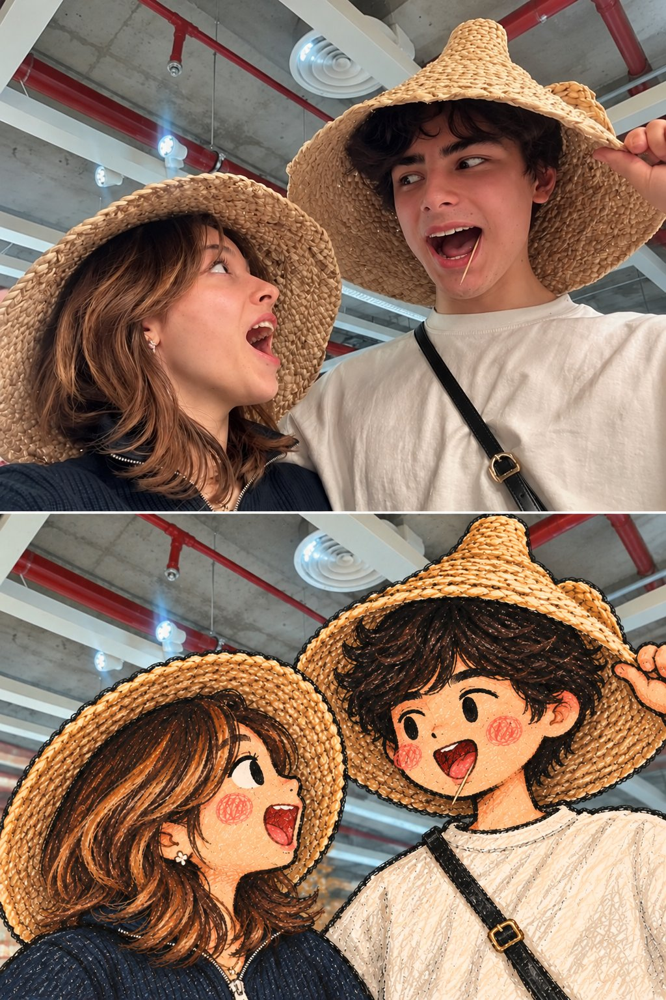

# Crayon Doodle People in an Unchanged Photograph

**中文标题：** 仅将照片中的人物变成蜡笔涂鸦  
**ID:** `gi25-x-648` · **Mode:** `edit`  
**Categories:** `edit-change-preserve`  
**Tags:** `x-twitter`, `community`, `gpt-image-2.5`, `bravoneo`, `en`



### Crayon Doodle People in an Unchanged Photograph

```text
Transform only the people in the uploaded photo into cute hand-drawn crayon doodle characters, while everything else in the photograph stays untouched and fully photographic. FORMAT: Vertical 3:4. Keep the original framing, camera angle, lens perspective, lighting and colors. BACKGROUND LOCK: Walls, sky, buildings, car interiors, graffiti, signs, text, furniture, water, ground and every object stay 100% photographic and unchanged. No doodle strokes, outlines or paper texture anywhere outside the people. CHARACTER: Replace each person with a chibi doodle version of themselves in the exact same position, scale, angle and pose. Oversized round head about one third of the body height, short simplified torso and limbs, small mitten-like hands. Keep head tilt, body direction, gestures, hand positions and interactions exactly as photographed. Never turn a person toward the camera. FACE: Minimal and cute. Tiny solid dot eyes or small curved closed-eye lines, short thick dash eyebrows that carry the original expression, a tiny hooked nose line, a small simple mouth matching the original expression, and round scribbled rosy-pink blush circles on both cheeks. Draw eyes only where they are visible; if sunglasses cover them, show only the sunglasses. IDENTITY DETAILS: Keep the exact hairstyle, hair color and volume, drawn as dense scribbled crayon strokes, with curls as loose looping scribbles. Keep every clothing color, garment shape, collar, sleeve and printed graphic. Redraw all accessories in bold simplified detail: sunglasses with glossy black lenses and white highlight streaks, chains, pendants, earrings, rings, headphones, earphone cables, bags and straps. Show visible stubble, beard or chest hair as light scribbles. DRAWING TECHNIQUE: Hand-drawn oil pastel and wax crayon on textured paper. Bold, uneven black crayon outlines, dense directional hatching fills in rich colors matched to the photo, visible paper grain, slightly wobbly imperfect shapes, small uncolored flecks inside the fills, and simple crayon fold lines on clothing. INTEGRATION: The doodle sits exactly where the real person was, as, with with correct correct scale, depth, overlap and contact with seats, walls, cars and the ground. Objects held in the hand, such as phones or cups, stay photographic. FINAL LOOK: A real, untouched photograph where only the people have been redrawn by hand as adorable crayon doodles, a clear mixed-media contrast between realistic photography and handmade drawing.

NEGATIVE PROMPT
Full-image illustration, doodled or stylized background, altered background, cartoon scenery, realistic human face, realistic anatomy, anime, manga, 3D render, Pixar style, vector art, smooth digital shading, thin clean lines, changed pose, rotated body, invented facial features, extra people, missing accessories, altered text or signage, color shift, added objects
```

- **Recommended model:** `gpt-image-2.5-sunburst`
- **Settings:** _(defaults)_
- **Source:** [community](https://x.com/harboriis/status/2105546366433013911) — @harboriis (via BravoNeo/awesome-gpt-image-2-5-prompts)
- **License note:** Original X post credited via BravoNeo/awesome-gpt-image-2-5-prompts (third-party source, no new license granted); remix with attribution
- **Notes:** BravoNeo entry x-2105546366433013911; use=image-editing; style=crayon,hand-drawn; prompt matches original X post text; verified=True
- **Preview:** `previews/gi25-x-648.jpg`
