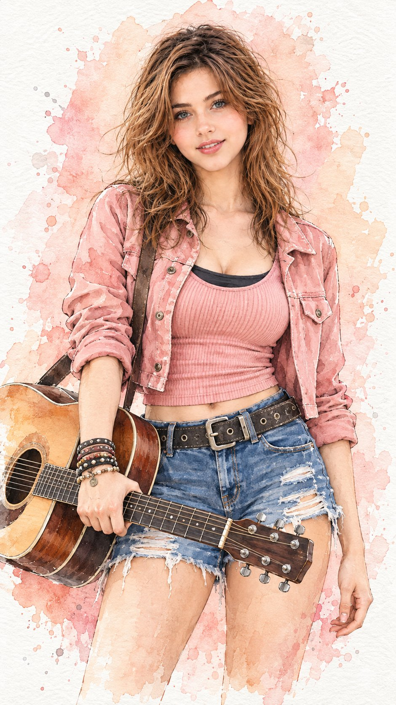

# Pastel Pink Watercolor Fashion Portrait

**中文标题：** 粉色水彩时装人像  
**ID:** `gi25-x-650` · **Mode:** `edit`  
**Categories:** `edit-change-preserve`, `general`  
**Tags:** `x-twitter`, `community`, `gpt-image-2.5`, `bravoneo`, `en`



### Pastel Pink Watercolor Fashion Portrait

```text
Hyper-realistic IMAX-level Netflix-style watercolor fashion illustration, 9:16 vertical. Use the uploaded image as the primary visual reference and preserve the exact facial identity, proportions, and defining features. Create a woman wearing a dusty-pink cropped jacket over a ribbed pink fitted top with a dark inner layer at the neckline, distressed blue short jeans and layered bracelets, standing upright with a relaxed slight lean, her torso facing mostly toward the viewer, left arm hanging naturally beside her thigh while her right arm bends forward and her right hand grips the neck of a guitar-like instrument crossing horizontally in front of her waist; her shoulders stay relaxed and her stance feels casual and confident. Her face tilts slightly upward and toward the camera with a bright gentle smile, softly raised cheeks, relaxed eyes looking directly forward, naturally lifted brows, relaxed jaw and softly closed lips, giving her a cheerful, warm and carefree expression. Her medium-length dark-brown hair is worn loose with a slightly messy natural texture, soft waves and uneven flowing strands around the shoulders, a loose center-to-slight-side part, wispy strands crossing the forehead and several fine flyaways extending outward to create an airy hand-painted movement. Fair luminous porcelain skin with a bright ivory to light beige tone and a neutral-cool undertone, rendered with delicate watercolor texture and soft translucent blush on the cheeks. Keep the background mostly white textured watercolor paper with a large irregular pale peach-pink watercolor wash behind the figure, with softly feathered edges and a few scattered paint splashes. Use gentle diffuse illustrated lighting with soft highlights along the face, hair and jacket and very subtle shadow washes beneath the chin, hair and clothing folds. Colour grade with a soft pastel palette of blush pink, dusty rose, muted blue, warm beige and clean ivory, low contrast, delicate saturation, creamy highlights and very light grey shadows. Apply a refined watercolor-and-fine-ink filter with visible paper grain, translucent layered pigment, soft pigment bleeding, delicate brush edges, subtle ink outlines and natural colour variation while keeping the face and important details clean and expressive.  
Negative prompt: changed identity, distorted anatomy, extra fingers, malformed hands, broken instrument, harsh digital rendering, photorealistic skin, 3D CGI, muddy colours, text, watermark.
```

- **Recommended model:** `gpt-image-2.5-sunburst`
- **Settings:** _(defaults)_
- **Source:** [community](https://x.com/imGopalTiwari/status/2105563629454348547) — @imGopalTiwari (via BravoNeo/awesome-gpt-image-2-5-prompts)
- **License note:** Original X post credited via BravoNeo/awesome-gpt-image-2-5-prompts (third-party source, no new license granted); remix with attribution
- **Notes:** BravoNeo entry x-2105563629454348547; use=image-editing,fashion-editorial; style=watercolor; prompt matches original X post text; verified=True
- **Preview:** `previews/gi25-x-650.jpg`
