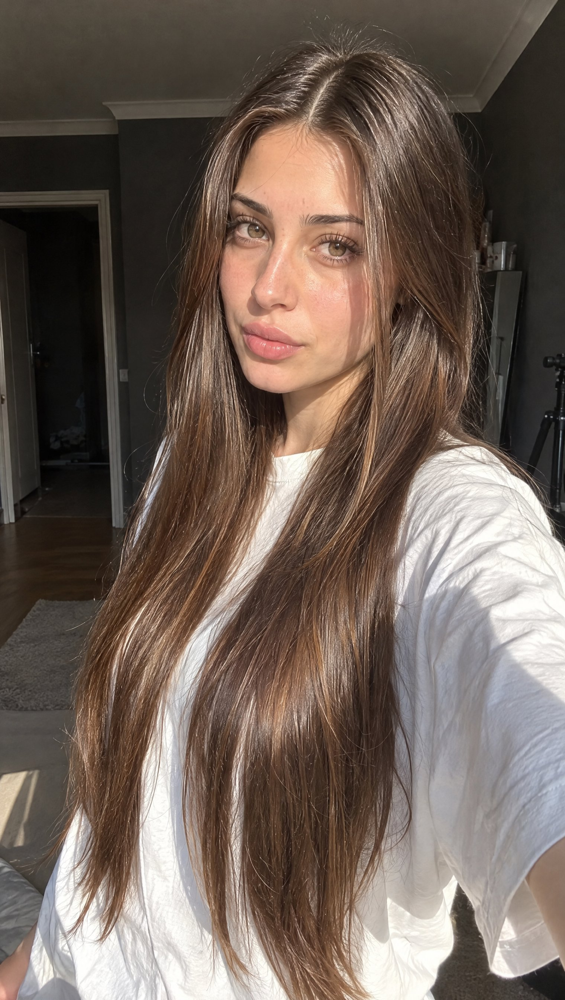

# JSON Reference Reconstruction: Sunlit Smartphone Portrait

**中文标题：** JSON 参考图复刻：窗边阳光手机人像  
**ID:** `gi25-x-656` · **Mode:** `edit`  
**Categories:** `edit-change-preserve`  
**Tags:** `x-twitter`, `community`, `gpt-image-2.5`, `x-direct`, `en`



### JSON Reference Reconstruction: Sunlit Smartphone Portrait

```text
{
  "prompt_type": "detailed_image_reconstruction",
  "aspect_ratio": "4:5 vertical portrait",
  "overall_goal": "Recreate the visual appearance, framing, lighting, styling, and casual smartphone-photo feel of the reference image as closely as possible while keeping the result photorealistic and natural.",

  "subject": {
    "type": "young adult woman",
    "age_range": "early to mid 20s",
    "pose": "standing indoors, upper body turned slightly away from the camera while her face turns toward the lens",
    "body_position": "relaxed casual posture with shoulders slightly angled",
    "expression": "soft neutral expression with a subtle pout, calm and confident",
    "gaze": "looking directly toward the camera",
    "styling": "minimal everyday styling, clean and natural"
  },

  "face": {
    "shape": "soft oval face with a gently tapered jawline",
    "forehead": "medium-height forehead partly framed by center-parted hair",
    "eyebrows": "natural medium-thick dark brown eyebrows with a soft arch",
    "eyes": {
      "shape": "almond-shaped",
      "color": "light brown to hazel",
      "appearance": "bright eyes with visible catchlights",
      "lashes": "long defined eyelashes with subtle mascara"
    },
    "nose": "small straight nose with a softly rounded tip",
    "lips": {
      "shape": "full lips with a defined cupid's bow",
      "color": "natural rosy pink",
      "finish": "soft satin finish, not glossy"
    },
    "skin": {
      "tone": "light warm-neutral skin tone",
      "texture": "smooth natural skin with subtle pores and realistic tonal variation",
      "cheeks": "soft natural pink flush",
      "finish": "fresh luminous skin without heavy retouching"
    },
    "makeup": "very light natural makeup, softly defined lashes, subtle blush, natural pink lips, no dramatic contour"
  },

  "hair": {
    "color": "rich medium-to-dark chocolate brown",
    "length": "very long, extending well below the chest",
    "parting": "clean center part",
    "texture": "mostly straight with very soft natural bends through the lower lengths",
    "density": "thick and healthy-looking",
    "finish": "smooth and glossy but still realistic",
    "front_sections": "two thin face-framing strands falling naturally along both sides of the face",
    "details": "visible individual strands, subtle flyaways near the crown, realistic highlights from sunlight, natural uneven strand separation",
    "movement": "hair hanging naturally over both shoulders and down the front of the shirt"
  },

  "clothing": {
    "top": "oversized plain white crew-neck T-shirt",
    "fit": "loose casual fit",
    "fabric": "soft slightly wrinkled cotton",
    "logos": "none",
    "accessories": "no visible jewelry or prominent accessories"
  },

  "composition": {
    "shot_type": "close upper-body portrait",
    "camera_angle": "slightly above chest level, close to eye level",
    "camera_distance": "approximately arm's-length smartphone distance",
    "subject_position": "face slightly right of center with long hair occupying much of the lower frame",
    "crop": "top of head fully visible, image extending down to around lower torso",
    "orientation": "vertical",
    "perspective": "natural wide smartphone-camera perspective with mild close-range distortion"
  },

  "lighting": {
    "primary_source": "strong warm natural sunlight entering from the side/front through a nearby window",
    "direction": "sunlight striking the subject from camera-left/front",
    "face_effect": "bright warm illumination across the forehead, cheeks, nose, and hair",
    "hair_effect": "distinct brown highlights and soft reflective streaks along individual strands",
    "shadow_quality": "strong but soft-edged natural indoor shadows",
    "exposure": "face slightly brightly exposed while the room behind remains much darker",
    "color_temperature": "warm daylight"
  },

  "environment": {
    "location": "casual indoor residential room",
    "background": "dark gray walls with a white ceiling cornice",
    "left_background": "open doorway or darker hallway area",
    "right_background": "dark wall and partially visible household objects",
    "lower_right": "part of a black tripod or light stand visible",
    "overall_feel": "ordinary lived-in room rather than a studio",
    "depth": "background moderately out of focus but still recognizable"
  },

  "camera": {
    "capture_device": "modern smartphone camera",
    "lens_equivalent": "approximately 24-28mm full-frame equivalent",
    "focus": "sharp focus on face and front hair",
    "depth_of_field": "mostly natural smartphone depth of field with gentle background softness",
    "dynamic_range": "realistic phone-camera HDR with slightly clipped highlights in direct sun",
    "image_character": "casual social-media selfie/photo, not professionally staged"
  },

  "photorealism_details": [
    "real individual hair strands",
    "natural skin pores and micro-texture",
    "subtle peach fuzz",
    "realistic eyelash separation",
    "tiny variations in lip texture",
    "slight fabric creases in the T-shirt",
    "small flyaway hairs around the crown",
    "natural sunlight falloff across the face",
    "slightly imperfect casual framing",
    "realistic indoor shadow noise"
  ],

  "style": {
    "visual_style": "highly photorealistic casual smartphone portrait",
    "mood": "soft, youthful, relaxed, sunlit",
    "processing": "light social-media style processing with warm skin tones and slightly enhanced clarity",
    "avoid": [
      "cinematic movie lighting",
      "studio portrait lighting",
      "overly smooth plastic skin",
      "CGI appearance",
      "anime or illustration",
      "heavy beauty filter",
      "extreme facial symmetry",
      "over-sharpened hair",
      "artificial jet-black hair",
      "dramatic makeup",
      "excessive background blur",
      "professional studio backdrop",
      "text",
      "watermarks",
      "logos"
    ]
  },

  "negative_prompt": "cartoon, anime, illustration, CGI, plastic skin, waxy face, over-retouched skin, excessive beauty filter, unnatural facial symmetry, distorted eyes, crossed eyes, malformed lips, warped face, duplicate hair strands, fake wig appearance, overly black hair, metallic hair shine, stiff hair, messy anatomy, distorted shoulders, extra limbs, extra fingers, studio backdrop, cinematic lighting, dramatic color grading, excessive bokeh, oversaturated colors, text, logo, watermark"
}
```

- **Recommended model:** `gpt-image-2.5-sunburst`
- **Settings:** _(defaults)_
- **Source:** [community](https://x.com/EvoLinkAi/status/2107698201100730875) — @EvoLinkAi
- **License note:** Original public X post; quoted with attribution — remix with attribution
- **Notes:** Collected directly from X; original post https://x.com/EvoLinkAi/status/2107698201100730875 (prompt posted as the author's reply to https://x.com/EvoLinkAi/status/2107698195895902548, which carries the images); post text names GPT Image 2.5; verified=True; from a Nano Banana 2.1 vs GPT Image 2.5 comparison — preview is the second image (GPT Image 2.5 per the post order); trailing promo link removed
- **Preview:** `previews/gi25-x-656.jpg`
