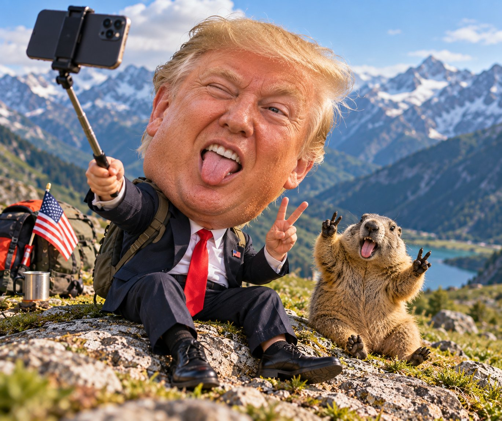

# Oversized-Head Travel Portrait Edit

**中文标题：** 旅行照大头娃娃风改图  
**ID:** `gi25-x-658` · **Mode:** `edit`  
**Categories:** `edit-change-preserve`  
**Tags:** `x-twitter`, `community`, `gpt-image-2.5`, `x-direct`, `en`



### Oversized-Head Travel Portrait Edit

```text
Edit the input single-person travel photograph into an “OVERSIZED HEAD TRAVEL PORTRAIT” while preserving the authentic photographic look of the original image.

Keep the original environment, location, camera viewpoint, perspective, composition, lighting direction, shadows, depth of field, and the person’s identity unchanged.

BODY PROPORTION TRANSFORMATION

Only modify the proportions of the person.

Enlarge the entire head, face, and hairstyle together to approximately 1.5×–2× their original size.

Reduce the body, arms, legs, hands, clothing, and overall body proportions to approximately 35%–60% of their original scale, creating an obvious and humorous oversized-head / tiny-body effect.

The head should feel dramatically oversized compared with the body, but the final result must still look like a real photograph, not a cartoon or 3D character.

IDENTITY & REALISM

Preserve the person’s recognizable identity exactly.

Maintain the original:

- facial structure and proportions
- eyes, eyebrows, nose, lips, jawline, and ears
- facial expression
- gaze direction
- hairstyle and individual hair strands
- natural skin tone and realistic skin texture
- pores, wrinkles, facial hair, and natural imperfections
- hats, earrings, glasses, or other accessories
- clothing design, fabric texture, folds, and materials

Do not beautify, redesign, stylize, or artificially smooth the face.

POSE & ANATOMY

Keep the person’s original pose, gesture, body orientation, action, and viewing direction unchanged.

Naturally reconstruct the transition between the enlarged head and reduced body, especially around the neck, shoulders, collar, upper torso, and clothing.

Hands, arms, legs, sitting posture, standing posture, and contact with the ground or surrounding objects must remain physically believable.

Maintain realistic weight distribution, contact points, perspective, and shadows.

Absolutely avoid:

- broken or disconnected neck
- floating body parts
- distorted hands or feet
- extra fingers or limbs
- duplicated body parts
- duplicated people
- warped clothing
- unnatural anatomy
- incorrect ground contact

BACKGROUND

Preserve the actual travel environment from the input photograph.

Plants, roads, buildings, mountains, streets, architecture, landscape, furniture, ground surfaces, and other environmental elements should remain consistent with the original image.

Do not replace the background with solid colors, graphic shapes, studio backgrounds, fictional scenery, or newly invented landmarks.

PHOTOGRAPHIC STYLE

The final image must remain 100% photorealistic and convincingly photographic.

Use only subtle, soft lifestyle/travel photography color grading while preserving the original lighting and atmosphere.

The humor and visual impact must come only from the exaggerated head-to-body proportions, not from artificial visual effects.

No cartoon filter.
No comic-book treatment.
No halftone effect.
No plastic 3D appearance.
No CGI look.
No artificial AI-style skin.
No excessive beauty retouching.

The final result should look like a real travel photograph captured with a camera, except the person naturally has an absurdly oversized head and tiny body.

OUTPUT RESTRICTIONS

Single person only.
No text.
No logos.
No watermark.
No AI labels or badges.
No “original image” labels.
No stickers.
No fake Chinese characters or other generated typography.
```

- **Recommended model:** `gpt-image-2.5-sunburst`
- **Settings:** _(defaults)_
- **Source:** [community](https://x.com/TheVirtualMuse/status/2106740171278589993) — @TheVirtualMuse
- **License note:** Original public X post; quoted with attribution — remix with attribution
- **Notes:** Collected directly from X; original post https://x.com/TheVirtualMuse/status/2106740171278589993 (prompt posted as the author's reply to https://x.com/TheVirtualMuse/status/2106740106015240384, which carries the images); post text names GPT Image 2.5; verified=True
- **Preview:** `previews/gi25-x-658.jpg`
