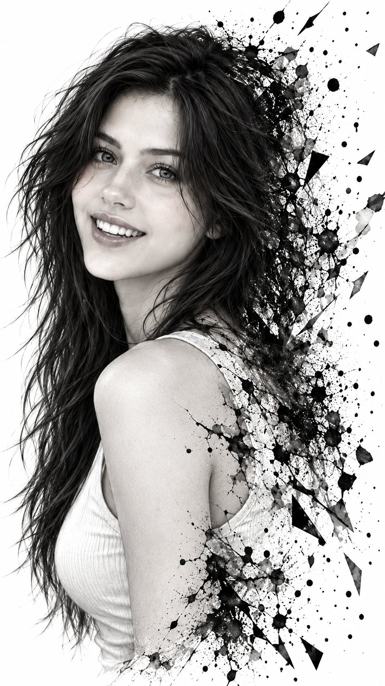

# Monochrome Ink-Splash Fragmentation Portrait

**中文标题：** 黑白水墨飞溅碎裂人像  
**ID:** `gi25-x-670` · **Mode:** `edit`  
**Categories:** `edit-change-preserve`  
**Tags:** `x-twitter`, `community`, `gpt-image-2.5`, `x-direct`, `en`



### Monochrome Ink-Splash Fragmentation Portrait

```text
Hyper-realistic IMAX-level Netflix-style monochrome ink-splash fragmentation portrait, 9:16 vertical. Use the uploaded image as the primary visual reference and preserve the exact facial identity, proportions, and defining features. Create a woman wearing a simple light-colored sleeveless top; her upper body is turned slightly toward the right while her face turns back toward the camera, her shoulders relaxed and positioned diagonally across the lower frame, with her head gently tilted and her neck naturally angled; she has a bright genuine smile with her teeth clearly visible, eyes looking directly toward the camera, slightly raised cheeks, relaxed eyelids, naturally lifted eyebrows and a cheerful expressive mood; her long dark hair is loose, tousled and slightly wind-swept, with fine strands crossing around her forehead, cheeks and neck, while the hair gradually breaks apart into ink marks and scattered fragments on the right side; natural realistic facial texture translated into detailed monochrome linework with soft gray tonal shading rather than smooth photographic skin; a completely clean white background surrounds the portrait, while the right side of her head, hair, shoulder and upper body progressively dissolves into dense black ink splashes, fine brush strokes, cracked textures, tiny droplets, floating particles and sharp geometric black-and-white fragments spreading outward toward the right edge, with the transition remaining organic and irregular rather than a clean cut; soft even illumination keeps the facial features clearly readable while maintaining the strong white background and deep black ink contrast, with delicate gray shading defining the nose, cheekbones, lips, neck and clothing folds; monochrome colour grading built entirely from pure white, deep black and layered graphite-gray tones, extremely crisp black linework, high micro-detail, controlled highlights, subtle paper-like texture, strong tonal separation, delicate cross-hatching, ink-wash gradients and a sophisticated fine-art editorial illustration finish. 
Negative prompt: changed identity, photorealistic colour rendering, 3D CGI, smooth digital painting, incorrect face angle, missing smile, distorted eyes, deformed hands, messy facial features, flat ink texture, symmetrical fragmentation, coloured elements, text, watermark.
```

- **Recommended model:** `gpt-image-2.5-sunburst`
- **Settings:** _(defaults)_
- **Source:** [community](https://x.com/imGopalTiwari/status/2107539874958221667) — @imGopalTiwari
- **License note:** Original public X post; quoted with attribution — remix with attribution
- **Notes:** Collected directly from X; original post https://x.com/imGopalTiwari/status/2107539874958221667; post text names GPT Image 2.5; verified=True
- **Preview:** `previews/gi25-x-670.jpg`
