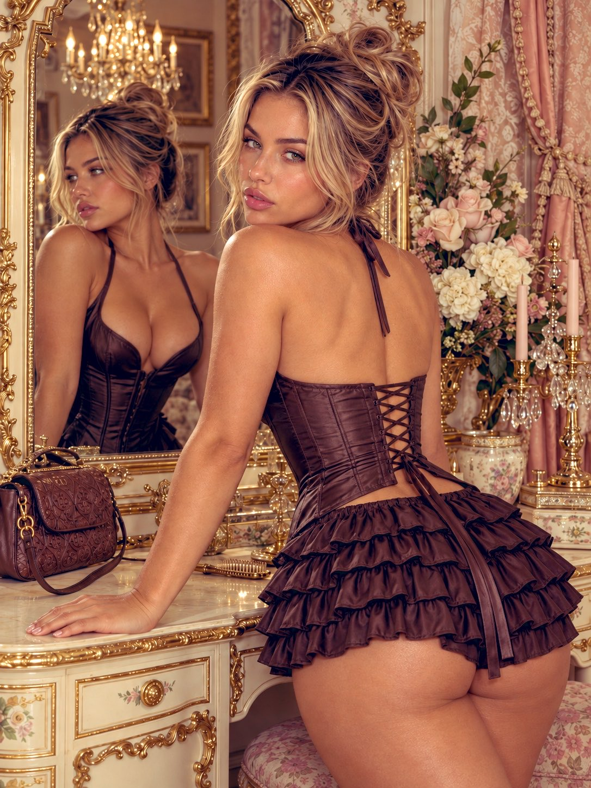

# Source-Faithful Ornate Vanity Recreation

**中文标题：** 华丽梳妆台参考图高保真复刻  
**ID:** `gi25-x-683` · **Mode:** `edit`  
**Categories:** `edit-change-preserve`  
**Tags:** `x-twitter`, `community`, `gpt-image-2.5`, `x-direct`, `en`



### Source-Faithful Ornate Vanity Recreation

```text
Create a source-faithful photorealistic vertical 3:4 recreation of the ornate-vanity reference. It controls the woman’s identity, complexion, proportions, hair, makeup, tattoos, outfit, accessories, pose, reflection, environment, and finish.

Photograph her from behind in three-quarter view, leaning toward a cream-and-gold vanity. Her torso faces the mirror, hips project back and slightly image-right, and her head turns over the near shoulder for direct eye contact. Preserve open eyes, defined brows/lashes, parted nude-pink/brown lips, peach-pink cheek highlights, warm skin, and natural asymmetry. Her near arm extends down-left to a palm planted on the tabletop, fingers pointing left with pink/mauve nails. Far hand and feet remain concealed or cropped. Keep believable wrist pressure and a thigh-length crop.

Show exactly one person and one geometrically correct reflection. The real view shows her exposed back, tattooed near shoulder/arm, rear corset lacing, and returned face. The mirror shows her front and image-left profile, low-cut garment front, halter straps, chest lettering, corresponding tattoos, hoop earring, and the same bun from another angle. Never create a flipped duplicate, second woman, or independently posed reflection. Leave uncertain lettering unreadable.

Hair is dark-rooted chestnut with honey-caramel ribbons in a high loosely coiled bun with folded loops, flyaways, and long face/neck tendrils; match it in reflection. Preserve chunky gold hoops, floral shoulder/upper-arm tattoo, forearm floral/linework with colored areas, and visible chest lettering.

Keep the black satin-like corset/halter with structured panels. Its low back has paired lacing points, crossed ties, and long ends over the waist; thin straps tie behind the neck. In reflection show the deep front and narrow vertical seam—never rear lacing. Retain short tiered black ruffled bottoms, central separation, fitted hem, lower-back skin gap, and natural folds. No stockings, skirt, or footwear.

Place a black embossed monogram-like shoulder bag independently behind the planted arm, with gold fittings and a U-shaped strap over the vanity edge. Keep bag, strap, forearm, fingers, and tabletop separate; add no brand. Preserve decorative boxes, blush plumes, and brush/comb details.

Retain the arched mirror with cream-gold floral scrollwork, blush/mint/blue accents, matching drawers, curved panels, and cropped crest. At image-right keep ivory/pale-pink flowers, leaves, gold candleholders with crystal drops and unlit pink tapers, blush plumes, patterned curtains, tassels, lace, and olive-gold drapery. In reflection retain the lit chandelier, pictures, drapery, and décor on the correct side of the glass.

Only the chandelier emits visible light; other décor merely reflects it. Use warm peach/cream/gold illumination, readable black clothing, rosy skin, and honey-brown hair. Gentle frontal fill may support the face, back, and arm, but no flash orb appears in the mirror. Keep satin, ruffles, metal, crystal, petals, lace, plumes, skin, and painted relief distinct.

Use a slightly downward 35mm digital view with moderate depth, focusing on the real eyes while retaining the reflection and décor. Compose the head upper-middle, back/corset center-right, reflection left, crest/chandelier high-left, flowers/candlesticks upper-right, and hand/bag lower-left. No portrait blur.

Finish with warm midtones, textured blacks, cream relief, localized glints, minimal grain, and moderate sharpening. Avoid copied reflections, extra hands, floating objects, fused straps/fingers, altered tattoos, invented text or brands, incorrect garment front/back, lit tapers, glowing flowers, orange grading, strong bokeh, bloom, flare, or oversharpening. Prioritize mirror geometry, physical support, human continuity, and garment construction.
```

- **Recommended model:** `gpt-image-2.5-sunburst`
- **Settings:** _(defaults)_
- **Source:** [community](https://x.com/RougeHalo_AI/status/2107525779185664150) — @RougeHalo_AI
- **License note:** Original public X post; quoted with attribution — remix with attribution
- **Notes:** Collected directly from X; original post https://x.com/RougeHalo_AI/status/2107525779185664150; post text names GPT Image 2.5; verified=True
- **Preview:** `previews/gi25-x-683.jpg`
