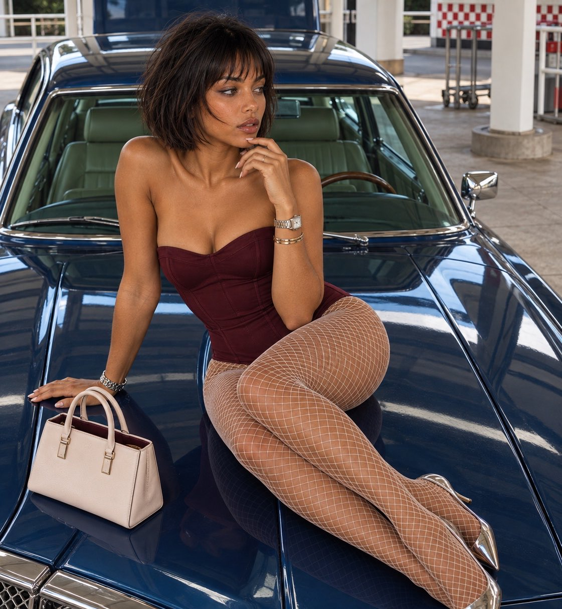

# Source-Faithful Vintage Car Hood Recreation

**中文标题：** 复古汽车引擎盖参考图高保真复刻  
**ID:** `gi25-x-684` · **Mode:** `edit`  
**Categories:** `edit-change-preserve`  
**Tags:** `x-twitter`, `community`, `gpt-image-2.5`, `x-direct`, `en`



### Source-Faithful Vintage Car Hood Recreation

```text
Create a source-faithful photorealistic vertical recreation at 1017:1272. The supplied photograph controls the subject’s identity, complexion, proportions, hair, outfit, accessories, pose, environment, and finish.

Use an elevated exterior view looking down over a metallic cobalt/royal-blue vintage-style car. Its broad closed hood fills the frame and supports the woman and handbag. Preserve the long hood, seams, contours, circular detail, chrome-trimmed greenish windshield, lighter green interior, roof, mirrors, tall blue panel behind it, and grille with two round headlights cropped at lower-left. Keep branding unresolved.

Pose her sideways: hips toward image-right, torso rising image-left near the windshield, knees bent center-left, shins folded back right. One lower leg overlaps the other; the rear pump is partly hidden while the foreground pump extends farther down-right. Preserve two connected legs, two worn shoes, and credible compression against the hood.

Plant the image-left palm beside the handbag, fingers extending left. Bend the opposite elbow and raise its hand near the chin/lower lip. Retain fine reddish hand linework without inventing text. Preserve pale pointed-almond nails, a broad pale watch-like piece with metallic bracelets, and silver accessories on the planted wrist. Keep fingers, jewelry, and handles separate.

Turn her head and open eyes toward image-right, looking off-camera. Preserve shaped brows, liner, lashes, slightly parted nude-brown lips with deeper edging, warm textured skin, and natural asymmetry. Hair is very long, sleek, straight, center-parted pale blonde with subtle mint-green influence, modest crown volume, and fine strands falling beside the shoulders and behind the torso.

Dress her in a fitted turquoise strapless one-piece/bodysuit. Cover both legs in fine ivory fishnet following curvature, bends, overlap, and perspective. Both shoes are enclosed pointed pumps with slender heels and iridescent silver surfaces reflecting pale green, pink, and gold. Maintain continuous foot-to-shoe anatomy.

Place a structured ivory handbag independently on the lower-left hood. Preserve its rectangular body, upright handles, pale metallic closures, burgundy interior strip, and grounded base. Do not merge handles with fingers.

Retain the covered forecourt: pale posts, circular opening near the image-right post base, pavement, white railings, dark openings, distant red-white checkerboard panels, and small cart/rack forms. Preserve face upper-left of center, hips right of center, folded legs across the hood, shoes rightward, bag lower-left, and grille clipped below.

Emulate high-angle digital photography near 35mm. Match hood width, face scale, leg overlap, shoes, and grille crop together. Use bright covered daylight, face/torso focus, readable materials, and no portrait blur.

Reproduce warm skin illumination and blue/cyan reflected bands following the glossy car curvature. Chrome carries narrow glints; windshield reflections retain interior depth. Keep the car cobalt, garment greener turquoise, hair and glass subtly cool-green, skin warm, fishnet and bag ivory, and red accents localized.

Use mild texture and softness, controlled highlights, and restrained sharpening. Avoid direct gaze, curled hair, erased markings, extra or fused limbs, missing shoes, floating body or bag, fused fingers and handles, opened hood, invented branding or stripes, cyan skin, extreme bokeh, heavy grain, bloom, flare, or oversharpening. Prioritize support, vehicle perspective, and regional color fidelity.
```

- **Recommended model:** `gpt-image-2.5-sunburst`
- **Settings:** _(defaults)_
- **Source:** [community](https://x.com/RougeHalo_AI/status/2107524464401617124) — @RougeHalo_AI
- **License note:** Original public X post; quoted with attribution — remix with attribution
- **Notes:** Collected directly from X; original post https://x.com/RougeHalo_AI/status/2107524464401617124; post text names GPT Image 2.5; verified=True
- **Preview:** `previews/gi25-x-684.jpg`
