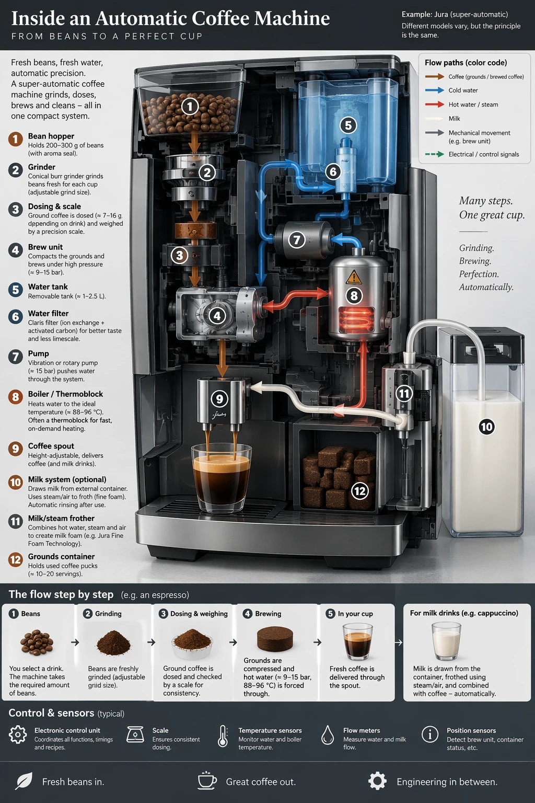

# Coffee machine technical infographic

**中文标题：** 全自动咖啡机流程信息图  
**ID:** `gi25-gen-002` · **Mode:** `generate`  
**Categories:** `poster-typography`, `flare-vs-sunburst`  
**Tags:** `infographic`, `diagram`, `openai-official`  



### Coffee machine technical infographic

```text
Create a detailed Infographic of the functioning and flow of an automatic coffee machine like a Jura.
From bean basket, to grinding, to scale, water tank, boiler, etc.
I'd like to understand technically and visually the flow.
```

- **Recommended model:** `gpt-image-2.5-sunburst`
- **Settings:** `quality=medium`, `size=1024x1536`
- **Source:** [OpenAI Image prompting](https://developers.openai.com/api/docs/guides/image-prompting) — OpenAI
- **License note:** OpenAI docs examples
- **Notes:** Dense labels: prefer Sunburst or high quality; official Flare/Sunburst comparison pair.
