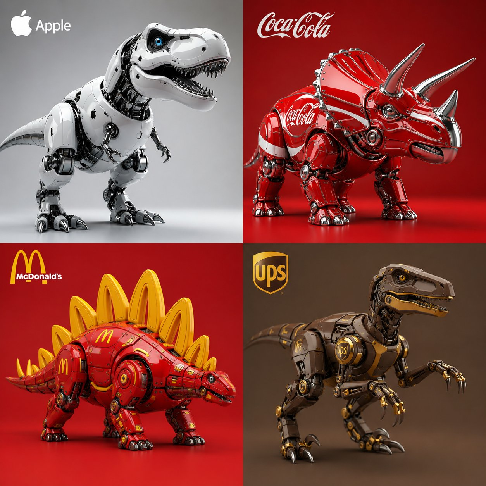

# Brand Dino Four-Model Bake-Off (Image2/Flare/Sunburst)

**中文标题：** 品牌恐龙四模同题：Image2 / Flare / Sunburst / ChatGPT  
**ID:** `gi25-x-493` · **Mode:** `generate`  
**Categories:** `flare-vs-sunburst`, `general`, `ui-mockup`  
**Tags:** `x-twitter`, `community`, `gpt-image-2.5`, `xianyu`, `en`



### Brand Dino Four-Model Bake-Off (Image2/Flare/Sunburst)

```text
GPT Image 2 vs GPT Image 2.5 Flare (Higgsfield) vs. GPT Image 2.5 Sunburst (Higgsfield) vs. ChatGPT :

Brands as dinosaurs. Same prompt.

2x2 grid, do this for 4 dinosaurs inferred from subject and 4 famous Fortune 500 brands: void main() {
string brand = "[$BRAND]";
string insect = "[$dinosaurs]";
// Semantic Material Mapping based on Brand
vec3 base_mat = infer_brand_primary_material(brand); // e.g., brushed_metal(), white_glass(), or matte_carbon()
vec3 accent_mat = infer_brand_accent_colors(brand);  // e.g., primary_color_grid(), or neon_green_emissive()

// Geometry Deformation
mat4 mechanical_chassis = convert_to_robot(load_mesh(insect));
apply_panel_gaps_and_servos(mechanical_chassis);

// Render 3D Subject
render_mesh(mechanical_chassis, base_mat, accent_mat);
apply_lighting(commercial_studio_softbox, macro_lens: true);

// UI Overlay Overlay (No depth, pure 2D)
draw_2D_overlay(top_left, infer_logo(brand));

}
```

- **Recommended model:** `gpt-image-2.5-sunburst`
- **Settings:** _(defaults)_
- **Source:** [community](https://x.com/Gdgtify/status/2100496729627836540) — @Gdgtify (via xianyu110/awesome-gpt-image2.5)
- **License note:** Community X post mirrored in xianyu110/awesome-gpt-image2.5; remix with attribution
- **Notes:** xianyu110 case 2100496729627836540; category=选型评测
- **Preview:** `previews/gi25-x-493.jpg`
