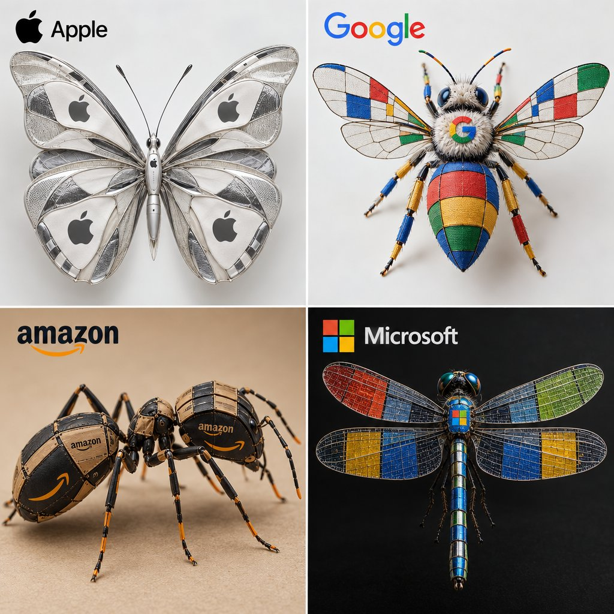

# Sunburst vs Image2: Tech Brand as Insect 2×2

**中文标题：** Sunburst vs Image2：科技品牌捏成昆虫 2×2  
**ID:** `gi25-x-502` · **Mode:** `generate`  
**Categories:** `flare-vs-sunburst`, `general`  
**Tags:** `x-twitter`, `community`, `gpt-image-2.5`, `xianyu`, `en`



### Sunburst vs Image2: Tech Brand as Insect 2×2

```text
2x2 grid, 1080x1080: <instructions> Input = Tech companies Identify 4 iconic tech brands and their signature elements/patterns. Function Draw ($ Tech_Brand, $ Insect_Species) ... Anchor: [$Insect_Species] :: [$Tech_Brand]::4 | Morphology: Biological anatomy of [$Insect_Species] reconstructed via the assemblage of [$Tech_Brand] textiles, exoskeleton formed from constituent haute couture garments... </instructions>
```

- **Recommended model:** `gpt-image-2.5-sunburst`
- **Settings:** _(defaults)_
- **Source:** [community](https://x.com/Gdgtify/status/2100211349414441426) — @Gdgtify (via xianyu110/awesome-gpt-image2.5)
- **License note:** Community X post mirrored in xianyu110/awesome-gpt-image2.5; remix with attribution
- **Notes:** xianyu110 case 2100211349414441426; category=选型评测
- **Preview:** `previews/gi25-x-502.jpg`
