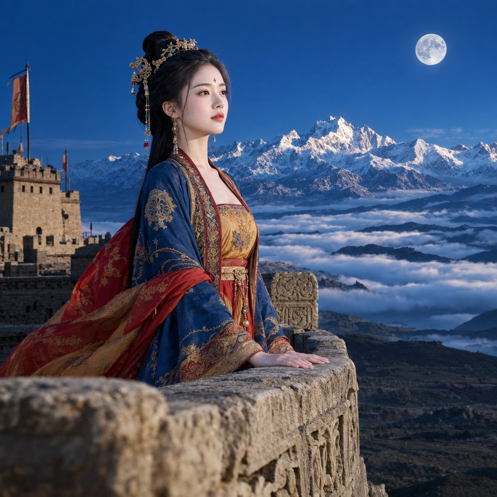

# Flare Max vs Sunburst Max: Same Silk Road Portrait Head-to-Head

**中文标题：** Flare Max vs Sunburst Max：同题丝路人像硬对比  
**ID:** `gi25-x-539` · **Mode:** `generate`  
**Categories:** `flare-vs-sunburst`, `general`  
**Tags:** `x-twitter`, `community`, `gpt-image-2.5`, `xianyu`, `en`



### Flare Max vs Sunburst Max: Same Silk Road Portrait Head-to-Head

```text
Create a breathtaking, ultra-realistic live-action movie still of a pristine, flawlessly beautiful 20-year-old classical Chinese maiden. Open, highly breathable and majestic Silk Road landscape portrait framing (ABSOLUTELY NO dark frames, vast and crystal-clear evening sky). STRICT SPATIAL LAYOUT: She stands on the high, carved-stone terrace of an ancient Silk Road fortress watchtower (烽燧石台). In the infinitely deep background, the colossal, jagged, snow-capped peaks of the Tian Shan mountain range (天山雪峰) rise majestically into a deep indigo-blue twilight sky above a calm sea of clouds. Above the snow peaks hangs an astronomically accurate, realistically proportioned bright silver full moon (ABSOLUTELY NOT an oversized fantasy moon). CRUCIAL FACIAL BEAUTY: She possesses a pristine, baby-smooth youthful face (NO wrinkles, pure, absolute clean dry skin, zero dirt). ATTIRE: She wears authentic, high-Tang Silk Road Western Regions attire (西域唐风胡服 / 宝相花纹披帛) with rich, textured lapis-lazuli blue, warm ochre-gold, and pomegranate-crimson silk woven with fine metallic threads. CRUCIAL SAFE ANATOMY: Her hands are safely and gently resting completely flat on the carved, ancient weathered stone balustrade of the terrace (flawless flat rest, ABSOLUTELY NO holding weapons, NO complex fingers). Cinematic high-altitude twilight lighting: crisp, clear evening twilight blends with soft, cool-silver moonlight striking the snow-capped mountain ridges and her face, casting natural, heroic, perfectly exposed highlights. In the extreme foreground, out-of-focus macro carved stone balustrade edge. 8k, absolute cinematic realism, profound Silk Road majesty.
```

- **Recommended model:** `gpt-image-2.5-sunburst`
- **Settings:** _(defaults)_
- **Source:** [community](https://x.com/shitunote/status/2099714542511292721) — @shitunote (via xianyu110/awesome-gpt-image2.5)
- **License note:** Community X post mirrored in xianyu110/awesome-gpt-image2.5; remix with attribution
- **Notes:** xianyu110 case 2099714542511292721; category=选型评测; verified=True
- **Preview:** `previews/gi25-x-539.jpg`
