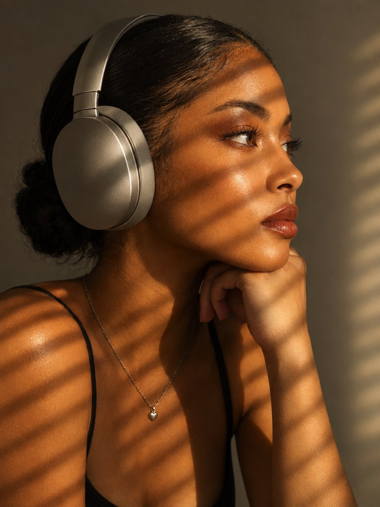

# Same Prompt Three Ways: Flare vs Sunburst vs Nano Banana 2

**中文标题：** 同 prompt 三连：Flare / Sunburst / NB2  
**ID:** `gi25-x-577` · **Mode:** `generate`  
**Categories:** `flare-vs-sunburst`, `general`  
**Tags:** `x-twitter`, `community`, `gpt-image-2.5`, `xianyu`, `en`



### Same Prompt Three Ways: Flare vs Sunburst vs Nano Banana 2

```text
The woman is positioned indoors by a window, her body turned in profile to the camera, her shoulder jutting forward, her chin slightly raised and resting on the back of her hand, her head turned to the right, her gaze directed toward the light source. The portrait is close-up, from chest to crown, with an eye-level angle. The composition is shifted to the left, the right side of the frame is filled with a softly lit background. Diagonal stripes of light from the window frame or blinds fall across her face and shoulder.

She has even skin with a distinct warm, bronze-golden undertone, warm, brown-terracotta eyeshadow with a smooth blend, long lashes, and a rich, warm, reddish-brown lipstick with a soft sheen.

Hair is pulled back into a sleek low bun, the texture is neatly smoothed, the hairline is defined, fine natural strands are visible at the temples, and the hair surface is shiny and smooth.

She's wearing a black top with thin straps made of a smooth matte fabric, a thin silver chain with a small heart-shaped pendant around her neck, and large, silver-gray, matte-finish over-ear headphones with smooth, rounded shapes.

The location is a minimalist interior with a neutral gray-beige wall. The light source is positioned to the right of the side. Sunlight streams through a window frame or blinds, creating distinct stripes of light and shadow on her face and shoulder. The background remains softly illuminated without harsh details. The lighting is hard, directional, and natural, creating distinct stripes of contrast, deep shadows with sharp edges, high contrast, bright and controlled highlights on her skin, and a warm overall atmosphere thanks to the sunlight. Highly detailed, photorealistic photography, shot with an 85mm portrait lens, uses a shallow depth of field with sharp focus on the eyes and profile lines. The background is softly blurred, and the texture of the skin and metal of the headphones is detailed.

warm sunlit editorial mood,

strong golden amber highlights,

high contrast directional lighting,

deep defined shadow bands,

rich warm skin tones,

moderate saturation with bronze emphasis,

clean dark background separation,

sharp specular highlights on skin,

subtle cinematic grain,

dramatic sunlight color grading.
```

- **Recommended model:** `gpt-image-2.5-sunburst`
- **Settings:** _(defaults)_
- **Source:** [community](https://x.com/dreamydigiarts/status/2098267794613883368) — @dreamydigiarts (via xianyu110/awesome-gpt-image2.5)
- **License note:** Community X post mirrored in xianyu110/awesome-gpt-image2.5; remix with attribution
- **Notes:** xianyu110 case 2098267794613883368; category=选型评测; verified=True
- **Preview:** `previews/gi25-x-577.jpg`
