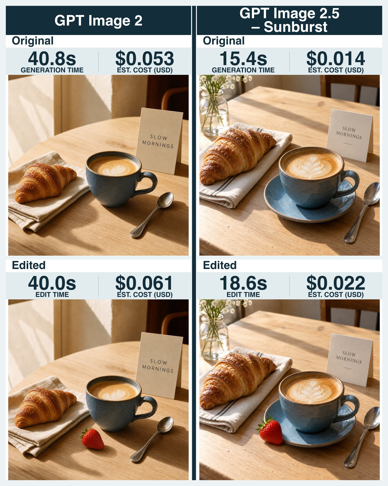

# Add One Strawberry: Flare vs Sunburst Edit Precision Test

**中文标题：** 加一颗草莓看出 Flare vs Sunburst 精度差  
**ID:** `gi25-x-608` · **Mode:** `edit`  
**Categories:** `flare-vs-sunburst`, `general`  
**Tags:** `x-twitter`, `community`, `gpt-image-2.5`, `xianyu`, `en`



### Add One Strawberry: Flare vs Sunburst Edit Precision Test

```text
A realistic product photograph of a blue ceramic cup of coffee on a pale wooden café table. Beside it, a croissant rests on a folded cream linen napkin, with a silver teaspoon to the right. A small upright card reads “SLOW MORNINGS” in clear lettering. Warm sunlight from the left creates soft shadows. Keep the composition uncluttered.

Edit prompt:
Add one ripe red strawberry on the table directly beside the blue cup. Keep every existing object, the lettering, camera angle, lighting, and composition unchanged.
```

- **Recommended model:** `gpt-image-2.5-sunburst`
- **Settings:** _(defaults)_
- **Source:** [community](https://x.com/nocodemba/status/2097785065547984984) — @nocodemba (via xianyu110/awesome-gpt-image2.5)
- **License note:** Community X post mirrored in xianyu110/awesome-gpt-image2.5; remix with attribution
- **Notes:** xianyu110 case 2097785065547984984; category=选型评测; verified=True
- **Preview:** `previews/gi25-x-608.jpg`
